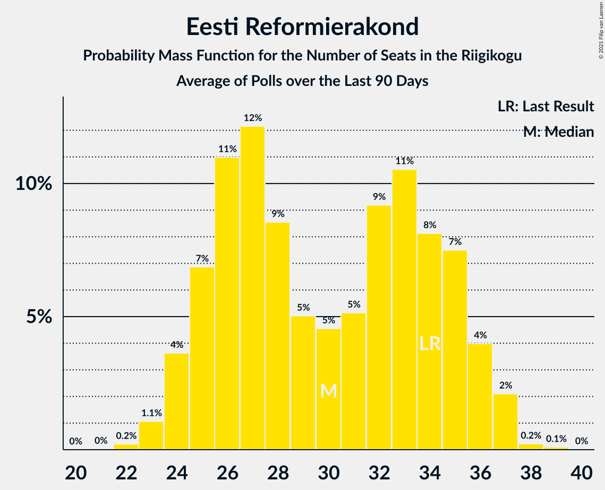

# Eesti Reformierakond

<a href="#voting-intentions">Voting Intentions</a> | <a href="#seats">Seats</a>

## Voting Intentions

Last result: **28.9%** (General Election of 3 March 2019)

### Confidence Intervals

| Period     | Polling firm/Commissioner(s) | Median | 80% Confidence Interval | 90% Confidence Interval | 95% Confidence Interval | 99% Confidence Interval |
|:----------:|:----------------:|:-----------:|:-----------------------:|:-----------------------:|:-----------------------:|:-----------------------:|
| N/A | [Poll Average](average.html) | 30.9% | 28.8–33.2% | 28.3–33.9% | 27.8–34.5% | 26.9–35.6% |
| [9–15 August 2022](2022-08-15-Norstat.html) | Norstat   MTÜ Ühiskonnauuringute Instituut | 31.8% | 29.9–33.7% | 29.4–34.3% | 29.0–34.8% | 28.1–35.7% |
| [2–8 August 2022](2022-08-08-Norstat.html) | Norstat   MTÜ Ühiskonnauuringute Instituut | 35.5% | 33.6–37.5% | 33.1–38.0% | 32.6–38.5% | 31.7–39.5% |
| [25 July–1 August 2022](2022-08-01-Norstat.html) | Norstat   MTÜ Ühiskonnauuringute Instituut | 35.5% | 33.6–37.5% | 33.1–38.0% | 32.6–38.5% | 31.7–39.5% |
| [19–25 July 2022](2022-07-25-Norstat.html) | Norstat   MTÜ Ühiskonnauuringute Instituut | 32.8% | 30.9–34.8% | 30.4–35.3% | 29.9–35.8% | 29.1–36.7% |
| [14–20 July 2022](2022-07-20-KantarEmor.html) | Kantar Emor   ERR | 30.0% | 28.5–31.5% | 28.1–32.0% | 27.7–32.4% | 27.0–33.1% |
| [12–18 July 2022](2022-07-18-Norstat.html) | Norstat   MTÜ Ühiskonnauuringute Instituut | 33.9% | 32.0–35.9% | 31.5–36.4% | 31.0–36.9% | 30.1–37.8% |
| [5–11 July 2022](2022-07-11-Norstat.html) | Norstat   MTÜ Ühiskonnauuringute Instituut | 32.4% | 30.5–34.3% | 30.0–34.9% | 29.6–35.4% | 28.7–36.3% |
| [27 June–4 July 2022](2022-07-04-Norstat.html) | Norstat   MTÜ Ühiskonnauuringute Instituut | 32.5% | 30.6–34.4% | 30.1–35.0% | 29.7–35.5% | 28.8–36.4% |
| [14–20 June 2022](2022-06-20-Norstat.html) | Norstat   MTÜ Ühiskonnauuringute Instituut | 34.1% | 32.2–36.1% | 31.7–36.6% | 31.2–37.1% | 30.3–38.0% |
| [17 June 2022](2022-06-17-Turu-uuringuteAS.html) | Turu-uuringute AS | 31.0% | 28.7–33.5% | 28.0–34.2% | 27.4–34.8% | 26.3–36.0% |
| [9–14 June 2022](2022-06-14-KantarEmor.html) | Kantar Emor   ERR | 31.9% | 30.4–33.5% | 30.0–33.9% | 29.7–34.3% | 28.9–35.1% |
| [7–13 June 2022](2022-06-13-Norstat.html) | Norstat   MTÜ Ühiskonnauuringute Instituut | 35.2% | 33.3–37.2% | 32.8–37.7% | 32.3–38.2% | 31.4–39.2% |
| [1–6 June 2022](2022-06-06-Norstat.html) | Norstat   MTÜ Ühiskonnauuringute Instituut | 33.5% | 31.6–35.5% | 31.1–36.0% | 30.6–36.5% | 29.8–37.4% |
| [24–30 May 2022](2022-05-30-Norstat.html) | Norstat   MTÜ Ühiskonnauuringute Instituut | 34.7% | 32.8–36.7% | 32.3–37.2% | 31.8–37.7% | 30.9–38.7% |
| [16–23 May 2022](2022-05-23-Norstat.html) | Norstat   MTÜ Ühiskonnauuringute Instituut | 35.4% | 33.5–37.4% | 33.0–37.9% | 32.5–38.4% | 31.6–39.4% |
| [12–20 May 2022](2022-05-20-KantarEmor.html) | Kantar Emor   ERR | 32.9% | 31.4–34.5% | 30.9–35.0% | 30.6–35.4% | 29.8–36.2% |
| [19 May 2022](2022-05-19-Turu-uuringuteAS.html) | Turu-uuringute AS | 32.0% | N/A | N/A | N/A | N/A |
| [10–16 May 2022](2022-05-16-Norstat.html) | Norstat   MTÜ Ühiskonnauuringute Instituut | 33.3% | 31.4–35.3% | 30.9–35.8% | 30.4–36.3% | 29.6–37.2% |
| [4–9 May 2022](2022-05-09-Norstat.html) | Norstat   MTÜ Ühiskonnauuringute Instituut | 35.9% | 34.0–37.9% | 33.4–38.4% | 33.0–38.9% | 32.1–39.9% |
| [26 April–2 May 2022](2022-05-02-Norstat.html) | Norstat   MTÜ Ühiskonnauuringute Instituut | 30.6% | 28.8–32.5% | 28.3–33.1% | 27.8–33.5% | 27.0–34.5% |
| [19–25 April 2022](2022-04-25-Norstat.html) | Norstat   MTÜ Ühiskonnauuringute Instituut | 34.0% | 32.1–36.0% | 31.6–36.5% | 31.1–37.0% | 30.2–38.0% |
| [14–20 April 2022](2022-04-20-KantarEmor.html) | Kantar Emor   ERR | 24.9% | 23.5–26.4% | 23.2–26.8% | 22.8–27.2% | 22.2–27.9% |
| [18 April 2022](2022-04-18-Turu-uuringuteAS.html) | Turu-uuringute AS | 30.0% | 27.7–32.5% | 27.0–33.2% | 26.5–33.8% | 25.4–35.0% |
| [12–18 April 2022](2022-04-18-Norstat.html) | Norstat   MTÜ Ühiskonnauuringute Instituut | 30.9% | 29.1–32.8% | 28.5–33.4% | 28.1–33.8% | 27.3–34.8% |
| [6–11 April 2022](2022-04-11-Norstat.html) | Norstat   MTÜ Ühiskonnauuringute Instituut | 32.1% | 30.3–34.0% | 29.7–34.6% | 29.3–35.1% | 28.4–36.0% |
| [28 March–4 April 2022](2022-04-04-Norstat.html) | Norstat   MTÜ Ühiskonnauuringute Instituut | 29.3% | 27.5–31.2% | 27.0–31.7% | 26.6–32.2% | 25.7–33.1% |
| [21–28 March 2022](2022-03-28-Norstat.html) | Norstat   MTÜ Ühiskonnauuringute Instituut | 31.7% | 29.9–33.6% | 29.3–34.2% | 28.9–34.7% | 28.0–35.6% |
| [19 March 2022](2022-03-19-Turu-uuringuteAS.html) | Turu-uuringute AS | 23.0% | 21.2–25.0% | 20.7–25.6% | 20.2–26.0% | 19.4–27.0% |
| [14–18 March 2022](2022-03-18-Norstat.html) | Norstat   MTÜ Ühiskonnauuringute Instituut | 28.0% | 26.2–29.9% | 25.7–30.4% | 25.3–30.9% | 24.5–31.8% |
| [10–16 March 2022](2022-03-16-KantarEmor.html) | Kantar Emor   ERR | 26.2% | 24.7–27.8% | 24.2–28.3% | 23.9–28.7% | 23.2–29.5% |
| [8–14 March 2022](2022-03-14-Norstat.html) | Norstat   MTÜ Ühiskonnauuringute Instituut | 24.5% | 22.8–26.3% | 22.3–26.8% | 21.9–27.3% | 21.1–28.2% |
| [1–7 March 2022](2022-03-07-Norstat.html) | Norstat   MTÜ Ühiskonnauuringute Instituut | 31.2% | 29.4–33.1% | 28.9–33.7% | 28.4–34.1% | 27.5–35.1% |
| [22–28 February 2022](2022-02-28-Norstat.html) | Norstat   MTÜ Ühiskonnauuringute Instituut | 26.5% | 24.8–28.3% | 24.3–28.9% | 23.9–29.3% | 23.0–30.2% |
| [15–21 February 2022](2022-02-21-Norstat.html) | Norstat   MTÜ Ühiskonnauuringute Instituut | 23.3% | 21.6–25.1% | 21.2–25.6% | 20.8–26.0% | 20.0–26.9% |
| [18 February 2022](2022-02-18-Turu-uuringuteAS.html) | Turu-uuringute AS | 17.9% | 16.3–19.8% | 15.9–20.3% | 15.5–20.7% | 14.7–21.6% |
| [10–18 February 2022](2022-02-18-KantarEmor.html) | Kantar Emor   ERR | 20.0% | 18.7–21.3% | 18.3–21.7% | 18.0–22.1% | 17.4–22.7% |
| [8–14 February 2022](2022-02-14-Norstat.html) | Norstat   MTÜ Ühiskonnauuringute Instituut | 23.1% | 21.4–24.9% | 21.0–25.4% | 20.6–25.8% | 19.8–26.7% |
| [1–7 February 2022](2022-02-07-Norstat.html) | Norstat   MTÜ Ühiskonnauuringute Instituut | 23.5% | 21.8–25.3% | 21.4–25.8% | 21.0–26.2% | 20.2–27.1% |
| [25–31 January 2022](2022-01-31-Norstat.html) | Norstat   MTÜ Ühiskonnauuringute Instituut | 18.2% | 16.7–19.8% | 16.3–20.3% | 15.9–20.7% | 15.2–21.5% |
| [18–24 January 2022](2022-01-24-Norstat.html) | Norstat   MTÜ Ühiskonnauuringute Instituut | 21.9% | N/A | N/A | N/A | N/A |
| [13–21 January 2022](2022-01-21-KantarEmor.html) | Kantar Emor   ERR | 18.6% | 17.2–20.1% | 16.8–20.5% | 16.5–20.9% | 15.9–21.6% |
| [12–17 January 2022](2022-01-17-Turu-uuringuteAS.html) | Turu-uuringute AS | 18.0% | 16.4–19.7% | 16.0–20.2% | 15.6–20.7% | 14.8–21.5% |
| [11–17 January 2022](2022-01-17-Norstat.html) | Norstat   MTÜ Ühiskonnauuringute Instituut | 22.0% | N/A | N/A | N/A | N/A |
| [5–10 January 2022](2022-01-10-Norstat.html) | Norstat   MTÜ Ühiskonnauuringute Instituut | 24.4% | N/A | N/A | N/A | N/A |
| [27 December 2021–4 January 2022](2022-01-04-Norstat.html) | Norstat   MTÜ Ühiskonnauuringute Instituut | 27.4% | N/A | N/A | N/A | N/A |
| [14–20 December 2021](2021-12-20-Norstat.html) | Norstat   MTÜ Ühiskonnauuringute Instituut | 24.2% | N/A | N/A | N/A | N/A |
| [9–15 December 2021](2021-12-15-KantarEmor.html) | Kantar Emor | 19.0% | 17.6–20.5% | 17.2–20.9% | 16.9–21.3% | 16.3–22.1% |
| [7–13 December 2021](2021-12-13-Norstat.html) | Norstat   MTÜ Ühiskonnauuringute Instituut | 27.1% | 25.3–29.0% | 24.9–29.5% | 24.4–29.9% | 23.6–30.8% |
| [30 November–7 December 2021](2021-12-07-Turu-uuringuteAS.html) | Turu-uuringute AS   ERR | 21.2% | 19.6–22.9% | 19.2–23.4% | 18.8–23.8% | 18.1–24.7% |
| [1–7 December 2021](2021-12-07-Norstat.html) | Norstat   MTÜ Ühiskonnauuringute Instituut | 23.1% | N/A | N/A | N/A | N/A |
| [23–29 November 2021](2021-11-29-Norstat.html) | Norstat   MTÜ Ühiskonnauuringute Instituut | 19.8% | 18.3–21.5% | 17.8–22.0% | 17.4–22.4% | 16.7–23.2% |
| [16–22 November 2021](2021-11-22-Norstat.html) | Norstat   MTÜ Ühiskonnauuringute Instituut | 20.0% | N/A | N/A | N/A | N/A |
| [11–17 November 2021](2021-11-17-KantarEmor.html) | Kantar Emor | 19.8% | 18.3–21.5% | 17.9–21.9% | 17.5–22.3% | 16.8–23.2% |
| [9–15 November 2021](2021-11-15-Norstat.html) | Norstat   MTÜ Ühiskonnauuringute Instituut | 22.0% | N/A | N/A | N/A | N/A |
| [4–9 November 2021](2021-11-09-Turu-uuringuteAS.html) | Turu-uuringute AS   ERR | 21.0% | 19.4–22.7% | 19.0–23.2% | 18.6–23.6% | 17.8–24.5% |
| [2–8 November 2021](2021-11-08-Norstat.html) | Norstat   MTÜ Ühiskonnauuringute Instituut | 20.5% | 18.9–22.2% | 18.5–22.7% | 18.1–23.1% | 17.4–24.0% |
| [26 October–2 November 2021](2021-11-02-Norstat.html) | Norstat   MTÜ Ühiskonnauuringute Instituut | 22.8% | N/A | N/A | N/A | N/A |
| [20–25 October 2021](2021-10-25-Norstat.html) | Norstat   MTÜ Ühiskonnauuringute Instituut | 24.0% | N/A | N/A | N/A | N/A |
| [14–20 October 2021](2021-10-20-KantarEmor.html) | Kantar Emor | 22.7% | 21.2–24.3% | 20.8–24.8% | 20.5–25.2% | 19.8–26.0% |
| [13–18 October 2021](2021-10-18-Norstat.html) | Norstat   MTÜ Ühiskonnauuringute Instituut | 23.5% | N/A | N/A | N/A | N/A |
| [5–12 October 2021](2021-10-12-Norstat.html) | Norstat   MTÜ Ühiskonnauuringute Instituut | 26.7% | N/A | N/A | N/A | N/A |
| [4–8 October 2021](2021-10-08-Turu-uuringuteAS.html) | Turu-uuringute AS   ERR | 24.0% | 22.3–25.8% | 21.9–26.3% | 21.4–26.7% | 20.7–27.6% |
| [28 September–5 October 2021](2021-10-05-Norstat.html) | Norstat   MTÜ Ühiskonnauuringute Instituut | 22.8% | N/A | N/A | N/A | N/A |
| [22–27 September 2021](2021-09-27-Norstat.html) | Norstat   MTÜ Ühiskonnauuringute Instituut | 22.9% | N/A | N/A | N/A | N/A |
| [16–21 September 2021](2021-09-21-KantarEmor.html) | Kantar Emor | 27.0% | N/A | N/A | N/A | N/A |
| [14–20 September 2021](2021-09-20-Norstat.html) | Norstat   MTÜ Ühiskonnauuringute Instituut | 24.1% | N/A | N/A | N/A | N/A |
| [6–15 September 2021](2021-09-15-Turu-uuringuteAS.html) | Turu-uuringute AS   ERR | 24.0% | N/A | N/A | N/A | N/A |
| [8–13 September 2021](2021-09-13-Norstat.html) | Norstat   MTÜ Ühiskonnauuringute Instituut | 25.6% | N/A | N/A | N/A | N/A |
| [1–7 September 2021](2021-09-07-Norstat.html) | Norstat   MTÜ Ühiskonnauuringute Instituut | 24.7% | N/A | N/A | N/A | N/A |
| [25–31 August 2021](2021-08-31-Norstat.html) | Norstat   MTÜ Ühiskonnauuringute Instituut | 28.2% | N/A | N/A | N/A | N/A |
| [17–24 August 2021](2021-08-24-Norstat.html) | Norstat   MTÜ Ühiskonnauuringute Instituut | 30.0% | N/A | N/A | N/A | N/A |
| [12–17 August 2021](2021-08-17-KantarEmor.html) | Kantar Emor | 25.0% | N/A | N/A | N/A | N/A |
| [9–16 August 2021](2021-08-16-Norstat.html) | Norstat   MTÜ Ühiskonnauuringute Instituut | 32.1% | N/A | N/A | N/A | N/A |
| [5–13 August 2021](2021-08-13-Turu-uuringuteAS.html) | Turu-uuringute AS   ERR | 24.0% | N/A | N/A | N/A | N/A |
| [3–7 August 2021](2021-08-07-Norstat.html) | Norstat   MTÜ Ühiskonnauuringute Instituut | 29.9% | N/A | N/A | N/A | N/A |
| [27 July–2 August 2021](2021-08-02-Norstat.html) | Norstat   MTÜ Ühiskonnauuringute Instituut | 28.8% | 27.0–30.7% | 26.5–31.2% | 26.1–31.7% | 25.2–32.6% |
| [20–27 July 2021](2021-07-27-Norstat.html) | Norstat   MTÜ Ühiskonnauuringute Instituut | 33.3% | 31.4–35.3% | 30.9–35.8% | 30.4–36.3% | 29.6–37.2% |
| [14–22 July 2021](2021-07-22-KantarEmor.html) | Kantar Emor | 23.0% | N/A | N/A | N/A | N/A |
| [13–19 July 2021](2021-07-19-Norstat.html) | Norstat   MTÜ Ühiskonnauuringute Instituut | 29.5% | 27.7–31.4% | 27.2–31.9% | 26.7–32.4% | 25.9–33.3% |
| [6–12 July 2021](2021-07-12-Norstat.html) | Norstat   MTÜ Ühiskonnauuringute Instituut | 28.8% | 27.0–30.7% | 26.5–31.2% | 26.1–31.7% | 25.2–32.6% |
| [28 June–4 July 2021](2021-07-04-Norstat.html) | Norstat   MTÜ Ühiskonnauuringute Instituut | 30.0% | N/A | N/A | N/A | N/A |
| [15–21 June 2021](2021-06-21-Norstat.html) | Norstat   MTÜ Ühiskonnauuringute Instituut | 28.7% | 26.9–30.6% | 26.4–31.1% | 26.0–31.6% | 25.1–32.5% |
| [10–16 June 2021](2021-06-16-KantarEmor.html) | Kantar Emor | 25.0% | 23.3–26.8% | 22.8–27.3% | 22.4–27.8% | 21.6–28.7% |
| [8–14 June 2021](2021-06-14-Norstat.html) | Norstat   MTÜ Ühiskonnauuringute Instituut | 26.6% | N/A | N/A | N/A | N/A |
| [3–10 June 2021](2021-06-10-Turu-uuringuteAS.html) | Turu-uuringute AS   ERR | 24.0% | 22.3–25.8% | 21.9–26.3% | 21.4–26.7% | 20.7–27.6% |
| [1–7 June 2021](2021-06-07-Norstat.html) | Norstat   MTÜ Ühiskonnauuringute Instituut | 29.6% | N/A | N/A | N/A | N/A |
| [26–31 May 2021](2021-05-31-Norstat.html) | Norstat   MTÜ Ühiskonnauuringute Instituut | 29.3% | N/A | N/A | N/A | N/A |
| [19–25 May 2021](2021-05-25-Norstat.html) | Norstat   MTÜ Ühiskonnauuringute Instituut | 31.8% | N/A | N/A | N/A | N/A |
| [12–18 May 2021](2021-05-18-KantarEmor.html) | Kantar Emor | 27.4% | 25.7–29.2% | 25.2–29.8% | 24.8–30.2% | 24.0–31.1% |
| [12–17 May 2021](2021-05-17-Norstat.html) | Norstat   MTÜ Ühiskonnauuringute Instituut | 32.5% | N/A | N/A | N/A | N/A |
| [6–11 May 2021](2021-05-11-Turu-uuringuteAS.html) | Turu-uuringute AS   ERR | 26.0% | 24.3–27.9% | 23.8–28.4% | 23.4–28.9% | 22.6–29.8% |
| [4–10 May 2021](2021-05-10-Norstat.html) | Norstat   MTÜ Ühiskonnauuringute Instituut | 30.4% | 28.6–32.3% | 28.1–32.9% | 27.6–33.3% | 26.8–34.3% |
| [27 April–3 May 2021](2021-05-03-Norstat.html) | Norstat   MTÜ Ühiskonnauuringute Instituut | 29.1% | 27.3–31.0% | 26.8–31.5% | 26.4–32.0% | 25.5–32.9% |
| [20–26 April 2021](2021-04-26-Norstat.html) | Norstat   MTÜ Ühiskonnauuringute Instituut | 33.4% | N/A | N/A | N/A | N/A |
| [15–21 April 2021](2021-04-21-KantarEmor.html) | Kantar Emor | 27.0% | 25.4–28.8% | 24.9–29.3% | 24.5–29.7% | 23.7–30.6% |
| [13–19 April 2021](2021-04-19-Norstat.html) | Norstat   MTÜ Ühiskonnauuringute Instituut | 29.7% | N/A | N/A | N/A | N/A |
| [8–14 April 2021](2021-04-14-Turu-uuringuteAS.html) | Turu-uuringute AS   ERR | 27.2% | 25.5–29.1% | 25.0–29.6% | 24.6–30.1% | 23.7–31.0% |
| [7–12 April 2021](2021-04-12-Norstat.html) | Norstat   MTÜ Ühiskonnauuringute Instituut | 30.5% | N/A | N/A | N/A | N/A |
| [30 March–5 April 2021](2021-04-05-Norstat.html) | Norstat   MTÜ Ühiskonnauuringute Instituut | 34.4% | N/A | N/A | N/A | N/A |
| [23–29 March 2021](2021-03-29-Norstat.html) | Norstat   MTÜ Ühiskonnauuringute Instituut | 35.2% | N/A | N/A | N/A | N/A |
| [17–22 March 2021](2021-03-22-Norstat.html) | Norstat   MTÜ Ühiskonnauuringute Instituut | 33.3% | 31.4–35.3% | 30.9–35.8% | 30.4–36.3% | 29.6–37.2% |
| [11–16 March 2021](2021-03-16-KantarEmor.html) | Kantar Emor | 28.0% | 26.3–29.8% | 25.8–30.3% | 25.4–30.7% | 24.7–31.6% |
| [9–15 March 2021](2021-03-15-Turu-uuringuteAS.html) | Turu-uuringute AS   ERR | 26.0% | 24.2–27.8% | 23.8–28.3% | 23.4–28.8% | 22.5–29.7% |
| [10–15 March 2021](2021-03-15-Norstat.html) | Norstat   MTÜ Ühiskonnauuringute Instituut | 31.6% | 29.8–33.5% | 29.2–34.1% | 28.8–34.6% | 27.9–35.5% |
| [2–8 March 2021](2021-03-08-Norstat.html) | Norstat   MTÜ Ühiskonnauuringute Instituut | 36.7% | 34.8–38.7% | 34.2–39.2% | 33.8–39.7% | 32.9–40.7% |
| [23 February–1 March 2021](2021-03-01-Norstat.html) | Norstat   MTÜ Ühiskonnauuringute Instituut | 35.4% | 33.5–37.4% | 33.0–37.9% | 32.5–38.4% | 31.6–39.4% |
| [16–22 February 2021](2021-02-22-Norstat.html) | Norstat   MTÜ Ühiskonnauuringute Instituut | 35.3% | 33.4–37.3% | 32.9–37.8% | 32.4–38.3% | 31.5–39.3% |
| [17 February 2021](2021-02-17-Norstat.html) | Norstat   MTÜ Ühiskonnauuringute Instituut | 33.3% | 31.4–35.3% | 30.9–35.8% | 30.4–36.3% | 29.6–37.2% |
| [10–15 February 2021](2021-02-15-Turu-uuringuteAS.html) | Turu-uuringute AS   ERR | 28.0% | 26.2–29.8% | 25.7–30.4% | 25.3–30.8% | 24.4–31.7% |
| [9–15 February 2021](2021-02-15-Norstat.html) | Norstat   MTÜ Ühiskonnauuringute Instituut | 35.2% | 33.3–37.2% | 32.8–37.7% | 32.3–38.2% | 31.4–39.2% |
| [11–15 February 2021](2021-02-15-KantarEmor.html) | Kantar Emor | 30.0% | 28.3–31.8% | 27.8–32.3% | 27.4–32.7% | 26.6–33.6% |
| [2–8 February 2021](2021-02-08-Norstat.html) | Norstat   MTÜ Ühiskonnauuringute Instituut | 34.6% | 32.7–36.6% | 32.2–37.1% | 31.7–37.6% | 30.8–38.6% |
| [26 January–1 February 2021](2021-02-01-Norstat.html) | Norstat   MTÜ Ühiskonnauuringute Instituut | 28.4% | 26.6–30.3% | 26.1–30.8% | 25.7–31.3% | 24.9–32.2% |
| [25–31 January 2021](2021-01-31-Norstat.html) | Norstat   MTÜ Ühiskonnauuringute Instituut | 18.2% | N/A | N/A | N/A | N/A |
| [18–25 January 2021](2021-01-25-Norstat.html) | Norstat   MTÜ Ühiskonnauuringute Instituut | 28.5% | 26.7–30.4% | 26.2–30.9% | 25.8–31.4% | 25.0–32.3% |
| [18–24 January 2021](2021-01-24-Norstat.html) | Norstat   MTÜ Ühiskonnauuringute Instituut | 21.9% | N/A | N/A | N/A | N/A |
| [12–21 January 2021](2021-01-21-Turu-uuringuteAS.html) | Turu-uuringute AS   ERR | 25.2% | 23.5–27.0% | 23.0–27.5% | 22.6–28.0% | 21.8–28.9% |
| [13–21 January 2021](2021-01-21-KantarEmor.html) | Kantar Emor   BNS and Postimees | 18.6% | N/A | N/A | N/A | N/A |
| [14–19 January 2021](2021-01-19-KantarEmor.html) | Kantar Emor | 27.0% | 25.4–28.7% | 25.0–29.1% | 24.6–29.6% | 23.8–30.4% |
| [12–18 January 2021](2021-01-18-Norstat.html) | Norstat   MTÜ Ühiskonnauuringute Instituut | 28.7% | 26.9–30.6% | 26.4–31.1% | 26.0–31.6% | 25.1–32.5% |
| [11–17 January 2021](2021-01-17-Norstat.html) | Norstat   MTÜ Ühiskonnauuringute Instituut | 22.0% | N/A | N/A | N/A | N/A |
| [5–11 January 2021](2021-01-11-Norstat.html) | Norstat   MTÜ Ühiskonnauuringute Instituut | 29.5% | 27.7–31.4% | 27.2–31.9% | 26.7–32.4% | 25.9–33.3% |
| [5–10 January 2021](2021-01-10-Norstat.html) | Norstat   MTÜ Ühiskonnauuringute Instituut | 24.4% | N/A | N/A | N/A | N/A |
| [29 December 2020–4 January 2021](2021-01-04-Norstat.html) | Norstat   MTÜ Ühiskonnauuringute Instituut | 29.6% | 27.8–31.5% | 27.3–32.0% | 26.9–32.5% | 26.0–33.4% |
| [16–21 December 2020](2020-12-21-Norstat.html) | Norstat   MTÜ Ühiskonnauuringute Instituut | 28.1% | 26.3–30.0% | 25.8–30.5% | 25.4–31.0% | 24.6–31.9% |
| [9–14 December 2020](2020-12-14-Norstat.html) | Norstat   MTÜ Ühiskonnauuringute Instituut | 26.4% | 24.7–28.2% | 24.2–28.8% | 23.8–29.2% | 23.0–30.1% |
| [3–9 December 2020](2020-12-09-KantarEmor.html) | Kantar Emor | 27.0% | 25.4–28.6% | 25.0–29.1% | 24.6–29.5% | 23.9–30.3% |
| [27 November–7 December 2020](2020-12-07-Turu-uuringuteAS.html) | Turu-uuringute AS   ERR | 21.0% | 19.3–22.8% | 18.8–23.4% | 18.4–23.8% | 17.6–24.7% |
| [1–7 December 2020](2020-12-07-Norstat.html) | Norstat   MTÜ Ühiskonnauuringute Instituut | 32.3% | 30.4–34.2% | 29.9–34.8% | 29.4–35.2% | 28.6–36.2% |
| [24–30 November 2020](2020-11-30-Norstat.html) | Norstat   MTÜ Ühiskonnauuringute Instituut | 28.8% | 27.0–30.7% | 26.5–31.2% | 26.1–31.7% | 25.2–32.6% |
| [17–23 November 2020](2020-11-23-Norstat.html) | Norstat   MTÜ Ühiskonnauuringute Instituut | 29.6% | 27.8–31.5% | 27.3–32.0% | 26.9–32.5% | 26.0–33.4% |
| [13–18 November 2020](2020-11-18-KantarEmor.html) | Kantar Emor   BNS and Postimees | 28.0% | 26.4–29.7% | 26.0–30.1% | 25.6–30.5% | 24.9–31.3% |
| [11–16 November 2020](2020-11-16-Norstat.html) | Norstat   MTÜ Ühiskonnauuringute Instituut | 33.7% | 31.8–35.7% | 31.3–36.2% | 30.8–36.7% | 29.9–37.6% |
| [30 October–9 November 2020](2020-11-09-Turu-uuringuteAS.html) | Turu-uuringute AS | 23.0% | 21.2–24.9% | 20.7–25.4% | 20.3–25.9% | 19.4–26.8% |
| [3–9 November 2020](2020-11-09-Norstat.html) | Norstat   MTÜ Ühiskonnauuringute Instituut | 29.7% | 27.9–31.6% | 27.4–32.1% | 26.9–32.6% | 26.1–33.5% |
| [27 October–2 November 2020](2020-11-02-Norstat.html) | Norstat   MTÜ Ühiskonnauuringute Instituut | 31.5% | 29.7–33.4% | 29.1–34.0% | 28.7–34.4% | 27.8–35.4% |
| [22–26 October 2020](2020-10-26-Norstat.html) | Norstat   MTÜ Ühiskonnauuringute Instituut | 35.1% | 33.2–37.1% | 32.7–37.6% | 32.2–38.1% | 31.3–39.1% |
| [14–20 October 2020](2020-10-20-Norstat.html) | Norstat   MTÜ Ühiskonnauuringute Instituut | 29.4% | 27.6–31.3% | 27.1–31.8% | 26.7–32.3% | 25.8–33.2% |
| [1–15 October 2020](2020-10-15-Turu-uuringuteAS.html) | Turu-uuringute AS | 24.1% | 22.3–26.0% | 21.8–26.5% | 21.3–27.0% | 20.5–28.0% |
| [8–14 October 2020](2020-10-14-KantarEmor.html) | Kantar Emor   BNS and Postimees | 33.0% | N/A | N/A | N/A | N/A |
| [6–13 October 2020](2020-10-13-Norstat.html) | Norstat   MTÜ Ühiskonnauuringute Instituut | 32.2% | 30.3–34.1% | 29.8–34.7% | 29.4–35.2% | 28.5–36.1% |
| [28 September–5 October 2020](2020-10-05-Norstat.html) | Norstat   MTÜ Ühiskonnauuringute Instituut | 35.1% | 33.2–37.1% | 32.7–37.6% | 32.2–38.1% | 31.3–39.1% |
| [23–28 September 2020](2020-09-28-Norstat.html) | Norstat   MTÜ Ühiskonnauuringute Instituut | 31.4% | 29.6–33.3% | 29.0–33.9% | 28.6–34.4% | 27.7–35.3% |
| [17–23 September 2020](2020-09-23-KantarEmor.html) | Kantar Emor   BNS and Postimees | 32.0% | N/A | N/A | N/A | N/A |
| [15–21 September 2020](2020-09-21-Norstat.html) | Norstat   MTÜ Ühiskonnauuringute Instituut | 34.7% | 32.8–36.7% | 32.3–37.2% | 31.8–37.7% | 30.9–38.7% |
| [7–17 September 2020](2020-09-17-Turu-uuringuteAS.html) | Turu-uuringute AS | 27.0% | 25.3–28.9% | 24.8–29.4% | 24.4–29.9% | 23.6–30.8% |
| [9–15 September 2020](2020-09-15-Norstat.html) | Norstat   MTÜ Ühiskonnauuringute Instituut | 32.5% | 30.6–34.4% | 30.1–35.0% | 29.7–35.5% | 28.8–36.4% |
| [2–9 September 2020](2020-09-09-Norstat.html) | Norstat   MTÜ Ühiskonnauuringute Instituut | 33.6% | 31.7–35.6% | 31.2–36.1% | 30.7–36.6% | 29.8–37.5% |
| [25–31 August 2020](2020-08-31-Norstat.html) | Norstat   MTÜ Ühiskonnauuringute Instituut | 33.5% | 31.6–35.5% | 31.1–36.0% | 30.6–36.5% | 29.8–37.4% |
| [17–25 August 2020](2020-08-25-Norstat.html) | Norstat   MTÜ Ühiskonnauuringute Instituut | 35.5% | 33.6–37.5% | 33.1–38.0% | 32.6–38.5% | 31.7–39.5% |
| [12–24 August 2020](2020-08-24-Turu-uuringuteAS.html) | Turu-uuringute AS   ERR | 23.9% | 22.3–25.7% | 21.8–26.2% | 21.4–26.7% | 20.6–27.5% |
| [13–19 August 2020](2020-08-19-KantarEmor.html) | Kantar Emor   BNS and Postimees | 29.4% | N/A | N/A | N/A | N/A |
| [10–17 August 2020](2020-08-17-Norstat.html) | Norstat   MTÜ Ühiskonnauuringute Instituut | 33.0% | 31.1–34.9% | 30.6–35.5% | 30.1–36.0% | 29.3–36.9% |
| [4–10 August 2020](2020-08-10-Norstat.html) | Norstat   MTÜ Ühiskonnauuringute Instituut | 32.1% | 30.3–34.0% | 29.7–34.6% | 29.3–35.1% | 28.4–36.0% |
| [27 July–3 August 2020](2020-08-03-Norstat.html) | Norstat   MTÜ Ühiskonnauuringute Instituut | 33.0% | 31.1–34.9% | 30.6–35.5% | 30.1–36.0% | 29.3–36.9% |
| [21–28 July 2020](2020-07-28-Norstat.html) | Norstat   MTÜ Ühiskonnauuringute Instituut | 31.2% | 29.4–33.1% | 28.9–33.7% | 28.4–34.1% | 27.5–35.1% |
| [16–22 July 2020](2020-07-22-KantarEmor.html) | Kantar Emor   BNS and Postimees | 30.9% | 29.3–32.6% | 28.8–33.1% | 28.4–33.5% | 27.7–34.3% |
| [14–20 July 2020](2020-07-20-Norstat.html) | Norstat   MTÜ Ühiskonnauuringute Instituut | 34.0% | 32.1–36.0% | 31.6–36.5% | 31.1–37.0% | 30.2–38.0% |
| [7–13 July 2020](2020-07-13-Norstat.html) | Norstat   MTÜ Ühiskonnauuringute Instituut | 32.3% | 30.4–34.2% | 29.9–34.8% | 29.5–35.3% | 28.6–36.2% |
| [29–6 July 2020](2020-07-06-Norstat.html) | Norstat   MTÜ Ühiskonnauuringute Instituut | 32.1% | 30.3–34.0% | 29.7–34.6% | 29.3–35.1% | 28.4–36.0% |
| [1–30 June 2020](2020-06-30-KantarEmor.html) | Kantar Emor   BNS and Postimees | 27.9% | 26.3–29.6% | 25.9–30.0% | 25.5–30.5% | 24.8–31.3% |
| [16–22 June 2020](2020-06-22-Norstat.html) | Norstat   MTÜ Ühiskonnauuringute Instituut | 30.2% | 28.4–32.1% | 27.9–32.6% | 27.4–33.1% | 26.6–34.0% |
| [9–16 June 2020](2020-06-16-Norstat.html) | Norstat   MTÜ Ühiskonnauuringute Instituut | 31.7% | 29.9–33.6% | 29.3–34.2% | 28.9–34.7% | 28.0–35.6% |
| [9–15 June 2020](2020-06-15-Turu-uuringuteAS.html) | Turu-uuringute AS   ERR | 33.3% | 31.4–35.2% | 30.9–35.8% | 30.4–36.2% | 29.5–37.2% |
| [1–8 June 2020](2020-06-08-Norstat.html) | Norstat   MTÜ Ühiskonnauuringute Instituut | 30.3% | 28.5–32.2% | 28.0–32.8% | 27.5–33.2% | 26.7–34.2% |
| [25 May–1 June 2020](2020-06-01-Norstat.html) | Norstat   MTÜ Ühiskonnauuringute Instituut | 30.8% | 29.0–32.7% | 28.5–33.3% | 28.0–33.7% | 27.2–34.7% |
| [18–25 May 2020](2020-05-25-Norstat.html) | Norstat   MTÜ Ühiskonnauuringute Instituut | 32.4% | 30.5–34.3% | 30.0–34.9% | 29.6–35.4% | 28.7–36.3% |
| [14–20 May 2020](2020-05-20-KantarEmor.html) | Kantar Emor   BNS and Postimees | 24.0% | 22.5–25.6% | 22.1–26.0% | 21.7–26.4% | 21.0–27.2% |
| [12–18 May 2020](2020-05-18-Norstat.html) | Norstat   MTÜ Ühiskonnauuringute Instituut | 30.8% | 29.0–32.7% | 28.5–33.3% | 28.0–33.7% | 27.2–34.7% |
| [7–15 May 2020](2020-05-15-Turu-uuringuteAS.html) | Turu-uuringute AS   ERR | 31.2% | 29.3–33.1% | 28.8–33.6% | 28.4–34.1% | 27.5–35.0% |
| [6–12 May 2020](2020-05-12-Norstat.html) | Norstat   MTÜ Ühiskonnauuringute Instituut | 28.9% | 27.1–30.8% | 26.6–31.3% | 26.2–31.8% | 25.3–32.7% |
| [24 April–5 May 2020](2020-05-05-Norstat.html) | Norstat   MTÜ Ühiskonnauuringute Instituut | 29.8% | 28.0–31.7% | 27.5–32.3% | 27.0–32.7% | 26.2–33.6% |
| [21–27 April 2020](2020-04-27-Norstat.html) | Norstat   MTÜ Ühiskonnauuringute Instituut | 29.1% | 27.3–31.0% | 26.8–31.5% | 26.4–32.0% | 25.5–32.9% |
| [20–22 April 2020](2020-04-22-KantarEmor.html) | Kantar Emor   BNS and Postimees | 29.7% | 27.9–31.6% | 27.4–32.1% | 26.9–32.6% | 26.1–33.5% |
| [15–20 April 2020](2020-04-20-Norstat.html) | Norstat   MTÜ Ühiskonnauuringute Instituut | 34.7% | 32.8–36.7% | 32.3–37.2% | 31.8–37.7% | 30.9–38.7% |
| [7–14 April 2020](2020-04-14-Norstat.html) | Norstat   MTÜ Ühiskonnauuringute Instituut | 32.9% | 31.0–34.8% | 30.5–35.4% | 30.1–35.9% | 29.2–36.8% |
| [6–7 April 2020](2020-04-07-Turu-uuringuteAS.html) | Turu-uuringute AS   ERR | 27.0% | 25.3–28.9% | 24.8–29.4% | 24.3–29.8% | 23.5–30.7% |
| [31 March–6 April 2020](2020-04-06-Norstat.html) | Norstat   MTÜ Ühiskonnauuringute Instituut | 33.5% | 31.6–35.5% | 31.1–36.0% | 30.6–36.5% | 29.8–37.4% |
| [24–30 March 2020](2020-03-30-Norstat.html) | Norstat   MTÜ Ühiskonnauuringute Instituut | 29.7% | 27.9–31.6% | 27.4–32.1% | 26.9–32.6% | 26.1–33.5% |
| [18–23 March 2020](2020-03-23-Norstat.html) | Norstat   MTÜ Ühiskonnauuringute Instituut | 29.6% | 27.8–31.5% | 27.3–32.0% | 26.9–32.5% | 26.0–33.4% |
| [12–18 March 2020](2020-03-18-KantarEmor.html) | Kantar Emor   BNS and Postimees | 28.9% | 27.2–30.7% | 26.7–31.2% | 26.3–31.6% | 25.5–32.5% |
| [10–16 March 2020](2020-03-16-Turu-uuringuteAS.html) | Turu-uuringute AS   ERR | 26.2% | 24.5–28.0% | 24.1–28.5% | 23.7–29.0% | 22.9–29.8% |
| [10–16 March 2020](2020-03-16-Norstat.html) | Norstat   MTÜ Ühiskonnauuringute Instituut | 30.8% | 29.0–32.7% | 28.5–33.3% | 28.0–33.7% | 27.2–34.7% |
| [4–9 March 2020](2020-03-09-Norstat.html) | Norstat   MTÜ Ühiskonnauuringute Instituut | 28.7% | 26.9–30.6% | 26.4–31.1% | 26.0–31.6% | 25.1–32.5% |
| [26 February–2 March 2020](2020-03-02-Norstat.html) | Norstat   MTÜ Ühiskonnauuringute Instituut | 33.2% | 31.3–35.1% | 30.8–35.7% | 30.3–36.2% | 29.5–37.1% |
| [19–26 February 2020](2020-02-26-Norstat.html) | Norstat   MTÜ Ühiskonnauuringute Instituut | 33.2% | 31.3–35.1% | 30.8–35.7% | 30.3–36.2% | 29.5–37.1% |
| [13–18 February 2020](2020-02-18-Norstat.html) | Norstat   MTÜ Ühiskonnauuringute Instituut | 30.9% | 29.1–32.8% | 28.5–33.4% | 28.1–33.8% | 27.3–34.8% |
| [6–17 February 2020](2020-02-17-Turu-uuringuteAS.html) | Turu-uuringute AS   ERR | 27.2% | 25.3–29.3% | 24.7–29.9% | 24.3–30.4% | 23.4–31.4% |
| [4–11 February 2020](2020-02-11-Norstat.html) | Norstat   MTÜ Ühiskonnauuringute Instituut | 33.8% | 31.9–35.8% | 31.4–36.3% | 30.9–36.8% | 30.0–37.7% |
| [28 January–3 February 2020](2020-02-03-Norstat.html) | Norstat   MTÜ Ühiskonnauuringute Instituut | 35.1% | 33.2–37.1% | 32.7–37.6% | 32.2–38.1% | 31.3–39.1% |
| [1–31 January 2020](2020-01-31-KantarEmor.html) | Kantar Emor | 30.0% | 28.0–32.0% | 27.5–32.6% | 27.0–33.1% | 26.1–34.1% |
| [17–27 January 2020](2020-01-27-Turu-uuringuteAS.html) | Turu-uuringute AS   ERR | 25.0% | 23.1–27.0% | 22.6–27.6% | 22.1–28.1% | 21.3–29.1% |
| [23–27 January 2020](2020-01-27-Norstat.html) | Norstat   MTÜ Ühiskonnauuringute Instituut | 35.9% | 34.0–37.9% | 33.4–38.4% | 33.0–38.9% | 32.1–39.9% |
| [16–24 January 2020](2020-01-24-Norstat.html) | Norstat   MTÜ Ühiskonnauuringute Instituut | 35.0% | 33.1–37.0% | 32.6–37.5% | 32.1–38.0% | 31.2–39.0% |
| [8–14 January 2020](2020-01-14-Norstat.html) | Norstat   MTÜ Ühiskonnauuringute Instituut | 32.3% | 30.4–34.2% | 29.9–34.8% | 29.5–35.3% | 28.6–36.2% |
| [3–7 January 2020](2020-01-07-Norstat.html) | Norstat   MTÜ Ühiskonnauuringute Instituut | 34.1% | 32.2–36.1% | 31.7–36.6% | 31.2–37.1% | 30.3–38.0% |
| [18–23 December 2019](2019-12-23-Norstat.html) | Norstat   MTÜ Ühiskonnauuringute Instituut | 30.3% | 28.5–32.2% | 28.0–32.8% | 27.5–33.2% | 26.7–34.2% |
| [11–17 December 2019](2019-12-17-Norstat.html) | Norstat   MTÜ Ühiskonnauuringute Instituut | 34.3% | 32.4–36.3% | 31.9–36.8% | 31.4–37.3% | 30.5–38.3% |
| [5–12 December 2019](2019-12-12-KantarEmor.html) | Kantar Emor   BNS and Postimees | 34.8% | 33.2–36.5% | 32.8–36.9% | 32.4–37.4% | 31.6–38.2% |
| [28 November–9 December 2019](2019-12-09-Turu-uuringuteAS.html) | Turu-uuringute AS   ERR | 29.0% | 27.2–30.9% | 26.7–31.4% | 26.3–31.9% | 25.4–32.8% |
| [2–9 December 2019](2019-12-09-Norstat.html) | Norstat   MTÜ Ühiskonnauuringute Instituut | 35.4% | 33.5–37.4% | 33.0–37.9% | 32.5–38.4% | 31.6–39.4% |
| [25–29 November 2019](2019-11-29-Norstat.html) | Norstat   MTÜ Ühiskonnauuringute Instituut | 36.5% | 34.6–38.5% | 34.0–39.0% | 33.6–39.5% | 32.7–40.5% |
| [18–25 November 2019](2019-11-25-Norstat.html) | Norstat   MTÜ Ühiskonnauuringute Instituut | 36.1% | 34.2–38.1% | 33.6–38.6% | 33.2–39.1% | 32.3–40.1% |
| [11–15 November 2019](2019-11-15-Norstat.html) | Norstat   MTÜ Ühiskonnauuringute Instituut | 35.3% | 33.4–37.3% | 32.9–37.8% | 32.4–38.3% | 31.5–39.3% |
| [7–13 November 2019](2019-11-13-KantarEmor.html) | Kantar Emor   BNS and Postimees | 27.4% | 25.9–29.0% | 25.5–29.4% | 25.2–29.8% | 24.5–30.6% |
| [31 October–12 November 2019](2019-11-12-Turu-uuringuteAS.html) | Turu-uuringute AS   ERR | 30.9% | 29.1–32.8% | 28.6–33.3% | 28.2–33.8% | 27.3–34.8% |
| [5–11 November 2019](2019-11-11-Norstat.html) | Norstat   MTÜ Ühiskonnauuringute Instituut | 32.6% | 30.7–34.6% | 30.2–35.1% | 29.8–35.6% | 28.9–36.5% |
| [28 October–5 November 2019](2019-11-05-Norstat.html) | Norstat   MTÜ Ühiskonnauuringute Instituut | 36.3% | 34.4–38.3% | 33.8–38.9% | 33.4–39.3% | 32.5–40.3% |
| [22–28 October 2019](2019-10-28-Norstat.html) | Norstat   MTÜ Ühiskonnauuringute Instituut | 36.2% | 34.3–38.2% | 33.7–38.7% | 33.3–39.2% | 32.4–40.2% |
| [15–21 October 2019](2019-10-21-Norstat.html) | Norstat   MTÜ Ühiskonnauuringute Instituut | 36.4% | 34.5–38.4% | 33.9–38.9% | 33.5–39.4% | 32.6–40.4% |
| [10–16 October 2019](2019-10-16-KantarEmor.html) | Kantar Emor   BNS and Postimees | 32.7% | 31.0–34.5% | 30.5–35.0% | 30.1–35.5% | 29.3–36.3% |
| [9–14 October 2019](2019-10-14-Norstat.html) | Norstat   MTÜ Ühiskonnauuringute Instituut | 30.9% | 29.1–32.8% | 28.5–33.4% | 28.1–33.8% | 27.3–34.8% |
| [3–13 October 2019](2019-10-13-Turu-uuringuteAS.html) | Turu-uuringute AS   ERR | 32.0% | 30.2–33.9% | 29.7–34.5% | 29.2–34.9% | 28.4–35.8% |
| [1–8 October 2019](2019-10-08-Norstat.html) | Norstat   MTÜ Ühiskonnauuringute Instituut | 35.6% | 33.7–37.6% | 33.2–38.1% | 32.7–38.6% | 31.8–39.6% |
| [25–30 September 2019](2019-09-30-Norstat.html) | Norstat   MTÜ Ühiskonnauuringute Instituut | 32.7% | 30.8–34.6% | 30.3–35.2% | 29.9–35.7% | 29.0–36.6% |
| [18–23 September 2019](2019-09-23-Norstat.html) | Norstat   MTÜ Ühiskonnauuringute Instituut | 37.1% | 35.2–39.1% | 34.6–39.7% | 34.2–40.1% | 33.2–41.1% |
| [11–19 September 2019](2019-09-19-KantarEmor.html) | Kantar Emor   BNS and Postimees | 33.1% | 31.3–34.9% | 30.8–35.4% | 30.4–35.8% | 29.6–36.7% |
| [10–17 September 2019](2019-09-17-Norstat.html) | Norstat   MTÜ Ühiskonnauuringute Instituut | 33.7% | 31.8–35.7% | 31.3–36.2% | 30.8–36.7% | 29.9–37.6% |
| [5–16 September 2019](2019-09-16-Turu-uuringuteAS.html) | Turu-uuringute AS   ERR | 33.6% | 31.7–35.5% | 31.2–36.0% | 30.7–36.5% | 29.9–37.4% |
| [3–9 September 2019](2019-09-09-Norstat.html) | Norstat   MTÜ Ühiskonnauuringute Instituut | 33.9% | 32.0–35.9% | 31.5–36.4% | 31.0–36.9% | 30.1–37.8% |
| [27 August–2 September 2019](2019-09-02-Norstat.html) | Norstat   MTÜ Ühiskonnauuringute Instituut | 35.9% | 34.0–37.9% | 33.4–38.4% | 33.0–38.9% | 32.1–39.9% |
| [21–26 August 2019](2019-08-26-Norstat.html) | Norstat   MTÜ Ühiskonnauuringute Instituut | 34.3% | 32.4–36.3% | 31.9–36.8% | 31.4–37.3% | 30.5–38.3% |
| [15–21 August 2019](2019-08-21-KantarEmor.html) | Kantar Emor   BNS and Postimees | 36.4% | 34.6–38.3% | 34.1–38.8% | 33.7–39.2% | 32.9–40.1% |
| [9–20 August 2019](2019-08-20-Turu-uuringuteAS.html) | Turu-uuringute AS   ERR | 35.1% | 33.2–37.1% | 32.7–37.6% | 32.2–38.1% | 31.3–39.1% |
| [13–19 August 2019](2019-08-19-Norstat.html) | Norstat   MTÜ Ühiskonnauuringute Instituut | 33.9% | 32.0–35.9% | 31.5–36.4% | 31.0–36.9% | 30.1–37.8% |
| [5–12 August 2019](2019-08-12-Norstat.html) | Norstat   MTÜ Ühiskonnauuringute Instituut | 33.5% | 31.6–35.5% | 31.1–36.0% | 30.6–36.5% | 29.8–37.4% |
| [30 July–5 August 2019](2019-08-05-Norstat.html) | Norstat   MTÜ Ühiskonnauuringute Instituut | 40.3% | 38.3–42.3% | 37.8–42.9% | 37.3–43.4% | 36.4–44.4% |
| [22–30 July 2019](2019-07-30-Norstat.html) | Norstat   MTÜ Ühiskonnauuringute Instituut | 36.2% | 34.3–38.2% | 33.7–38.7% | 33.3–39.2% | 32.4–40.2% |
| [18–24 July 2019](2019-07-24-KantarEmor.html) | Kantar Emor   BNS and Postimees | 34.5% | 32.8–36.2% | 32.4–36.7% | 31.9–37.1% | 31.2–37.9% |
| [15–22 July 2019](2019-07-22-Norstat.html) | Norstat   MTÜ Ühiskonnauuringute Instituut | 39.0% | 37.1–41.0% | 36.5–41.6% | 36.0–42.1% | 35.1–43.0% |
| [8–15 July 2019](2019-07-15-Norstat.html) | Norstat   MTÜ Ühiskonnauuringute Instituut | 37.7% | 35.8–39.7% | 35.2–40.3% | 34.8–40.8% | 33.8–41.7% |
| [2–8 July 2019](2019-07-08-Norstat.html) | Norstat   MTÜ Ühiskonnauuringute Instituut | 31.9% | 30.1–33.8% | 29.5–34.4% | 29.1–34.9% | 28.2–35.8% |
| [26 June–1 July 2019](2019-07-01-Norstat.html) | Norstat   MTÜ Ühiskonnauuringute Instituut | 34.3% | 32.4–36.3% | 31.9–36.8% | 31.4–37.3% | 30.5–38.3% |
| [11–19 June 2019](2019-06-19-Norstat.html) | Norstat   MTÜ Ühiskonnauuringute Instituut | 34.4% | N/A | N/A | N/A | N/A |
| [6–13 June 2019](2019-06-13-KantarEmor.html) | Kantar Emor   BNS and Postimees | 36.2% | N/A | N/A | N/A | N/A |
| [4–11 June 2019](2019-06-11-Norstat.html) | Norstat   MTÜ Ühiskonnauuringute Instituut | 30.4% | N/A | N/A | N/A | N/A |
| [28 May–10 June 2019](2019-06-10-Turu-uuringuteAS.html) | Turu-uuringute AS   ERR | 33.3% | N/A | N/A | N/A | N/A |
| [27 May–3 June 2019](2019-06-03-Norstat.html) | Norstat   MTÜ Ühiskonnauuringute Instituut | 30.2% | N/A | N/A | N/A | N/A |
| [20–27 May 2019](2019-05-27-Norstat.html) | Norstat   MTÜ Ühiskonnauuringute Instituut | 33.0% | N/A | N/A | N/A | N/A |
| [14–20 May 2019](2019-05-20-Norstat.html) | Norstat   MTÜ Ühiskonnauuringute Instituut | 28.6% | N/A | N/A | N/A | N/A |
| [6–13 May 2019](2019-05-13-Norstat.html) | Norstat   MTÜ Ühiskonnauuringute Instituut | 32.0% | N/A | N/A | N/A | N/A |
| [7–9 May 2019](2019-05-09-KantarEmor.html) | Kantar Emor   BNS and Postimees | 34.0% | N/A | N/A | N/A | N/A |
| [29 April–7 May 2019](2019-05-07-Norstat.html) | Norstat   MTÜ Ühiskonnauuringute Instituut | 35.5% | N/A | N/A | N/A | N/A |
| [22–29 April 2019](2019-04-29-Norstat.html) | Norstat   MTÜ Ühiskonnauuringute Instituut | 33.6% | N/A | N/A | N/A | N/A |
| [15–22 April 2019](2019-04-22-Norstat.html) | Norstat   MTÜ Ühiskonnauuringute Instituut | 32.3% | N/A | N/A | N/A | N/A |
| [2–15 April 2019](2019-04-15-Turu-uuringuteAS.html) | Turu-uuringute AS   ERR | 30.3% | N/A | N/A | N/A | N/A |
| [8–15 April 2019](2019-04-15-Norstat.html) | Norstat   MTÜ Ühiskonnauuringute Instituut | 34.8% | N/A | N/A | N/A | N/A |
| [10–15 April 2019](2019-04-15-KantarEmor.html) | Kantar Emor   BNS and Postimees | 32.3% | N/A | N/A | N/A | N/A |
| [1–8 April 2019](2019-04-08-Norstat.html) | Norstat   MTÜ Ühiskonnauuringute Instituut | 33.4% | N/A | N/A | N/A | N/A |
| [25–29 March 2019](2019-03-29-Norstat.html) | Norstat   MTÜ Ühiskonnauuringute Instituut | 32.5% | N/A | N/A | N/A | N/A |
| [18–24 March 2019](2019-03-24-Norstat.html) | Norstat   MTÜ Ühiskonnauuringute Instituut | 31.9% | N/A | N/A | N/A | N/A |
| [14–21 March 2019](2019-03-21-KantarEmor.html) | Kantar Emor   BNS and Postimees | 32.0% | N/A | N/A | N/A | N/A |
| [5–18 March 2019](2019-03-18-Turu-uuringuteAS.html) | Turu-uuringute AS   ERR | 27.0% | N/A | N/A | N/A | N/A |
| [11–15 March 2019](2019-03-15-Norstat.html) | Norstat   MTÜ Ühiskonnauuringute Instituut | 36.9% | N/A | N/A | N/A | N/A |
| [12–13 March 2019](2019-03-13-KantarEmor.html) | Kantar Emor   BNS and Postimees | 29.9% | N/A | N/A | N/A | N/A |
| [5–11 March 2019](2019-03-11-Norstat.html) | Norstat   MTÜ Ühiskonnauuringute Instituut | 31.9% | N/A | N/A | N/A | N/A |

### Probability Mass Function

The following table shows the probability mass function per percentage block of voting intentions for the [poll average](average.html) for Eesti Reformierakond.

| Voting Intentions | Probability | Accumulated | Special Marks |
|:-----------------:|:-----------:|:-----------:|:-------------:|
| 24.5–25.5% | 0% | 100% |  |
| 25.5–26.5% | 0.2% | 100% |  |
| 26.5–27.5% | 1.3% | 99.7% |  |
| 27.5–28.5% | 5% | 98% |  |
| 28.5–29.5% | 14% | 93% | Last Result |
| 29.5–30.5% | 21% | 79% |  |
| 30.5–31.5% | 22% | 58% | Median |
| 31.5–32.5% | 18% | 35% |  |
| 32.5–33.5% | 11% | 18% |  |
| 33.5–34.5% | 5% | 7% |  |
| 34.5–35.5% | 2% | 2% |  |
| 35.5–36.5% | 0.4% | 0.5% |  |
| 36.5–37.5% | 0.1% | 0.1% |  |
| 37.5–38.5% | 0% | 0% |  |

## Seats

Last result: **34** seats (General Election of 3 March 2019)

### Confidence Intervals

| Period     | Polling firm/Commissioner(s) | Median | 80% Confidence Interval | 90% Confidence Interval | 95% Confidence Interval | 99% Confidence Interval |
|:----------:|:----------------:|:------:|:-----------------------:|:-----------------------:|:-----------------------:|:-----------------------:|
| N/A | [Poll Average](average.html) | 35 | 32–37 | 32–38 | 31–39 | 30–40 |
| [9–15 August 2022](2022-08-15-Norstat.html) | Norstat   MTÜ Ühiskonnauuringute Instituut | 35 | 33–38 | 32–38 | 32–39 | 31–40 |
| [2–8 August 2022](2022-08-08-Norstat.html) | Norstat   MTÜ Ühiskonnauuringute Instituut | 40 | 37–42 | 37–43 | 36–44 | 35–45 |
| [25 July–1 August 2022](2022-08-01-Norstat.html) | Norstat   MTÜ Ühiskonnauuringute Instituut | 40 | 37–42 | 37–42 | 36–43 | 35–44 |
| [19–25 July 2022](2022-07-25-Norstat.html) | Norstat   MTÜ Ühiskonnauuringute Instituut | 36 | 34–39 | 34–40 | 33–40 | 32–41 |
| [14–20 July 2022](2022-07-20-KantarEmor.html) | Kantar Emor   ERR | 34 | 32–36 | 32–36 | 31–37 | 30–38 |
| [12–18 July 2022](2022-07-18-Norstat.html) | Norstat   MTÜ Ühiskonnauuringute Instituut | 38 | 36–41 | 35–41 | 35–42 | 34–43 |
| [5–11 July 2022](2022-07-11-Norstat.html) | Norstat   MTÜ Ühiskonnauuringute Instituut | 36 | 34–38 | 33–39 | 33–40 | 32–41 |
| [27 June–4 July 2022](2022-07-04-Norstat.html) | Norstat   MTÜ Ühiskonnauuringute Instituut | 36 | 34–38 | 33–39 | 33–40 | 32–41 |
| [14–20 June 2022](2022-06-20-Norstat.html) | Norstat   MTÜ Ühiskonnauuringute Instituut | 39 | 36–41 | 36–42 | 35–43 | 34–44 |
| [17 June 2022](2022-06-17-Turu-uuringuteAS.html) | Turu-uuringute AS | 35 | 32–38 | 31–39 | 31–40 | 29–41 |
| [9–14 June 2022](2022-06-14-KantarEmor.html) | Kantar Emor   ERR | 36 | 34–38 | 33–38 | 33–39 | 32–40 |
| [7–13 June 2022](2022-06-13-Norstat.html) | Norstat   MTÜ Ühiskonnauuringute Instituut | 39 | 37–41 | 37–43 | 36–44 | 35–45 |
| [1–6 June 2022](2022-06-06-Norstat.html) | Norstat   MTÜ Ühiskonnauuringute Instituut | 37 | 35–40 | 34–41 | 34–41 | 33–42 |
| [24–30 May 2022](2022-05-30-Norstat.html) | Norstat   MTÜ Ühiskonnauuringute Instituut | 39 | 36–41 | 36–42 | 35–42 | 34–44 |
| [16–23 May 2022](2022-05-23-Norstat.html) | Norstat   MTÜ Ühiskonnauuringute Instituut | 40 | 38–43 | 37–44 | 37–44 | 36–46 |
| [12–20 May 2022](2022-05-20-KantarEmor.html) | Kantar Emor   ERR | 37 | 35–39 | 35–39 | 34–40 | 33–41 |
| [19 May 2022](2022-05-19-Turu-uuringuteAS.html) | Turu-uuringute AS |  |  |  |  |  |
| [10–16 May 2022](2022-05-16-Norstat.html) | Norstat   MTÜ Ühiskonnauuringute Instituut | 37 | 35–39 | 35–40 | 34–41 | 33–42 |
| [4–9 May 2022](2022-05-09-Norstat.html) | Norstat   MTÜ Ühiskonnauuringute Instituut | 41 | 39–44 | 38–45 | 37–45 | 36–47 |
| [26 April–2 May 2022](2022-05-02-Norstat.html) | Norstat   MTÜ Ühiskonnauuringute Instituut | 34 | 32–37 | 31–38 | 31–38 | 30–39 |
| [19–25 April 2022](2022-04-25-Norstat.html) | Norstat   MTÜ Ühiskonnauuringute Instituut | 38 | 36–41 | 35–41 | 34–42 | 33–44 |
| [14–20 April 2022](2022-04-20-KantarEmor.html) | Kantar Emor   ERR | 28 | 26–30 | 25–30 | 25–30 | 24–31 |
| [18 April 2022](2022-04-18-Turu-uuringuteAS.html) | Turu-uuringute AS | 34 | 31–37 | 30–38 | 29–38 | 28–40 |
| [12–18 April 2022](2022-04-18-Norstat.html) | Norstat   MTÜ Ühiskonnauuringute Instituut | 35 | 33–38 | 32–39 | 32–40 | 30–41 |
| [6–11 April 2022](2022-04-11-Norstat.html) | Norstat   MTÜ Ühiskonnauuringute Instituut | 36 | 34–39 | 33–39 | 32–40 | 31–42 |
| [28 March–4 April 2022](2022-04-04-Norstat.html) | Norstat   MTÜ Ühiskonnauuringute Instituut | 33 | 31–36 | 30–36 | 30–37 | 29–38 |
| [21–28 March 2022](2022-03-28-Norstat.html) | Norstat   MTÜ Ühiskonnauuringute Instituut | 37 | 34–39 | 33–40 | 33–41 | 31–42 |
| [19 March 2022](2022-03-19-Turu-uuringuteAS.html) | Turu-uuringute AS | 25 | 23–28 | 22–28 | 22–29 | 21–30 |
| [14–18 March 2022](2022-03-18-Norstat.html) | Norstat   MTÜ Ühiskonnauuringute Instituut | 31 | 29–34 | 28–34 | 28–35 | 27–36 |
| [10–16 March 2022](2022-03-16-KantarEmor.html) | Kantar Emor   ERR | 29 | 27–31 | 27–32 | 26–32 | 25–33 |
| [8–14 March 2022](2022-03-14-Norstat.html) | Norstat   MTÜ Ühiskonnauuringute Instituut | 26 | 24–29 | 24–29 | 23–30 | 22–31 |
| [1–7 March 2022](2022-03-07-Norstat.html) | Norstat   MTÜ Ühiskonnauuringute Instituut | 35 | 32–37 | 32–38 | 31–38 | 30–40 |
| [22–28 February 2022](2022-02-28-Norstat.html) | Norstat   MTÜ Ühiskonnauuringute Instituut | 29 | 27–31 | 26–31 | 25–32 | 24–33 |
| [15–21 February 2022](2022-02-21-Norstat.html) | Norstat   MTÜ Ühiskonnauuringute Instituut | 25 | 23–27 | 23–28 | 22–28 | 21–29 |
| [18 February 2022](2022-02-18-Turu-uuringuteAS.html) | Turu-uuringute AS | 18 | 16–21 | 16–21 | 15–22 | 15–23 |
| [10–18 February 2022](2022-02-18-KantarEmor.html) | Kantar Emor   ERR | 21 | 20–23 | 19–23 | 19–24 | 18–24 |
| [8–14 February 2022](2022-02-14-Norstat.html) | Norstat   MTÜ Ühiskonnauuringute Instituut | 25 | 23–27 | 22–28 | 22–28 | 21–29 |
| [1–7 February 2022](2022-02-07-Norstat.html) | Norstat   MTÜ Ühiskonnauuringute Instituut | 25 | 23–27 | 22–28 | 22–28 | 21–29 |
| [25–31 January 2022](2022-01-31-Norstat.html) | Norstat   MTÜ Ühiskonnauuringute Instituut | 19 | 17–21 | 17–21 | 16–22 | 15–23 |
| [18–24 January 2022](2022-01-24-Norstat.html) | Norstat   MTÜ Ühiskonnauuringute Instituut |  |  |  |  |  |
| [13–21 January 2022](2022-01-21-KantarEmor.html) | Kantar Emor   ERR | 20 | 18–22 | 18–22 | 17–23 | 17–24 |
| [12–17 January 2022](2022-01-17-Turu-uuringuteAS.html) | Turu-uuringute AS | 19 | 17–21 | 16–21 | 16–22 | 15–23 |
| [11–17 January 2022](2022-01-17-Norstat.html) | Norstat   MTÜ Ühiskonnauuringute Instituut |  |  |  |  |  |
| [5–10 January 2022](2022-01-10-Norstat.html) | Norstat   MTÜ Ühiskonnauuringute Instituut |  |  |  |  |  |
| [27 December 2021–4 January 2022](2022-01-04-Norstat.html) | Norstat   MTÜ Ühiskonnauuringute Instituut |  |  |  |  |  |
| [14–20 December 2021](2021-12-20-Norstat.html) | Norstat   MTÜ Ühiskonnauuringute Instituut |  |  |  |  |  |
| [9–15 December 2021](2021-12-15-KantarEmor.html) | Kantar Emor | 21 | 19–22 | 18–23 | 18–23 | 17–24 |
| [7–13 December 2021](2021-12-13-Norstat.html) | Norstat   MTÜ Ühiskonnauuringute Instituut | 29 | 27–32 | 27–32 | 26–33 | 25–34 |
| [30 November–7 December 2021](2021-12-07-Turu-uuringuteAS.html) | Turu-uuringute AS   ERR | 23 | 21–25 | 20–25 | 20–26 | 19–27 |
| [1–7 December 2021](2021-12-07-Norstat.html) | Norstat   MTÜ Ühiskonnauuringute Instituut |  |  |  |  |  |
| [23–29 November 2021](2021-11-29-Norstat.html) | Norstat   MTÜ Ühiskonnauuringute Instituut | 21 | 19–23 | 19–24 | 18–24 | 17–25 |
| [16–22 November 2021](2021-11-22-Norstat.html) | Norstat   MTÜ Ühiskonnauuringute Instituut |  |  |  |  |  |
| [11–17 November 2021](2021-11-17-KantarEmor.html) | Kantar Emor | 21 | 19–23 | 19–24 | 18–24 | 18–25 |
| [9–15 November 2021](2021-11-15-Norstat.html) | Norstat   MTÜ Ühiskonnauuringute Instituut |  |  |  |  |  |
| [4–9 November 2021](2021-11-09-Turu-uuringuteAS.html) | Turu-uuringute AS   ERR | 23 | 21–25 | 21–26 | 20–26 | 19–27 |
| [2–8 November 2021](2021-11-08-Norstat.html) | Norstat   MTÜ Ühiskonnauuringute Instituut | 22 | 20–24 | 19–24 | 19–25 | 18–26 |
| [26 October–2 November 2021](2021-11-02-Norstat.html) | Norstat   MTÜ Ühiskonnauuringute Instituut |  |  |  |  |  |
| [20–25 October 2021](2021-10-25-Norstat.html) | Norstat   MTÜ Ühiskonnauuringute Instituut |  |  |  |  |  |
| [14–20 October 2021](2021-10-20-KantarEmor.html) | Kantar Emor | 25 | 23–27 | 23–28 | 22–28 | 21–29 |
| [13–18 October 2021](2021-10-18-Norstat.html) | Norstat   MTÜ Ühiskonnauuringute Instituut |  |  |  |  |  |
| [5–12 October 2021](2021-10-12-Norstat.html) | Norstat   MTÜ Ühiskonnauuringute Instituut |  |  |  |  |  |
| [4–8 October 2021](2021-10-08-Turu-uuringuteAS.html) | Turu-uuringute AS   ERR | 27 | 25–29 | 24–30 | 24–31 | 23–32 |
| [28 September–5 October 2021](2021-10-05-Norstat.html) | Norstat   MTÜ Ühiskonnauuringute Instituut |  |  |  |  |  |
| [22–27 September 2021](2021-09-27-Norstat.html) | Norstat   MTÜ Ühiskonnauuringute Instituut |  |  |  |  |  |
| [16–21 September 2021](2021-09-21-KantarEmor.html) | Kantar Emor |  |  |  |  |  |
| [14–20 September 2021](2021-09-20-Norstat.html) | Norstat   MTÜ Ühiskonnauuringute Instituut |  |  |  |  |  |
| [6–15 September 2021](2021-09-15-Turu-uuringuteAS.html) | Turu-uuringute AS   ERR |  |  |  |  |  |
| [8–13 September 2021](2021-09-13-Norstat.html) | Norstat   MTÜ Ühiskonnauuringute Instituut |  |  |  |  |  |
| [1–7 September 2021](2021-09-07-Norstat.html) | Norstat   MTÜ Ühiskonnauuringute Instituut |  |  |  |  |  |
| [25–31 August 2021](2021-08-31-Norstat.html) | Norstat   MTÜ Ühiskonnauuringute Instituut |  |  |  |  |  |
| [17–24 August 2021](2021-08-24-Norstat.html) | Norstat   MTÜ Ühiskonnauuringute Instituut |  |  |  |  |  |
| [12–17 August 2021](2021-08-17-KantarEmor.html) | Kantar Emor |  |  |  |  |  |
| [9–16 August 2021](2021-08-16-Norstat.html) | Norstat   MTÜ Ühiskonnauuringute Instituut |  |  |  |  |  |
| [5–13 August 2021](2021-08-13-Turu-uuringuteAS.html) | Turu-uuringute AS   ERR |  |  |  |  |  |
| [3–7 August 2021](2021-08-07-Norstat.html) | Norstat   MTÜ Ühiskonnauuringute Instituut |  |  |  |  |  |
| [27 July–2 August 2021](2021-08-02-Norstat.html) | Norstat   MTÜ Ühiskonnauuringute Instituut | 32 | 30–34 | 29–35 | 28–36 | 28–37 |
| [20–27 July 2021](2021-07-27-Norstat.html) | Norstat   MTÜ Ühiskonnauuringute Instituut | 37 | 35–39 | 34–40 | 33–41 | 32–42 |
| [14–22 July 2021](2021-07-22-KantarEmor.html) | Kantar Emor |  |  |  |  |  |
| [13–19 July 2021](2021-07-19-Norstat.html) | Norstat   MTÜ Ühiskonnauuringute Instituut | 32 | 30–35 | 30–35 | 29–36 | 28–37 |
| [6–12 July 2021](2021-07-12-Norstat.html) | Norstat   MTÜ Ühiskonnauuringute Instituut | 32 | 30–34 | 29–35 | 28–35 | 27–37 |
| [28 June–4 July 2021](2021-07-04-Norstat.html) | Norstat   MTÜ Ühiskonnauuringute Instituut |  |  |  |  |  |
| [15–21 June 2021](2021-06-21-Norstat.html) | Norstat   MTÜ Ühiskonnauuringute Instituut | 33 | 30–35 | 30–36 | 29–37 | 28–38 |
| [10–16 June 2021](2021-06-16-KantarEmor.html) | Kantar Emor | 28 | 26–31 | 26–31 | 25–32 | 24–33 |
| [8–14 June 2021](2021-06-14-Norstat.html) | Norstat   MTÜ Ühiskonnauuringute Instituut |  |  |  |  |  |
| [3–10 June 2021](2021-06-10-Turu-uuringuteAS.html) | Turu-uuringute AS   ERR | 27 | 25–29 | 24–29 | 23–30 | 23–31 |
| [1–7 June 2021](2021-06-07-Norstat.html) | Norstat   MTÜ Ühiskonnauuringute Instituut |  |  |  |  |  |
| [26–31 May 2021](2021-05-31-Norstat.html) | Norstat   MTÜ Ühiskonnauuringute Instituut |  |  |  |  |  |
| [19–25 May 2021](2021-05-25-Norstat.html) | Norstat   MTÜ Ühiskonnauuringute Instituut |  |  |  |  |  |
| [12–18 May 2021](2021-05-18-KantarEmor.html) | Kantar Emor | 30 | 29–33 | 28–34 | 28–35 | 27–36 |
| [12–17 May 2021](2021-05-17-Norstat.html) | Norstat   MTÜ Ühiskonnauuringute Instituut |  |  |  |  |  |
| [6–11 May 2021](2021-05-11-Turu-uuringuteAS.html) | Turu-uuringute AS   ERR | 30 | 27–32 | 27–33 | 26–33 | 25–35 |
| [4–10 May 2021](2021-05-10-Norstat.html) | Norstat   MTÜ Ühiskonnauuringute Instituut | 34 | 32–37 | 31–37 | 31–38 | 30–39 |
| [27 April–3 May 2021](2021-05-03-Norstat.html) | Norstat   MTÜ Ühiskonnauuringute Instituut | 33 | 30–36 | 30–36 | 29–37 | 28–38 |
| [20–26 April 2021](2021-04-26-Norstat.html) | Norstat   MTÜ Ühiskonnauuringute Instituut |  |  |  |  |  |
| [15–21 April 2021](2021-04-21-KantarEmor.html) | Kantar Emor | 31 | 29–34 | 28–34 | 28–35 | 27–36 |
| [13–19 April 2021](2021-04-19-Norstat.html) | Norstat   MTÜ Ühiskonnauuringute Instituut |  |  |  |  |  |
| [8–14 April 2021](2021-04-14-Turu-uuringuteAS.html) | Turu-uuringute AS   ERR | 31 | 29–34 | 28–34 | 27–35 | 26–36 |
| [7–12 April 2021](2021-04-12-Norstat.html) | Norstat   MTÜ Ühiskonnauuringute Instituut |  |  |  |  |  |
| [30 March–5 April 2021](2021-04-05-Norstat.html) | Norstat   MTÜ Ühiskonnauuringute Instituut |  |  |  |  |  |
| [23–29 March 2021](2021-03-29-Norstat.html) | Norstat   MTÜ Ühiskonnauuringute Instituut |  |  |  |  |  |
| [17–22 March 2021](2021-03-22-Norstat.html) | Norstat   MTÜ Ühiskonnauuringute Instituut | 38 | 36–40 | 35–41 | 34–41 | 33–43 |
| [11–16 March 2021](2021-03-16-KantarEmor.html) | Kantar Emor | 32 | 30–34 | 29–35 | 29–36 | 27–37 |
| [9–15 March 2021](2021-03-15-Turu-uuringuteAS.html) | Turu-uuringute AS   ERR | 29 | 27–32 | 26–32 | 26–33 | 25–34 |
| [10–15 March 2021](2021-03-15-Norstat.html) | Norstat   MTÜ Ühiskonnauuringute Instituut | 36 | 34–39 | 33–40 | 32–40 | 31–42 |
| [2–8 March 2021](2021-03-08-Norstat.html) | Norstat   MTÜ Ühiskonnauuringute Instituut | 42 | 40–45 | 39–46 | 38–47 | 37–48 |
| [23 February–1 March 2021](2021-03-01-Norstat.html) | Norstat   MTÜ Ühiskonnauuringute Instituut | 40 | 38–43 | 37–44 | 36–45 | 35–46 |
| [16–22 February 2021](2021-02-22-Norstat.html) | Norstat   MTÜ Ühiskonnauuringute Instituut | 40 | 38–43 | 37–44 | 36–45 | 35–46 |
| [17 February 2021](2021-02-17-Norstat.html) | Norstat   MTÜ Ühiskonnauuringute Instituut | 37 | 35–41 | 35–41 | 34–42 | 33–44 |
| [10–15 February 2021](2021-02-15-Turu-uuringuteAS.html) | Turu-uuringute AS   ERR | 32 | 30–34 | 29–35 | 28–36 | 27–37 |
| [9–15 February 2021](2021-02-15-Norstat.html) | Norstat   MTÜ Ühiskonnauuringute Instituut | 41 | 38–43 | 37–44 | 36–44 | 35–46 |
| [11–15 February 2021](2021-02-15-KantarEmor.html) | Kantar Emor | 34 | 32–37 | 31–38 | 31–38 | 30–39 |
| [2–8 February 2021](2021-02-08-Norstat.html) | Norstat   MTÜ Ühiskonnauuringute Instituut | 40 | 37–42 | 36–43 | 35–44 | 34–45 |
| [26 January–1 February 2021](2021-02-01-Norstat.html) | Norstat   MTÜ Ühiskonnauuringute Instituut | 33 | 30–35 | 30–36 | 29–37 | 28–38 |
| [25–31 January 2021](2021-01-31-Norstat.html) | Norstat   MTÜ Ühiskonnauuringute Instituut |  |  |  |  |  |
| [18–25 January 2021](2021-01-25-Norstat.html) | Norstat   MTÜ Ühiskonnauuringute Instituut | 34 | 31–36 | 30–37 | 29–38 | 28–39 |
| [18–24 January 2021](2021-01-24-Norstat.html) | Norstat   MTÜ Ühiskonnauuringute Instituut |  |  |  |  |  |
| [12–21 January 2021](2021-01-21-Turu-uuringuteAS.html) | Turu-uuringute AS   ERR | 29 | 27–32 | 26–33 | 26–33 | 25–35 |
| [13–21 January 2021](2021-01-21-KantarEmor.html) | Kantar Emor   BNS and Postimees |  |  |  |  |  |
| [14–19 January 2021](2021-01-19-KantarEmor.html) | Kantar Emor | 31 | 29–33 | 28–33 | 28–34 | 27–35 |
| [12–18 January 2021](2021-01-18-Norstat.html) | Norstat   MTÜ Ühiskonnauuringute Instituut | 32 | 30–35 | 29–35 | 29–36 | 28–37 |
| [11–17 January 2021](2021-01-17-Norstat.html) | Norstat   MTÜ Ühiskonnauuringute Instituut |  |  |  |  |  |
| [5–11 January 2021](2021-01-11-Norstat.html) | Norstat   MTÜ Ühiskonnauuringute Instituut | 34 | 32–37 | 31–38 | 30–38 | 29–39 |
| [5–10 January 2021](2021-01-10-Norstat.html) | Norstat   MTÜ Ühiskonnauuringute Instituut |  |  |  |  |  |
| [29 December 2020–4 January 2021](2021-01-04-Norstat.html) | Norstat   MTÜ Ühiskonnauuringute Instituut | 34 | 31–36 | 30–37 | 30–37 | 29–39 |
| [16–21 December 2020](2020-12-21-Norstat.html) | Norstat   MTÜ Ühiskonnauuringute Instituut | 31 | 29–34 | 29–34 | 28–35 | 27–36 |
| [9–14 December 2020](2020-12-14-Norstat.html) | Norstat   MTÜ Ühiskonnauuringute Instituut | 30 | 28–32 | 27–33 | 26–33 | 25–35 |
| [3–9 December 2020](2020-12-09-KantarEmor.html) | Kantar Emor | 29 | 28–32 | 28–33 | 27–34 | 26–35 |
| [27 November–7 December 2020](2020-12-07-Turu-uuringuteAS.html) | Turu-uuringute AS   ERR | 24 | 21–26 | 21–27 | 20–27 | 19–28 |
| [1–7 December 2020](2020-12-07-Norstat.html) | Norstat   MTÜ Ühiskonnauuringute Instituut | 36 | 33–38 | 33–39 | 32–39 | 31–41 |
| [24–30 November 2020](2020-11-30-Norstat.html) | Norstat   MTÜ Ühiskonnauuringute Instituut | 34 | 31–36 | 31–37 | 30–38 | 29–39 |
| [17–23 November 2020](2020-11-23-Norstat.html) | Norstat   MTÜ Ühiskonnauuringute Instituut | 34 | 32–36 | 31–37 | 30–38 | 29–39 |
| [13–18 November 2020](2020-11-18-KantarEmor.html) | Kantar Emor   BNS and Postimees | 32 | 30–34 | 29–35 | 29–35 | 28–36 |
| [11–16 November 2020](2020-11-16-Norstat.html) | Norstat   MTÜ Ühiskonnauuringute Instituut | 38 | 36–41 | 36–42 | 35–42 | 34–44 |
| [30 October–9 November 2020](2020-11-09-Turu-uuringuteAS.html) | Turu-uuringute AS | 26 | 24–29 | 23–30 | 23–30 | 22–32 |
| [3–9 November 2020](2020-11-09-Norstat.html) | Norstat   MTÜ Ühiskonnauuringute Instituut | 34 | 32–37 | 31–37 | 30–38 | 29–39 |
| [27 October–2 November 2020](2020-11-02-Norstat.html) | Norstat   MTÜ Ühiskonnauuringute Instituut | 37 | 35–40 | 33–41 | 33–41 | 32–43 |
| [22–26 October 2020](2020-10-26-Norstat.html) | Norstat   MTÜ Ühiskonnauuringute Instituut | 41 | 38–43 | 38–44 | 37–45 | 36–46 |
| [14–20 October 2020](2020-10-20-Norstat.html) | Norstat   MTÜ Ühiskonnauuringute Instituut | 33 | 31–35 | 30–36 | 30–36 | 28–38 |
| [1–15 October 2020](2020-10-15-Turu-uuringuteAS.html) | Turu-uuringute AS | 28 | 25–31 | 25–31 | 24–32 | 23–33 |
| [8–14 October 2020](2020-10-14-KantarEmor.html) | Kantar Emor   BNS and Postimees |  |  |  |  |  |
| [6–13 October 2020](2020-10-13-Norstat.html) | Norstat   MTÜ Ühiskonnauuringute Instituut | 38 | 36–41 | 35–41 | 34–42 | 33–43 |
| [28 September–5 October 2020](2020-10-05-Norstat.html) | Norstat   MTÜ Ühiskonnauuringute Instituut | 40 | 38–43 | 37–44 | 37–44 | 36–46 |
| [23–28 September 2020](2020-09-28-Norstat.html) | Norstat   MTÜ Ühiskonnauuringute Instituut | 38 | 35–40 | 34–41 | 34–42 | 32–43 |
| [17–23 September 2020](2020-09-23-KantarEmor.html) | Kantar Emor   BNS and Postimees |  |  |  |  |  |
| [15–21 September 2020](2020-09-21-Norstat.html) | Norstat   MTÜ Ühiskonnauuringute Instituut | 42 | 39–45 | 39–46 | 38–47 | 37–48 |
| [7–17 September 2020](2020-09-17-Turu-uuringuteAS.html) | Turu-uuringute AS | 32 | 30–35 | 29–35 | 28–36 | 27–37 |
| [9–15 September 2020](2020-09-15-Norstat.html) | Norstat   MTÜ Ühiskonnauuringute Instituut | 38 | 35–41 | 35–41 | 34–42 | 33–44 |
| [2–9 September 2020](2020-09-09-Norstat.html) | Norstat   MTÜ Ühiskonnauuringute Instituut | 38 | 36–41 | 35–42 | 34–42 | 33–43 |
| [25–31 August 2020](2020-08-31-Norstat.html) | Norstat   MTÜ Ühiskonnauuringute Instituut | 39 | 37–42 | 36–42 | 35–43 | 34–44 |
| [17–25 August 2020](2020-08-25-Norstat.html) | Norstat   MTÜ Ühiskonnauuringute Instituut | 41 | 39–44 | 38–45 | 37–45 | 36–47 |
| [12–24 August 2020](2020-08-24-Turu-uuringuteAS.html) | Turu-uuringute AS   ERR | 26 | 24–29 | 24–29 | 23–30 | 22–31 |
| [13–19 August 2020](2020-08-19-KantarEmor.html) | Kantar Emor   BNS and Postimees |  |  |  |  |  |
| [10–17 August 2020](2020-08-17-Norstat.html) | Norstat   MTÜ Ühiskonnauuringute Instituut | 38 | 35–40 | 35–41 | 34–42 | 33–43 |
| [4–10 August 2020](2020-08-10-Norstat.html) | Norstat   MTÜ Ühiskonnauuringute Instituut | 37 | 35–39 | 34–40 | 33–41 | 32–42 |
| [27 July–3 August 2020](2020-08-03-Norstat.html) | Norstat   MTÜ Ühiskonnauuringute Instituut | 37 | 35–40 | 35–41 | 34–42 | 33–43 |
| [21–28 July 2020](2020-07-28-Norstat.html) | Norstat   MTÜ Ühiskonnauuringute Instituut | 35 | 33–37 | 32–38 | 32–39 | 31–40 |
| [16–22 July 2020](2020-07-22-KantarEmor.html) | Kantar Emor   BNS and Postimees | 35 | 33–38 | 33–38 | 32–39 | 31–40 |
| [14–20 July 2020](2020-07-20-Norstat.html) | Norstat   MTÜ Ühiskonnauuringute Instituut | 39 | 37–42 | 36–43 | 35–43 | 34–45 |
| [7–13 July 2020](2020-07-13-Norstat.html) | Norstat   MTÜ Ühiskonnauuringute Instituut | 39 | 36–41 | 35–42 | 35–42 | 33–43 |
| [29–6 July 2020](2020-07-06-Norstat.html) | Norstat   MTÜ Ühiskonnauuringute Instituut | 37 | 35–39 | 34–40 | 33–41 | 32–42 |
| [1–30 June 2020](2020-06-30-KantarEmor.html) | Kantar Emor   BNS and Postimees | 33 | 30–35 | 30–36 | 29–36 | 28–37 |
| [16–22 June 2020](2020-06-22-Norstat.html) | Norstat   MTÜ Ühiskonnauuringute Instituut | 34 | 31–36 | 31–37 | 30–37 | 29–39 |
| [9–16 June 2020](2020-06-16-Norstat.html) | Norstat   MTÜ Ühiskonnauuringute Instituut | 37 | 34–38 | 33–39 | 33–40 | 31–41 |
| [9–15 June 2020](2020-06-15-Turu-uuringuteAS.html) | Turu-uuringute AS   ERR | 38 | 36–40 | 35–40 | 35–41 | 33–42 |
| [1–8 June 2020](2020-06-08-Norstat.html) | Norstat   MTÜ Ühiskonnauuringute Instituut | 36 | 33–39 | 32–40 | 32–40 | 31–41 |
| [25 May–1 June 2020](2020-06-01-Norstat.html) | Norstat   MTÜ Ühiskonnauuringute Instituut | 35 | 33–37 | 32–38 | 31–39 | 31–40 |
| [18–25 May 2020](2020-05-25-Norstat.html) | Norstat   MTÜ Ühiskonnauuringute Instituut | 37 | 34–39 | 34–40 | 34–40 | 33–42 |
| [14–20 May 2020](2020-05-20-KantarEmor.html) | Kantar Emor   BNS and Postimees | 28 | 25–29 | 25–29 | 24–30 | 23–31 |
| [12–18 May 2020](2020-05-18-Norstat.html) | Norstat   MTÜ Ühiskonnauuringute Instituut | 35 | 33–39 | 33–39 | 32–40 | 32–41 |
| [7–15 May 2020](2020-05-15-Turu-uuringuteAS.html) | Turu-uuringute AS   ERR | 34 | 33–37 | 32–38 | 31–38 | 30–40 |
| [6–12 May 2020](2020-05-12-Norstat.html) | Norstat   MTÜ Ühiskonnauuringute Instituut | 33 | 31–35 | 30–37 | 29–38 | 28–40 |
| [24 April–5 May 2020](2020-05-05-Norstat.html) | Norstat   MTÜ Ühiskonnauuringute Instituut | 34 | 32–37 | 31–38 | 31–39 | 30–40 |
| [21–27 April 2020](2020-04-27-Norstat.html) | Norstat   MTÜ Ühiskonnauuringute Instituut | 33 | 31–36 | 30–37 | 30–37 | 29–39 |
| [20–22 April 2020](2020-04-22-KantarEmor.html) | Kantar Emor   BNS and Postimees | 35 | 33–37 | 32–38 | 32–39 | 31–40 |
| [15–20 April 2020](2020-04-20-Norstat.html) | Norstat   MTÜ Ühiskonnauuringute Instituut | 41 | 38–43 | 38–44 | 37–44 | 35–46 |
| [7–14 April 2020](2020-04-14-Norstat.html) | Norstat   MTÜ Ühiskonnauuringute Instituut | 38 | 35–40 | 35–41 | 34–41 | 33–42 |
| [6–7 April 2020](2020-04-07-Turu-uuringuteAS.html) | Turu-uuringute AS   ERR | 29 | 27–30 | 27–31 | 27–31 | 26–33 |
| [31 March–6 April 2020](2020-04-06-Norstat.html) | Norstat   MTÜ Ühiskonnauuringute Instituut | 39 | 36–42 | 35–43 | 35–44 | 34–45 |
| [24–30 March 2020](2020-03-30-Norstat.html) | Norstat   MTÜ Ühiskonnauuringute Instituut | 34 | 32–37 | 31–38 | 31–38 | 29–39 |
| [18–23 March 2020](2020-03-23-Norstat.html) | Norstat   MTÜ Ühiskonnauuringute Instituut | 34 | 31–37 | 31–38 | 30–39 | 30–40 |
| [12–18 March 2020](2020-03-18-KantarEmor.html) | Kantar Emor   BNS and Postimees | 33 | 31–35 | 31–36 | 30–36 | 29–38 |
| [10–16 March 2020](2020-03-16-Turu-uuringuteAS.html) | Turu-uuringute AS   ERR | 29 | 27–31 | 27–32 | 26–33 | 25–34 |
| [10–16 March 2020](2020-03-16-Norstat.html) | Norstat   MTÜ Ühiskonnauuringute Instituut | 34 | 32–37 | 31–37 | 31–38 | 30–39 |
| [4–9 March 2020](2020-03-09-Norstat.html) | Norstat   MTÜ Ühiskonnauuringute Instituut | 33 | 30–36 | 29–37 | 28–37 | 28–37 |
| [26 February–2 March 2020](2020-03-02-Norstat.html) | Norstat   MTÜ Ühiskonnauuringute Instituut | 39 | 36–41 | 36–42 | 35–43 | 34–45 |
| [19–26 February 2020](2020-02-26-Norstat.html) | Norstat   MTÜ Ühiskonnauuringute Instituut | 38 | 37–39 | 35–40 | 34–42 | 33–43 |
| [13–18 February 2020](2020-02-18-Norstat.html) | Norstat   MTÜ Ühiskonnauuringute Instituut | 35 | 33–37 | 33–37 | 32–38 | 31–40 |
| [6–17 February 2020](2020-02-17-Turu-uuringuteAS.html) | Turu-uuringute AS   ERR | 30 | 28–33 | 27–33 | 27–34 | 25–36 |
| [4–11 February 2020](2020-02-11-Norstat.html) | Norstat   MTÜ Ühiskonnauuringute Instituut | 39 | 37–41 | 36–42 | 35–43 | 34–44 |
| [28 January–3 February 2020](2020-02-03-Norstat.html) | Norstat   MTÜ Ühiskonnauuringute Instituut | 40 | 39–41 | 38–43 | 37–43 | 36–45 |
| [1–31 January 2020](2020-01-31-KantarEmor.html) | Kantar Emor | 35 | 32–37 | 31–38 | 31–38 | 30–40 |
| [17–27 January 2020](2020-01-27-Turu-uuringuteAS.html) | Turu-uuringute AS   ERR | 29 | 27–31 | 26–32 | 25–33 | 24–34 |
| [23–27 January 2020](2020-01-27-Norstat.html) | Norstat   MTÜ Ühiskonnauuringute Instituut | 42 | 39–45 | 39–46 | 38–47 | 37–48 |
| [16–24 January 2020](2020-01-24-Norstat.html) | Norstat   MTÜ Ühiskonnauuringute Instituut | 41 | 38–43 | 37–45 | 37–45 | 35–46 |
| [8–14 January 2020](2020-01-14-Norstat.html) | Norstat   MTÜ Ühiskonnauuringute Instituut | 38 | 35–40 | 34–40 | 34–41 | 33–42 |
| [3–7 January 2020](2020-01-07-Norstat.html) | Norstat   MTÜ Ühiskonnauuringute Instituut | 39 | 37–41 | 36–42 | 36–43 | 34–44 |
| [18–23 December 2019](2019-12-23-Norstat.html) | Norstat   MTÜ Ühiskonnauuringute Instituut | 35 | 33–38 | 32–39 | 32–40 | 30–41 |
| [11–17 December 2019](2019-12-17-Norstat.html) | Norstat   MTÜ Ühiskonnauuringute Instituut | 40 | 38–43 | 37–43 | 37–44 | 35–45 |
| [5–12 December 2019](2019-12-12-KantarEmor.html) | Kantar Emor   BNS and Postimees | 40 | 38–42 | 37–42 | 37–43 | 36–44 |
| [28 November–9 December 2019](2019-12-09-Turu-uuringuteAS.html) | Turu-uuringute AS   ERR | 34 | 32–37 | 31–38 | 30–39 | 29–41 |
| [2–9 December 2019](2019-12-09-Norstat.html) | Norstat   MTÜ Ühiskonnauuringute Instituut | 41 | 41 | 41 | 41 | 40–42 |
| [25–29 November 2019](2019-11-29-Norstat.html) | Norstat   MTÜ Ühiskonnauuringute Instituut | 45 | 45 | 45–46 | 44–46 | 41–46 |
| [18–25 November 2019](2019-11-25-Norstat.html) | Norstat   MTÜ Ühiskonnauuringute Instituut | 43 | 40–45 | 39–46 | 39–47 | 38–49 |
| [11–15 November 2019](2019-11-15-Norstat.html) | Norstat   MTÜ Ühiskonnauuringute Instituut | 42 | 42 | 42 | 42–43 | 41–45 |
| [7–13 November 2019](2019-11-13-KantarEmor.html) | Kantar Emor   BNS and Postimees | 31 | 29–34 | 29–34 | 29–35 | 28–36 |
| [31 October–12 November 2019](2019-11-12-Turu-uuringuteAS.html) | Turu-uuringute AS   ERR | 35 | 32–38 | 32–39 | 31–39 | 31–40 |
| [5–11 November 2019](2019-11-11-Norstat.html) | Norstat   MTÜ Ühiskonnauuringute Instituut | 38 | 36–40 | 35–40 | 35–42 | 33–43 |
| [28 October–5 November 2019](2019-11-05-Norstat.html) | Norstat   MTÜ Ühiskonnauuringute Instituut | 41 | 41–43 | 41–43 | 41–45 | 36–45 |
| [22–28 October 2019](2019-10-28-Norstat.html) | Norstat   MTÜ Ühiskonnauuringute Instituut | 42 | 41–42 | 41–43 | 41–43 | 39–43 |
| [15–21 October 2019](2019-10-21-Norstat.html) | Norstat   MTÜ Ühiskonnauuringute Instituut | 44 | 41–46 | 39–46 | 39–47 | 37–49 |
| [10–16 October 2019](2019-10-16-KantarEmor.html) | Kantar Emor   BNS and Postimees | 38 | 36–39 | 35–40 | 34–41 | 33–42 |
| [9–14 October 2019](2019-10-14-Norstat.html) | Norstat   MTÜ Ühiskonnauuringute Instituut | 35 | 33–38 | 32–38 | 31–39 | 30–40 |
| [3–13 October 2019](2019-10-13-Turu-uuringuteAS.html) | Turu-uuringute AS   ERR | 38 | 35–40 | 34–40 | 34–41 | 33–42 |
| [1–8 October 2019](2019-10-08-Norstat.html) | Norstat   MTÜ Ühiskonnauuringute Instituut | 40 | 38–43 | 38–45 | 37–45 | 37–48 |
| [25–30 September 2019](2019-09-30-Norstat.html) | Norstat   MTÜ Ühiskonnauuringute Instituut | 38 | 35–40 | 34–40 | 34–41 | 33–43 |
| [18–23 September 2019](2019-09-23-Norstat.html) | Norstat   MTÜ Ühiskonnauuringute Instituut | 45 | 42–48 | 41–48 | 40–49 | 39–50 |
| [11–19 September 2019](2019-09-19-KantarEmor.html) | Kantar Emor   BNS and Postimees | 37 | 35–40 | 34–40 | 34–41 | 33–42 |
| [10–17 September 2019](2019-09-17-Norstat.html) | Norstat   MTÜ Ühiskonnauuringute Instituut | 40 | 37–43 | 37–43 | 36–45 | 34–45 |
| [5–16 September 2019](2019-09-16-Turu-uuringuteAS.html) | Turu-uuringute AS   ERR | 36 | 36–40 | 36–42 | 35–42 | 34–44 |
| [3–9 September 2019](2019-09-09-Norstat.html) | Norstat   MTÜ Ühiskonnauuringute Instituut | 39 | 37–42 | 37–44 | 35–45 | 34–45 |
| [27 August–2 September 2019](2019-09-02-Norstat.html) | Norstat   MTÜ Ühiskonnauuringute Instituut | 42 | 41–43 | 41–44 | 41–44 | 41–44 |
| [21–26 August 2019](2019-08-26-Norstat.html) | Norstat   MTÜ Ühiskonnauuringute Instituut | 43 | 43 | 42–43 | 38–43 | 36–43 |
| [15–21 August 2019](2019-08-21-KantarEmor.html) | Kantar Emor   BNS and Postimees | 42 | 41–42 | 41–46 | 41–46 | 38–46 |
| [9–20 August 2019](2019-08-20-Turu-uuringuteAS.html) | Turu-uuringute AS   ERR | 39 | 39 | 39–41 | 39–41 | 39–46 |
| [13–19 August 2019](2019-08-19-Norstat.html) | Norstat   MTÜ Ühiskonnauuringute Instituut | 41 | 41 | 38–41 | 35–41 | 35–41 |
| [5–12 August 2019](2019-08-12-Norstat.html) | Norstat   MTÜ Ühiskonnauuringute Instituut | 39 | 39 | 39 | 39–40 | 39–40 |
| [30 July–5 August 2019](2019-08-05-Norstat.html) | Norstat   MTÜ Ühiskonnauuringute Instituut | 48 | 46–51 | 46–53 | 45–53 | 43–54 |
| [22–30 July 2019](2019-07-30-Norstat.html) | Norstat   MTÜ Ühiskonnauuringute Instituut | 42 | 41–45 | 40–46 | 39–47 | 38–48 |
| [18–24 July 2019](2019-07-24-KantarEmor.html) | Kantar Emor   BNS and Postimees | 39 | 36–41 | 36–42 | 35–42 | 34–43 |
| [15–22 July 2019](2019-07-22-Norstat.html) | Norstat   MTÜ Ühiskonnauuringute Instituut | 48 | 45–51 | 44–51 | 44–51 | 42–52 |
| [8–15 July 2019](2019-07-15-Norstat.html) | Norstat   MTÜ Ühiskonnauuringute Instituut | 46 | 43–48 | 43–49 | 42–50 | 40–51 |
| [2–8 July 2019](2019-07-08-Norstat.html) | Norstat   MTÜ Ühiskonnauuringute Instituut | 37 | 35–39 | 34–40 | 33–41 | 32–41 |
| [26 June–1 July 2019](2019-07-01-Norstat.html) | Norstat   MTÜ Ühiskonnauuringute Instituut | 39 | 37–40 | 36–41 | 35–43 | 34–45 |
| [11–19 June 2019](2019-06-19-Norstat.html) | Norstat   MTÜ Ühiskonnauuringute Instituut |  |  |  |  |  |
| [6–13 June 2019](2019-06-13-KantarEmor.html) | Kantar Emor   BNS and Postimees |  |  |  |  |  |
| [4–11 June 2019](2019-06-11-Norstat.html) | Norstat   MTÜ Ühiskonnauuringute Instituut |  |  |  |  |  |
| [28 May–10 June 2019](2019-06-10-Turu-uuringuteAS.html) | Turu-uuringute AS   ERR |  |  |  |  |  |
| [27 May–3 June 2019](2019-06-03-Norstat.html) | Norstat   MTÜ Ühiskonnauuringute Instituut |  |  |  |  |  |
| [20–27 May 2019](2019-05-27-Norstat.html) | Norstat   MTÜ Ühiskonnauuringute Instituut |  |  |  |  |  |
| [14–20 May 2019](2019-05-20-Norstat.html) | Norstat   MTÜ Ühiskonnauuringute Instituut |  |  |  |  |  |
| [6–13 May 2019](2019-05-13-Norstat.html) | Norstat   MTÜ Ühiskonnauuringute Instituut |  |  |  |  |  |
| [7–9 May 2019](2019-05-09-KantarEmor.html) | Kantar Emor   BNS and Postimees |  |  |  |  |  |
| [29 April–7 May 2019](2019-05-07-Norstat.html) | Norstat   MTÜ Ühiskonnauuringute Instituut |  |  |  |  |  |
| [22–29 April 2019](2019-04-29-Norstat.html) | Norstat   MTÜ Ühiskonnauuringute Instituut |  |  |  |  |  |
| [15–22 April 2019](2019-04-22-Norstat.html) | Norstat   MTÜ Ühiskonnauuringute Instituut |  |  |  |  |  |
| [2–15 April 2019](2019-04-15-Turu-uuringuteAS.html) | Turu-uuringute AS   ERR |  |  |  |  |  |
| [8–15 April 2019](2019-04-15-Norstat.html) | Norstat   MTÜ Ühiskonnauuringute Instituut |  |  |  |  |  |
| [10–15 April 2019](2019-04-15-KantarEmor.html) | Kantar Emor   BNS and Postimees |  |  |  |  |  |
| [1–8 April 2019](2019-04-08-Norstat.html) | Norstat   MTÜ Ühiskonnauuringute Instituut |  |  |  |  |  |
| [25–29 March 2019](2019-03-29-Norstat.html) | Norstat   MTÜ Ühiskonnauuringute Instituut |  |  |  |  |  |
| [18–24 March 2019](2019-03-24-Norstat.html) | Norstat   MTÜ Ühiskonnauuringute Instituut |  |  |  |  |  |
| [14–21 March 2019](2019-03-21-KantarEmor.html) | Kantar Emor   BNS and Postimees |  |  |  |  |  |
| [5–18 March 2019](2019-03-18-Turu-uuringuteAS.html) | Turu-uuringute AS   ERR |  |  |  |  |  |
| [11–15 March 2019](2019-03-15-Norstat.html) | Norstat   MTÜ Ühiskonnauuringute Instituut |  |  |  |  |  |
| [12–13 March 2019](2019-03-13-KantarEmor.html) | Kantar Emor   BNS and Postimees |  |  |  |  |  |
| [5–11 March 2019](2019-03-11-Norstat.html) | Norstat   MTÜ Ühiskonnauuringute Instituut |  |  |  |  |  |

### Probability Mass Function

The following table shows the probability mass function per seat for the [poll average](average.html) for Eesti Reformierakond.

| Number of Seats | Probability | Accumulated | Special Marks |
|:---------------:|:-----------:|:-----------:|:-------------:|
| 28 | 0.1% | 100% |  |
| 29 | 0.2% | 99.9% |  |
| 30 | 0.8% | 99.7% |  |
| 31 | 3% | 98.9% |  |
| 32 | 8% | 96% |  |
| 33 | 15% | 88% |  |
| 34 | 19% | 73% | Last Result |
| 35 | 20% | 54% | Median |
| 36 | 15% | 34% |  |
| 37 | 10% | 19% |  |
| 38 | 5% | 9% |  |
| 39 | 2% | 3% |  |
| 40 | 0.9% | 1.3% |  |
| 41 | 0.3% | 0.4% |  |
| 42 | 0.1% | 0.1% |  |
| 43 | 0% | 0% |  |

