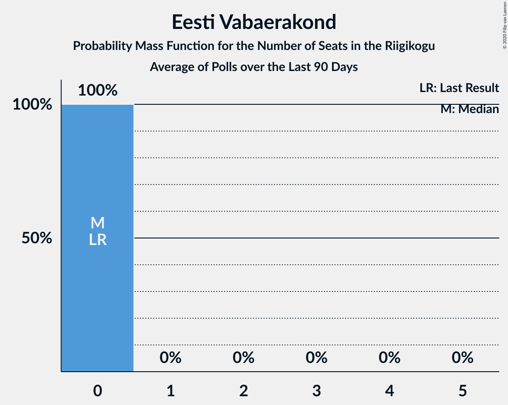

# Eesti Vabaerakond

<a href="#voting-intentions">Voting Intentions</a> | <a href="#seats">Seats</a>

## Voting Intentions

Last result: **1.2%** (General Election of 3 March 2019)

### Confidence Intervals

| Period     | Polling firm/Commissioner(s) | Median | 80% Confidence Interval | 90% Confidence Interval | 95% Confidence Interval | 99% Confidence Interval |
|:----------:|:----------------:|:-----------:|:-----------------------:|:-----------------------:|:-----------------------:|:-----------------------:|
| N/A | [Poll Average](average.html) | 0.4% | 0.2–1.3% | 0.1–1.5% | 0.1–1.7% | 0.1–2.1% |
| [4–10 August 2020](2020-08-10-Norstat.html) | Norstat   MTÜ Ühiskonnauuringute Instituut | 1.1% | 0.8–1.7% | 0.7–1.8% | 0.6–2.0% | 0.5–2.3% |
| [27 July–3 August 2020](2020-08-03-Norstat.html) | Norstat   MTÜ Ühiskonnauuringute Instituut | 0.9% | 0.6–1.4% | 0.5–1.6% | 0.5–1.7% | 0.4–2.0% |
| [21–28 July 2020](2020-07-28-Norstat.html) | Norstat   MTÜ Ühiskonnauuringute Instituut | 0.6% | 0.4–1.1% | 0.3–1.2% | 0.3–1.3% | 0.2–1.6% |
| [16–22 July 2020](2020-07-22-KantarEmor.html) | Kantar Emor   BNS and Postimees | 0.2% | 0.1–0.5% | 0.1–0.6% | 0.1–0.7% | 0.0–0.9% |
| [14–20 July 2020](2020-07-20-Norstat.html) | Norstat   MTÜ Ühiskonnauuringute Instituut | 0.3% | 0.2–0.7% | 0.1–0.8% | 0.1–0.9% | 0.1–1.1% |
| [7–13 July 2020](2020-07-13-Norstat.html) | Norstat   MTÜ Ühiskonnauuringute Instituut | 0.4% | 0.2–0.8% | 0.2–0.9% | 0.2–1.0% | 0.1–1.3% |
| [29–6 July 2020](2020-07-06-Norstat.html) | Norstat   MTÜ Ühiskonnauuringute Instituut | 0.6% | 0.4–1.1% | 0.3–1.2% | 0.3–1.3% | 0.2–1.6% |
| [1–30 June 2020](2020-06-30-KantarEmor.html) | Kantar Emor   BNS and Postimees | 0.2% | 0.1–0.5% | 0.1–0.6% | 0.1–0.7% | 0.0–0.9% |
| [16–22 June 2020](2020-06-22-Norstat.html) | Norstat   MTÜ Ühiskonnauuringute Instituut | 0.9% | 0.6–1.4% | 0.5–1.6% | 0.5–1.7% | 0.4–2.0% |
| [9–16 June 2020](2020-06-16-Norstat.html) | Norstat   MTÜ Ühiskonnauuringute Instituut | 0.4% | 0.2–0.8% | 0.2–0.9% | 0.2–1.0% | 0.1–1.3% |
| [9–15 June 2020](2020-06-15-Turu-uuringuteAS.html) | Turu-uuringute AS   ERR | 0.3% | 0.2–0.7% | 0.1–0.8% | 0.1–0.9% | 0.1–1.1% |
| [1–8 June 2020](2020-06-08-Norstat.html) | Norstat   MTÜ Ühiskonnauuringute Instituut | 0.4% | 0.2–0.8% | 0.2–0.9% | 0.2–1.0% | 0.1–1.3% |
| [25 May–1 June 2020](2020-06-01-Norstat.html) | Norstat   MTÜ Ühiskonnauuringute Instituut | 0.3% | 0.2–0.7% | 0.1–0.8% | 0.1–0.9% | 0.1–1.1% |
| [18–25 May 2020](2020-05-25-Norstat.html) | Norstat   MTÜ Ühiskonnauuringute Instituut | 0.4% | 0.2–0.8% | 0.2–0.9% | 0.2–1.0% | 0.1–1.3% |
| [14–20 May 2020](2020-05-20-KantarEmor.html) | Kantar Emor   BNS and Postimees | 0.2% | 0.1–0.5% | 0.1–0.6% | 0.1–0.7% | 0.0–0.9% |
| [12–18 May 2020](2020-05-18-Norstat.html) | Norstat   MTÜ Ühiskonnauuringute Instituut | 1.1% | 0.8–1.7% | 0.7–1.8% | 0.6–2.0% | 0.5–2.3% |
| [7–15 May 2020](2020-05-15-Turu-uuringuteAS.html) | Turu-uuringute AS   ERR | 0.3% | 0.2–0.7% | 0.1–0.8% | 0.1–0.9% | 0.1–1.1% |
| [6–12 May 2020](2020-05-12-Norstat.html) | Norstat   MTÜ Ühiskonnauuringute Instituut | 0.2% | 0.1–0.5% | 0.1–0.6% | 0.1–0.7% | 0.0–0.9% |
| [24 April–5 May 2020](2020-05-05-Norstat.html) | Norstat   MTÜ Ühiskonnauuringute Instituut | 0.8% | 0.5–1.3% | 0.5–1.4% | 0.4–1.6% | 0.3–1.9% |
| [21–27 April 2020](2020-04-27-Norstat.html) | Norstat   MTÜ Ühiskonnauuringute Instituut | 0.7% | 0.5–1.2% | 0.4–1.3% | 0.3–1.4% | 0.2–1.7% |
| [20–22 April 2020](2020-04-22-KantarEmor.html) | Kantar Emor   BNS and Postimees | 0.2% | 0.1–0.5% | 0.1–0.6% | 0.1–0.7% | 0.0–0.9% |
| [15–20 April 2020](2020-04-20-Norstat.html) | Norstat   MTÜ Ühiskonnauuringute Instituut | 0.2% | 0.1–0.5% | 0.1–0.6% | 0.1–0.7% | 0.0–0.9% |
| [7–14 April 2020](2020-04-14-Norstat.html) | Norstat   MTÜ Ühiskonnauuringute Instituut | 0.4% | 0.2–0.8% | 0.2–0.9% | 0.2–1.0% | 0.1–1.3% |
| [6–7 April 2020](2020-04-07-Turu-uuringuteAS.html) | Turu-uuringute AS   ERR | 1.0% | 0.7–1.5% | 0.6–1.7% | 0.5–1.8% | 0.4–2.1% |
| [31 March–6 April 2020](2020-04-06-Norstat.html) | Norstat   MTÜ Ühiskonnauuringute Instituut | 0.7% | 0.5–1.2% | 0.4–1.3% | 0.3–1.4% | 0.2–1.7% |
| [24–30 March 2020](2020-03-30-Norstat.html) | Norstat   MTÜ Ühiskonnauuringute Instituut | 0.5% | 0.3–0.9% | 0.3–1.1% | 0.2–1.2% | 0.2–1.4% |
| [18–23 March 2020](2020-03-23-Norstat.html) | Norstat   MTÜ Ühiskonnauuringute Instituut | 0.3% | 0.2–0.7% | 0.1–0.8% | 0.1–0.9% | 0.1–1.1% |
| [12–18 March 2020](2020-03-18-KantarEmor.html) | Kantar Emor   BNS and Postimees | 0.3% | 0.2–0.6% | 0.1–0.7% | 0.1–0.8% | 0.0–1.0% |
| [10–16 March 2020](2020-03-16-Turu-uuringuteAS.html) | Turu-uuringute AS   ERR | 1.0% | 0.7–1.6% | 0.7–1.7% | 0.6–1.9% | 0.5–2.1% |
| [10–16 March 2020](2020-03-16-Norstat.html) | Norstat   MTÜ Ühiskonnauuringute Instituut | 0.2% | 0.1–0.5% | 0.1–0.6% | 0.1–0.7% | 0.0–0.9% |
| [4–9 March 2020](2020-03-09-Norstat.html) | Norstat   MTÜ Ühiskonnauuringute Instituut | 0.5% | 0.3–0.9% | 0.3–1.1% | 0.2–1.2% | 0.2–1.4% |
| [26 February–2 March 2020](2020-03-02-Norstat.html) | Norstat   MTÜ Ühiskonnauuringute Instituut | 0.7% | 0.5–1.2% | 0.4–1.3% | 0.3–1.4% | 0.2–1.7% |
| [19–26 February 2020](2020-02-26-Norstat.html) | Norstat   MTÜ Ühiskonnauuringute Instituut | 0.5% | 0.3–0.9% | 0.3–1.1% | 0.2–1.2% | 0.2–1.4% |
| [13–18 February 2020](2020-02-18-Norstat.html) | Norstat   MTÜ Ühiskonnauuringute Instituut | 0.7% | 0.5–1.2% | 0.4–1.3% | 0.3–1.4% | 0.2–1.7% |
| [6–17 February 2020](2020-02-17-Turu-uuringuteAS.html) | Turu-uuringute AS   ERR | 0.0% | N/A | N/A | N/A | N/A |
| [4–11 February 2020](2020-02-11-Norstat.html) | Norstat   MTÜ Ühiskonnauuringute Instituut | 0.5% | 0.3–0.9% | 0.3–1.1% | 0.2–1.2% | 0.2–1.4% |
| [28 January–3 February 2020](2020-02-03-Norstat.html) | Norstat   MTÜ Ühiskonnauuringute Instituut | 0.3% | 0.2–0.7% | 0.1–0.8% | 0.1–0.9% | 0.1–1.1% |
| [1–31 January 2020](2020-01-31-KantarEmor.html) | Kantar Emor | 1.0% | 0.7–1.6% | 0.6–1.8% | 0.5–2.0% | 0.4–2.3% |
| [17–27 January 2020](2020-01-27-Turu-uuringuteAS.html) | Turu-uuringute AS   ERR | 1.0% | 0.7–1.6% | 0.6–1.8% | 0.5–2.0% | 0.4–2.3% |
| [23–27 January 2020](2020-01-27-Norstat.html) | Norstat   MTÜ Ühiskonnauuringute Instituut | 0.4% | 0.2–0.8% | 0.2–0.9% | 0.2–1.0% | 0.1–1.3% |
| [16–24 January 2020](2020-01-24-Norstat.html) | Norstat   MTÜ Ühiskonnauuringute Instituut | 1.1% | 0.8–1.7% | 0.7–1.8% | 0.6–2.0% | 0.5–2.3% |
| [8–14 January 2020](2020-01-14-Norstat.html) | Norstat   MTÜ Ühiskonnauuringute Instituut | 0.6% | 0.4–1.1% | 0.3–1.2% | 0.3–1.3% | 0.2–1.6% |
| [3–7 January 2020](2020-01-07-Norstat.html) | Norstat   MTÜ Ühiskonnauuringute Instituut | 0.6% | 0.4–1.1% | 0.3–1.2% | 0.3–1.3% | 0.2–1.6% |
| [18–23 December 2019](2019-12-23-Norstat.html) | Norstat   MTÜ Ühiskonnauuringute Instituut | 0.9% | 0.6–1.4% | 0.5–1.6% | 0.5–1.7% | 0.4–2.0% |
| [11–17 December 2019](2019-12-17-Norstat.html) | Norstat   MTÜ Ühiskonnauuringute Instituut | 0.1% | 0.0–0.4% | 0.0–0.5% | 0.0–0.6% | 0.0–0.7% |
| [5–12 December 2019](2019-12-12-KantarEmor.html) | Kantar Emor   BNS and Postimees | 0.0% | N/A | N/A | N/A | N/A |
| [28 November–9 December 2019](2019-12-09-Turu-uuringuteAS.html) | Turu-uuringute AS   ERR | 1.0% | 0.7–1.5% | 0.6–1.7% | 0.5–1.8% | 0.4–2.1% |
| [2–9 December 2019](2019-12-09-Norstat.html) | Norstat   MTÜ Ühiskonnauuringute Instituut | 0.4% | 0.2–0.8% | 0.2–0.9% | 0.2–1.0% | 0.1–1.3% |
| [25–29 November 2019](2019-11-29-Norstat.html) | Norstat   MTÜ Ühiskonnauuringute Instituut | 0.5% | 0.3–0.9% | 0.3–1.1% | 0.2–1.2% | 0.2–1.4% |
| [18–25 November 2019](2019-11-25-Norstat.html) | Norstat   MTÜ Ühiskonnauuringute Instituut | 0.5% | 0.3–0.9% | 0.3–1.1% | 0.2–1.2% | 0.2–1.4% |
| [11–15 November 2019](2019-11-15-Norstat.html) | Norstat   MTÜ Ühiskonnauuringute Instituut | 0.1% | 0.0–0.4% | 0.0–0.5% | 0.0–0.6% | 0.0–0.7% |
| [7–13 November 2019](2019-11-13-KantarEmor.html) | Kantar Emor   BNS and Postimees | 1.0% | 0.7–1.4% | 0.7–1.6% | 0.6–1.7% | 0.5–1.9% |
| [31 October–12 November 2019](2019-11-12-Turu-uuringuteAS.html) | Turu-uuringute AS   ERR | 1.1% | 0.8–1.6% | 0.7–1.8% | 0.6–1.9% | 0.5–2.2% |
| [5–11 November 2019](2019-11-11-Norstat.html) | Norstat   MTÜ Ühiskonnauuringute Instituut | 0.2% | 0.1–0.5% | 0.1–0.6% | 0.1–0.7% | 0.0–0.9% |
| [28 October–5 November 2019](2019-11-05-Norstat.html) | Norstat   MTÜ Ühiskonnauuringute Instituut | 0.8% | 0.5–1.3% | 0.5–1.4% | 0.4–1.6% | 0.3–1.9% |
| [22–28 October 2019](2019-10-28-Norstat.html) | Norstat   MTÜ Ühiskonnauuringute Instituut | 0.6% | 0.4–1.1% | 0.3–1.2% | 0.3–1.3% | 0.2–1.6% |
| [15–21 October 2019](2019-10-21-Norstat.html) | Norstat   MTÜ Ühiskonnauuringute Instituut | 0.3% | 0.2–0.7% | 0.1–0.8% | 0.1–0.9% | 0.1–1.1% |
| [10–16 October 2019](2019-10-16-KantarEmor.html) | Kantar Emor   BNS and Postimees | 0.0% | N/A | N/A | N/A | N/A |
| [9–14 October 2019](2019-10-14-Norstat.html) | Norstat   MTÜ Ühiskonnauuringute Instituut | 0.4% | 0.2–0.8% | 0.2–0.9% | 0.2–1.0% | 0.1–1.3% |
| [3–13 October 2019](2019-10-13-Turu-uuringuteAS.html) | Turu-uuringute AS   ERR | 1.0% | 0.7–1.5% | 0.6–1.6% | 0.5–1.8% | 0.4–2.1% |
| [1–8 October 2019](2019-10-08-Norstat.html) | Norstat   MTÜ Ühiskonnauuringute Instituut | 0.6% | 0.4–1.1% | 0.3–1.2% | 0.3–1.3% | 0.2–1.6% |
| [25–30 September 2019](2019-09-30-Norstat.html) | Norstat   MTÜ Ühiskonnauuringute Instituut | 0.6% | 0.4–1.1% | 0.3–1.2% | 0.3–1.3% | 0.2–1.6% |
| [18–23 September 2019](2019-09-23-Norstat.html) | Norstat   MTÜ Ühiskonnauuringute Instituut | 0.6% | 0.4–1.1% | 0.3–1.2% | 0.3–1.3% | 0.2–1.6% |
| [11–19 September 2019](2019-09-19-KantarEmor.html) | Kantar Emor   BNS and Postimees | 0.0% | N/A | N/A | N/A | N/A |
| [10–17 September 2019](2019-09-17-Norstat.html) | Norstat   MTÜ Ühiskonnauuringute Instituut | 0.1% | N/A | N/A | N/A | N/A |
| [5–16 September 2019](2019-09-16-Turu-uuringuteAS.html) | Turu-uuringute AS   ERR | 0.3% | N/A | N/A | N/A | N/A |
| [3–9 September 2019](2019-09-09-Norstat.html) | Norstat   MTÜ Ühiskonnauuringute Instituut | 0.6% | N/A | N/A | N/A | N/A |
| [27 August–2 September 2019](2019-09-02-Norstat.html) | Norstat   MTÜ Ühiskonnauuringute Instituut | 0.2% | N/A | N/A | N/A | N/A |
| [21–26 August 2019](2019-08-26-Norstat.html) | Norstat   MTÜ Ühiskonnauuringute Instituut | 0.8% | N/A | N/A | N/A | N/A |
| [15–21 August 2019](2019-08-21-KantarEmor.html) | Kantar Emor   BNS and Postimees | 0.9% | N/A | N/A | N/A | N/A |
| [9–20 August 2019](2019-08-20-Turu-uuringuteAS.html) | Turu-uuringute AS   ERR | 1.0% | N/A | N/A | N/A | N/A |
| [13–19 August 2019](2019-08-19-Norstat.html) | Norstat   MTÜ Ühiskonnauuringute Instituut | 0.7% | N/A | N/A | N/A | N/A |
| [5–12 August 2019](2019-08-12-Norstat.html) | Norstat   MTÜ Ühiskonnauuringute Instituut | 0.3% | N/A | N/A | N/A | N/A |
| [30 July–5 August 2019](2019-08-05-Norstat.html) | Norstat   MTÜ Ühiskonnauuringute Instituut | 0.8% | N/A | N/A | N/A | N/A |
| [22–30 July 2019](2019-07-30-Norstat.html) | Norstat   MTÜ Ühiskonnauuringute Instituut | 0.6% | N/A | N/A | N/A | N/A |
| [18–24 July 2019](2019-07-24-KantarEmor.html) | Kantar Emor   BNS and Postimees | 0.0% | N/A | N/A | N/A | N/A |
| [15–22 July 2019](2019-07-22-Norstat.html) | Norstat   MTÜ Ühiskonnauuringute Instituut | 0.2% | N/A | N/A | N/A | N/A |
| [8–15 July 2019](2019-07-15-Norstat.html) | Norstat   MTÜ Ühiskonnauuringute Instituut | 1.1% | N/A | N/A | N/A | N/A |
| [2–8 July 2019](2019-07-08-Norstat.html) | Norstat   MTÜ Ühiskonnauuringute Instituut | 0.9% | N/A | N/A | N/A | N/A |
| [26 June–1 July 2019](2019-07-01-Norstat.html) | Norstat   MTÜ Ühiskonnauuringute Instituut | 0.2% | N/A | N/A | N/A | N/A |
| [11–19 June 2019](2019-06-19-Norstat.html) | Norstat   MTÜ Ühiskonnauuringute Instituut | 0.3% | N/A | N/A | N/A | N/A |
| [6–13 June 2019](2019-06-13-KantarEmor.html) | Kantar Emor   BNS and Postimees | 0.0% | N/A | N/A | N/A | N/A |
| [4–11 June 2019](2019-06-11-Norstat.html) | Norstat   MTÜ Ühiskonnauuringute Instituut | 1.4% | N/A | N/A | N/A | N/A |
| [28 May–10 June 2019](2019-06-10-Turu-uuringuteAS.html) | Turu-uuringute AS   ERR | 1.0% | N/A | N/A | N/A | N/A |
| [27 May–3 June 2019](2019-06-03-Norstat.html) | Norstat   MTÜ Ühiskonnauuringute Instituut | 0.3% | N/A | N/A | N/A | N/A |
| [20–27 May 2019](2019-05-27-Norstat.html) | Norstat   MTÜ Ühiskonnauuringute Instituut | 0.4% | N/A | N/A | N/A | N/A |
| [14–20 May 2019](2019-05-20-Norstat.html) | Norstat   MTÜ Ühiskonnauuringute Instituut | 0.7% | N/A | N/A | N/A | N/A |
| [6–13 May 2019](2019-05-13-Norstat.html) | Norstat   MTÜ Ühiskonnauuringute Instituut | 0.3% | N/A | N/A | N/A | N/A |
| [7–9 May 2019](2019-05-09-KantarEmor.html) | Kantar Emor   BNS and Postimees | 0.2% | N/A | N/A | N/A | N/A |
| [29 April–7 May 2019](2019-05-07-Norstat.html) | Norstat   MTÜ Ühiskonnauuringute Instituut | 0.5% | N/A | N/A | N/A | N/A |
| [22–29 April 2019](2019-04-29-Norstat.html) | Norstat   MTÜ Ühiskonnauuringute Instituut | 0.3% | N/A | N/A | N/A | N/A |
| [15–22 April 2019](2019-04-22-Norstat.html) | Norstat   MTÜ Ühiskonnauuringute Instituut | 0.7% | N/A | N/A | N/A | N/A |
| [2–15 April 2019](2019-04-15-Turu-uuringuteAS.html) | Turu-uuringute AS   ERR | 1.0% | N/A | N/A | N/A | N/A |
| [8–15 April 2019](2019-04-15-Norstat.html) | Norstat   MTÜ Ühiskonnauuringute Instituut | 0.3% | N/A | N/A | N/A | N/A |
| [10–15 April 2019](2019-04-15-KantarEmor.html) | Kantar Emor   BNS and Postimees | 1.1% | N/A | N/A | N/A | N/A |
| [1–8 April 2019](2019-04-08-Norstat.html) | Norstat   MTÜ Ühiskonnauuringute Instituut | 0.5% | N/A | N/A | N/A | N/A |
| [25–29 March 2019](2019-03-29-Norstat.html) | Norstat   MTÜ Ühiskonnauuringute Instituut | 0.6% | N/A | N/A | N/A | N/A |
| [18–24 March 2019](2019-03-24-Norstat.html) | Norstat   MTÜ Ühiskonnauuringute Instituut | 0.9% | N/A | N/A | N/A | N/A |
| [14–21 March 2019](2019-03-21-KantarEmor.html) | Kantar Emor   BNS and Postimees | 0.3% | N/A | N/A | N/A | N/A |
| [5–18 March 2019](2019-03-18-Turu-uuringuteAS.html) | Turu-uuringute AS   ERR | 1.0% | N/A | N/A | N/A | N/A |
| [11–15 March 2019](2019-03-15-Norstat.html) | Norstat   MTÜ Ühiskonnauuringute Instituut | 0.6% | N/A | N/A | N/A | N/A |
| [12–13 March 2019](2019-03-13-KantarEmor.html) | Kantar Emor   BNS and Postimees | 0.5% | N/A | N/A | N/A | N/A |
| [5–11 March 2019](2019-03-11-Norstat.html) | Norstat   MTÜ Ühiskonnauuringute Instituut | 1.1% | N/A | N/A | N/A | N/A |

### Probability Mass Function

The following table shows the probability mass function per percentage block of voting intentions for the [poll average](average.html) for Eesti Vabaerakond.

| Voting Intentions | Probability | Accumulated | Special Marks |
|:-----------------:|:-----------:|:-----------:|:-------------:|
| 0.0–0.5% | 58% | 100% | Median |
| 0.5–1.5% | 37% | 42% | Last Result |
| 1.5–2.5% | 5% | 5% |  |
| 2.5–3.5% | 0% | 0% |  |

## Seats

Last result: **0** seats (General Election of 3 March 2019)

### Confidence Intervals

| Period     | Polling firm/Commissioner(s) | Median | 80% Confidence Interval | 90% Confidence Interval | 95% Confidence Interval | 99% Confidence Interval |
|:----------:|:----------------:|:------:|:-----------------------:|:-----------------------:|:-----------------------:|:-----------------------:|
| N/A | [Poll Average](average.html) | 0 | 0 | 0 | 0 | 0 |
| [4–10 August 2020](2020-08-10-Norstat.html) | Norstat   MTÜ Ühiskonnauuringute Instituut | 0 | 0 | 0 | 0 | 0 |
| [27 July–3 August 2020](2020-08-03-Norstat.html) | Norstat   MTÜ Ühiskonnauuringute Instituut | 0 | 0 | 0 | 0 | 0 |
| [21–28 July 2020](2020-07-28-Norstat.html) | Norstat   MTÜ Ühiskonnauuringute Instituut | 0 | 0 | 0 | 0 | 0 |
| [16–22 July 2020](2020-07-22-KantarEmor.html) | Kantar Emor   BNS and Postimees | 0 | 0 | 0 | 0 | 0 |
| [14–20 July 2020](2020-07-20-Norstat.html) | Norstat   MTÜ Ühiskonnauuringute Instituut | 0 | 0 | 0 | 0 | 0 |
| [7–13 July 2020](2020-07-13-Norstat.html) | Norstat   MTÜ Ühiskonnauuringute Instituut | 0 | 0 | 0 | 0 | 0 |
| [29–6 July 2020](2020-07-06-Norstat.html) | Norstat   MTÜ Ühiskonnauuringute Instituut | 0 | 0 | 0 | 0 | 0 |
| [1–30 June 2020](2020-06-30-KantarEmor.html) | Kantar Emor   BNS and Postimees | 0 | 0 | 0 | 0 | 0 |
| [16–22 June 2020](2020-06-22-Norstat.html) | Norstat   MTÜ Ühiskonnauuringute Instituut | 0 | 0 | 0 | 0 | 0 |
| [9–16 June 2020](2020-06-16-Norstat.html) | Norstat   MTÜ Ühiskonnauuringute Instituut | 0 | 0 | 0 | 0 | 0 |
| [9–15 June 2020](2020-06-15-Turu-uuringuteAS.html) | Turu-uuringute AS   ERR | 0 | 0 | 0 | 0 | 0 |
| [1–8 June 2020](2020-06-08-Norstat.html) | Norstat   MTÜ Ühiskonnauuringute Instituut | 0 | 0 | 0 | 0 | 0 |
| [25 May–1 June 2020](2020-06-01-Norstat.html) | Norstat   MTÜ Ühiskonnauuringute Instituut | 0 | 0 | 0 | 0 | 0 |
| [18–25 May 2020](2020-05-25-Norstat.html) | Norstat   MTÜ Ühiskonnauuringute Instituut | 0 | 0 | 0 | 0 | 0 |
| [14–20 May 2020](2020-05-20-KantarEmor.html) | Kantar Emor   BNS and Postimees | 0 | 0 | 0 | 0 | 0 |
| [12–18 May 2020](2020-05-18-Norstat.html) | Norstat   MTÜ Ühiskonnauuringute Instituut | 0 | 0 | 0 | 0 | 0 |
| [7–15 May 2020](2020-05-15-Turu-uuringuteAS.html) | Turu-uuringute AS   ERR | 0 | 0 | 0 | 0 | 0 |
| [6–12 May 2020](2020-05-12-Norstat.html) | Norstat   MTÜ Ühiskonnauuringute Instituut | 0 | 0 | 0 | 0 | 0 |
| [24 April–5 May 2020](2020-05-05-Norstat.html) | Norstat   MTÜ Ühiskonnauuringute Instituut | 0 | 0 | 0 | 0 | 0 |
| [21–27 April 2020](2020-04-27-Norstat.html) | Norstat   MTÜ Ühiskonnauuringute Instituut | 0 | 0 | 0 | 0 | 0 |
| [20–22 April 2020](2020-04-22-KantarEmor.html) | Kantar Emor   BNS and Postimees | 0 | 0 | 0 | 0 | 0 |
| [15–20 April 2020](2020-04-20-Norstat.html) | Norstat   MTÜ Ühiskonnauuringute Instituut | 0 | 0 | 0 | 0 | 0 |
| [7–14 April 2020](2020-04-14-Norstat.html) | Norstat   MTÜ Ühiskonnauuringute Instituut | 0 | 0 | 0 | 0 | 0 |
| [6–7 April 2020](2020-04-07-Turu-uuringuteAS.html) | Turu-uuringute AS   ERR | 0 | 0 | 0 | 0 | 0 |
| [31 March–6 April 2020](2020-04-06-Norstat.html) | Norstat   MTÜ Ühiskonnauuringute Instituut | 0 | 0 | 0 | 0 | 0 |
| [24–30 March 2020](2020-03-30-Norstat.html) | Norstat   MTÜ Ühiskonnauuringute Instituut | 0 | 0 | 0 | 0 | 0 |
| [18–23 March 2020](2020-03-23-Norstat.html) | Norstat   MTÜ Ühiskonnauuringute Instituut | 0 | 0 | 0 | 0 | 0 |
| [12–18 March 2020](2020-03-18-KantarEmor.html) | Kantar Emor   BNS and Postimees | 0 | 0 | 0 | 0 | 0 |
| [10–16 March 2020](2020-03-16-Turu-uuringuteAS.html) | Turu-uuringute AS   ERR | 0 | 0 | 0 | 0 | 0 |
| [10–16 March 2020](2020-03-16-Norstat.html) | Norstat   MTÜ Ühiskonnauuringute Instituut | 0 | 0 | 0 | 0 | 0 |
| [4–9 March 2020](2020-03-09-Norstat.html) | Norstat   MTÜ Ühiskonnauuringute Instituut | 0 | 0 | 0 | 0 | 0 |
| [26 February–2 March 2020](2020-03-02-Norstat.html) | Norstat   MTÜ Ühiskonnauuringute Instituut | 0 | 0 | 0 | 0 | 0 |
| [19–26 February 2020](2020-02-26-Norstat.html) | Norstat   MTÜ Ühiskonnauuringute Instituut | 0 | 0 | 0 | 0 | 0 |
| [13–18 February 2020](2020-02-18-Norstat.html) | Norstat   MTÜ Ühiskonnauuringute Instituut | 0 | 0 | 0 | 0 | 0 |
| [6–17 February 2020](2020-02-17-Turu-uuringuteAS.html) | Turu-uuringute AS   ERR |  |  |  |  |  |
| [4–11 February 2020](2020-02-11-Norstat.html) | Norstat   MTÜ Ühiskonnauuringute Instituut | 0 | 0 | 0 | 0 | 0 |
| [28 January–3 February 2020](2020-02-03-Norstat.html) | Norstat   MTÜ Ühiskonnauuringute Instituut | 0 | 0 | 0 | 0 | 0 |
| [1–31 January 2020](2020-01-31-KantarEmor.html) | Kantar Emor | 0 | 0 | 0 | 0 | 0 |
| [17–27 January 2020](2020-01-27-Turu-uuringuteAS.html) | Turu-uuringute AS   ERR | 0 | 0 | 0 | 0 | 0 |
| [23–27 January 2020](2020-01-27-Norstat.html) | Norstat   MTÜ Ühiskonnauuringute Instituut | 0 | 0 | 0 | 0 | 0 |
| [16–24 January 2020](2020-01-24-Norstat.html) | Norstat   MTÜ Ühiskonnauuringute Instituut | 0 | 0 | 0 | 0 | 0 |
| [8–14 January 2020](2020-01-14-Norstat.html) | Norstat   MTÜ Ühiskonnauuringute Instituut | 0 | 0 | 0 | 0 | 0 |
| [3–7 January 2020](2020-01-07-Norstat.html) | Norstat   MTÜ Ühiskonnauuringute Instituut | 0 | 0 | 0 | 0 | 0 |
| [18–23 December 2019](2019-12-23-Norstat.html) | Norstat   MTÜ Ühiskonnauuringute Instituut | 0 | 0 | 0 | 0 | 0 |
| [11–17 December 2019](2019-12-17-Norstat.html) | Norstat   MTÜ Ühiskonnauuringute Instituut | 0 | 0 | 0 | 0 | 0 |
| [5–12 December 2019](2019-12-12-KantarEmor.html) | Kantar Emor   BNS and Postimees |  |  |  |  |  |
| [28 November–9 December 2019](2019-12-09-Turu-uuringuteAS.html) | Turu-uuringute AS   ERR | 0 | 0 | 0 | 0 | 0 |
| [2–9 December 2019](2019-12-09-Norstat.html) | Norstat   MTÜ Ühiskonnauuringute Instituut | 0 | 0 | 0 | 0 | 0 |
| [25–29 November 2019](2019-11-29-Norstat.html) | Norstat   MTÜ Ühiskonnauuringute Instituut | 0 | 0 | 0 | 0 | 0 |
| [18–25 November 2019](2019-11-25-Norstat.html) | Norstat   MTÜ Ühiskonnauuringute Instituut | 0 | 0 | 0 | 0 | 0 |
| [11–15 November 2019](2019-11-15-Norstat.html) | Norstat   MTÜ Ühiskonnauuringute Instituut | 0 | 0 | 0 | 0 | 0 |
| [7–13 November 2019](2019-11-13-KantarEmor.html) | Kantar Emor   BNS and Postimees | 0 | 0 | 0 | 0 | 0 |
| [31 October–12 November 2019](2019-11-12-Turu-uuringuteAS.html) | Turu-uuringute AS   ERR | 0 | 0 | 0 | 0 | 0 |
| [5–11 November 2019](2019-11-11-Norstat.html) | Norstat   MTÜ Ühiskonnauuringute Instituut | 0 | 0 | 0 | 0 | 0 |
| [28 October–5 November 2019](2019-11-05-Norstat.html) | Norstat   MTÜ Ühiskonnauuringute Instituut | 0 | 0 | 0 | 0 | 0 |
| [22–28 October 2019](2019-10-28-Norstat.html) | Norstat   MTÜ Ühiskonnauuringute Instituut | 0 | 0 | 0 | 0 | 0 |
| [15–21 October 2019](2019-10-21-Norstat.html) | Norstat   MTÜ Ühiskonnauuringute Instituut | 0 | 0 | 0 | 0 | 0 |
| [10–16 October 2019](2019-10-16-KantarEmor.html) | Kantar Emor   BNS and Postimees |  |  |  |  |  |
| [9–14 October 2019](2019-10-14-Norstat.html) | Norstat   MTÜ Ühiskonnauuringute Instituut | 0 | 0 | 0 | 0 | 0 |
| [3–13 October 2019](2019-10-13-Turu-uuringuteAS.html) | Turu-uuringute AS   ERR | 0 | 0 | 0 | 0 | 0 |
| [1–8 October 2019](2019-10-08-Norstat.html) | Norstat   MTÜ Ühiskonnauuringute Instituut | 0 | 0 | 0 | 0 | 0 |
| [25–30 September 2019](2019-09-30-Norstat.html) | Norstat   MTÜ Ühiskonnauuringute Instituut | 0 | 0 | 0 | 0 | 0 |
| [18–23 September 2019](2019-09-23-Norstat.html) | Norstat   MTÜ Ühiskonnauuringute Instituut | 0 | 0 | 0 | 0 | 0 |
| [11–19 September 2019](2019-09-19-KantarEmor.html) | Kantar Emor   BNS and Postimees |  |  |  |  |  |
| [10–17 September 2019](2019-09-17-Norstat.html) | Norstat   MTÜ Ühiskonnauuringute Instituut |  |  |  |  |  |
| [5–16 September 2019](2019-09-16-Turu-uuringuteAS.html) | Turu-uuringute AS   ERR |  |  |  |  |  |
| [3–9 September 2019](2019-09-09-Norstat.html) | Norstat   MTÜ Ühiskonnauuringute Instituut |  |  |  |  |  |
| [27 August–2 September 2019](2019-09-02-Norstat.html) | Norstat   MTÜ Ühiskonnauuringute Instituut |  |  |  |  |  |
| [21–26 August 2019](2019-08-26-Norstat.html) | Norstat   MTÜ Ühiskonnauuringute Instituut |  |  |  |  |  |
| [15–21 August 2019](2019-08-21-KantarEmor.html) | Kantar Emor   BNS and Postimees |  |  |  |  |  |
| [9–20 August 2019](2019-08-20-Turu-uuringuteAS.html) | Turu-uuringute AS   ERR |  |  |  |  |  |
| [13–19 August 2019](2019-08-19-Norstat.html) | Norstat   MTÜ Ühiskonnauuringute Instituut |  |  |  |  |  |
| [5–12 August 2019](2019-08-12-Norstat.html) | Norstat   MTÜ Ühiskonnauuringute Instituut |  |  |  |  |  |
| [30 July–5 August 2019](2019-08-05-Norstat.html) | Norstat   MTÜ Ühiskonnauuringute Instituut |  |  |  |  |  |
| [22–30 July 2019](2019-07-30-Norstat.html) | Norstat   MTÜ Ühiskonnauuringute Instituut |  |  |  |  |  |
| [18–24 July 2019](2019-07-24-KantarEmor.html) | Kantar Emor   BNS and Postimees |  |  |  |  |  |
| [15–22 July 2019](2019-07-22-Norstat.html) | Norstat   MTÜ Ühiskonnauuringute Instituut |  |  |  |  |  |
| [8–15 July 2019](2019-07-15-Norstat.html) | Norstat   MTÜ Ühiskonnauuringute Instituut |  |  |  |  |  |
| [2–8 July 2019](2019-07-08-Norstat.html) | Norstat   MTÜ Ühiskonnauuringute Instituut |  |  |  |  |  |
| [26 June–1 July 2019](2019-07-01-Norstat.html) | Norstat   MTÜ Ühiskonnauuringute Instituut |  |  |  |  |  |
| [11–19 June 2019](2019-06-19-Norstat.html) | Norstat   MTÜ Ühiskonnauuringute Instituut |  |  |  |  |  |
| [6–13 June 2019](2019-06-13-KantarEmor.html) | Kantar Emor   BNS and Postimees |  |  |  |  |  |
| [4–11 June 2019](2019-06-11-Norstat.html) | Norstat   MTÜ Ühiskonnauuringute Instituut |  |  |  |  |  |
| [28 May–10 June 2019](2019-06-10-Turu-uuringuteAS.html) | Turu-uuringute AS   ERR |  |  |  |  |  |
| [27 May–3 June 2019](2019-06-03-Norstat.html) | Norstat   MTÜ Ühiskonnauuringute Instituut |  |  |  |  |  |
| [20–27 May 2019](2019-05-27-Norstat.html) | Norstat   MTÜ Ühiskonnauuringute Instituut |  |  |  |  |  |
| [14–20 May 2019](2019-05-20-Norstat.html) | Norstat   MTÜ Ühiskonnauuringute Instituut |  |  |  |  |  |
| [6–13 May 2019](2019-05-13-Norstat.html) | Norstat   MTÜ Ühiskonnauuringute Instituut |  |  |  |  |  |
| [7–9 May 2019](2019-05-09-KantarEmor.html) | Kantar Emor   BNS and Postimees |  |  |  |  |  |
| [29 April–7 May 2019](2019-05-07-Norstat.html) | Norstat   MTÜ Ühiskonnauuringute Instituut |  |  |  |  |  |
| [22–29 April 2019](2019-04-29-Norstat.html) | Norstat   MTÜ Ühiskonnauuringute Instituut |  |  |  |  |  |
| [15–22 April 2019](2019-04-22-Norstat.html) | Norstat   MTÜ Ühiskonnauuringute Instituut |  |  |  |  |  |
| [2–15 April 2019](2019-04-15-Turu-uuringuteAS.html) | Turu-uuringute AS   ERR |  |  |  |  |  |
| [8–15 April 2019](2019-04-15-Norstat.html) | Norstat   MTÜ Ühiskonnauuringute Instituut |  |  |  |  |  |
| [10–15 April 2019](2019-04-15-KantarEmor.html) | Kantar Emor   BNS and Postimees |  |  |  |  |  |
| [1–8 April 2019](2019-04-08-Norstat.html) | Norstat   MTÜ Ühiskonnauuringute Instituut |  |  |  |  |  |
| [25–29 March 2019](2019-03-29-Norstat.html) | Norstat   MTÜ Ühiskonnauuringute Instituut |  |  |  |  |  |
| [18–24 March 2019](2019-03-24-Norstat.html) | Norstat   MTÜ Ühiskonnauuringute Instituut |  |  |  |  |  |
| [14–21 March 2019](2019-03-21-KantarEmor.html) | Kantar Emor   BNS and Postimees |  |  |  |  |  |
| [5–18 March 2019](2019-03-18-Turu-uuringuteAS.html) | Turu-uuringute AS   ERR |  |  |  |  |  |
| [11–15 March 2019](2019-03-15-Norstat.html) | Norstat   MTÜ Ühiskonnauuringute Instituut |  |  |  |  |  |
| [12–13 March 2019](2019-03-13-KantarEmor.html) | Kantar Emor   BNS and Postimees |  |  |  |  |  |
| [5–11 March 2019](2019-03-11-Norstat.html) | Norstat   MTÜ Ühiskonnauuringute Instituut |  |  |  |  |  |

### Probability Mass Function

The following table shows the probability mass function per seat for the [poll average](average.html) for Eesti Vabaerakond.

| Number of Seats | Probability | Accumulated | Special Marks |
|:---------------:|:-----------:|:-----------:|:-------------:|
| 0 | 100% | 100% | Last Result, Median |

