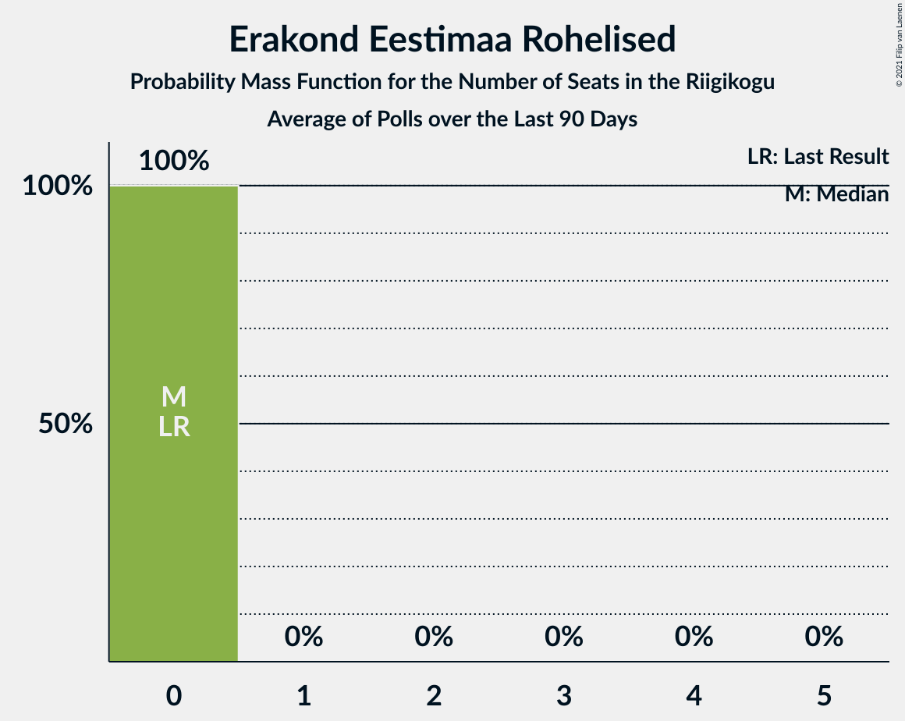

# Erakond Eestimaa Rohelised

<a href="#voting-intentions">Voting Intentions</a> | <a href="#seats">Seats</a>

## Voting Intentions

Last result: **1.8%** (General Election of 3 March 2019)

### Confidence Intervals

| Period     | Polling firm/Commissioner(s) | Median | 80% Confidence Interval | 90% Confidence Interval | 95% Confidence Interval | 99% Confidence Interval |
|:----------:|:----------------:|:-----------:|:-----------------------:|:-----------------------:|:-----------------------:|:-----------------------:|
| N/A | [Poll Average](average.html) | 1.6% | 0.9–3.3% | 0.7–3.5% | 0.6–3.7% | 0.4–4.1% |
| [6–12 December 2022](2022-12-12-Norstat.html) | Norstat   MTÜ Ühiskonnauuringute Instituut | 1.4% | 1.0–2.0% | 0.9–2.2% | 0.8–2.3% | 0.7–2.7% |
| [29 November–5 December 2022](2022-12-05-Norstat.html) | Norstat   MTÜ Ühiskonnauuringute Instituut | 1.6% | 1.2–2.2% | 1.1–2.4% | 1.0–2.6% | 0.8–2.9% |
| [22–28 November 2022](2022-11-28-Norstat.html) | Norstat   MTÜ Ühiskonnauuringute Instituut | 1.5% | 1.1–2.1% | 1.0–2.3% | 0.9–2.5% | 0.7–2.8% |
| [15–21 November 2022](2022-11-21-Norstat.html) | Norstat   MTÜ Ühiskonnauuringute Instituut | 1.2% | 0.9–1.8% | 0.8–1.9% | 0.7–2.1% | 0.5–2.4% |
| [10–17 November 2022](2022-11-17-KantarEmor.html) | Kantar Emor   ERR | 3.0% | 2.5–3.6% | 2.3–3.8% | 2.2–4.0% | 2.0–4.3% |
| [8–14 November 2022](2022-11-14-Norstat.html) | Norstat   MTÜ Ühiskonnauuringute Instituut | 1.1% | 0.8–1.7% | 0.7–1.8% | 0.6–2.0% | 0.5–2.3% |
| [1–6 November 2022](2022-11-06-Norstat.html) | Norstat   MTÜ Ühiskonnauuringute Instituut | 1.3% | 0.9–1.9% | 0.8–2.1% | 0.8–2.2% | 0.6–2.5% |
| [26–31 October 2022](2022-10-31-Norstat.html) | Norstat   MTÜ Ühiskonnauuringute Instituut | 1.0% | 0.7–1.5% | 0.6–1.7% | 0.5–1.8% | 0.4–2.1% |
| [18–25 October 2022](2022-10-25-Norstat.html) | Norstat   MTÜ Ühiskonnauuringute Instituut | 0.5% | 0.3–0.9% | 0.3–1.1% | 0.2–1.2% | 0.2–1.4% |
| [13–19 October 2022](2022-10-19-KantarEmor.html) | Kantar Emor   ERR | 2.0% | 1.6–2.6% | 1.5–2.8% | 1.4–2.9% | 1.3–3.2% |
| [11–17 October 2022](2022-10-17-Norstat.html) | Norstat   MTÜ Ühiskonnauuringute Instituut | 1.7% | 1.3–2.4% | 1.2–2.5% | 1.1–2.7% | 0.9–3.1% |
| [12 October 2022](2022-10-12-Turu-uuringuteAS.html) | Turu-uuringute AS | 1.0% | 0.6–1.8% | 0.5–2.0% | 0.5–2.2% | 0.3–2.6% |
| [4–10 October 2022](2022-10-10-Norstat.html) | Norstat   MTÜ Ühiskonnauuringute Instituut | 1.7% | 1.3–2.4% | 1.2–2.5% | 1.1–2.7% | 0.9–3.1% |
| [27 September–3 October 2022](2022-10-03-Norstat.html) | Norstat   MTÜ Ühiskonnauuringute Instituut | 1.4% | 1.0–2.0% | 0.9–2.2% | 0.8–2.3% | 0.7–2.7% |
| [20–26 September 2022](2022-09-26-Norstat.html) | Norstat   MTÜ Ühiskonnauuringute Instituut | 1.5% | 1.1–2.1% | 1.0–2.3% | 0.9–2.5% | 0.7–2.8% |
| [13–19 September 2022](2022-09-19-Norstat.html) | Norstat   MTÜ Ühiskonnauuringute Instituut | 1.2% | 0.9–1.8% | 0.8–1.9% | 0.7–2.1% | 0.5–2.4% |
| [16 September 2022](2022-09-16-Turu-uuringuteAS.html) | Turu-uuringute AS | 2.0% | 1.4–3.1% | 1.2–3.4% | 1.1–3.6% | 0.9–4.2% |
| [8–14 September 2022](2022-09-14-KantarEmor.html) | Kantar Emor   ERR | 3.0% | 2.5–3.7% | 2.3–3.9% | 2.2–4.0% | 2.0–4.4% |
| [6–12 September 2022](2022-09-12-Norstat.html) | Norstat   MTÜ Ühiskonnauuringute Instituut | 1.7% | 1.3–2.4% | 1.2–2.5% | 1.1–2.7% | 0.9–3.1% |
| [27 August–5 September 2022](2022-09-05-Norstat.html) | Norstat   MTÜ Ühiskonnauuringute Instituut | 2.1% | 1.6–2.8% | 1.5–3.0% | 1.4–3.2% | 1.2–3.6% |
| [23–29 August 2022](2022-08-29-Norstat.html) | Norstat   MTÜ Ühiskonnauuringute Instituut | 1.5% | 1.1–2.1% | 1.0–2.3% | 0.9–2.5% | 0.7–2.8% |
| [25 August 2022](2022-08-25-Turu-uuringuteAS.html) | Turu-uuringute AS | 2.0% | 1.4–3.0% | 1.3–3.2% | 1.1–3.5% | 0.9–4.0% |
| [16–22 August 2022](2022-08-22-Norstat.html) | Norstat   MTÜ Ühiskonnauuringute Instituut | 2.2% | 1.7–2.9% | 1.6–3.1% | 1.4–3.3% | 1.2–3.7% |
| [11–22 August 2022](2022-08-22-KantarEmor.html) | Kantar Emor   ERR | 2.0% | 1.6–2.6% | 1.5–2.8% | 1.4–2.9% | 1.3–3.2% |
| [9–15 August 2022](2022-08-15-Norstat.html) | Norstat   MTÜ Ühiskonnauuringute Instituut | 1.0% | 0.7–1.5% | 0.6–1.7% | 0.5–1.8% | 0.4–2.1% |
| [2–8 August 2022](2022-08-08-Norstat.html) | Norstat   MTÜ Ühiskonnauuringute Instituut | 1.1% | 0.8–1.7% | 0.7–1.8% | 0.6–2.0% | 0.5–2.3% |
| [25 July–1 August 2022](2022-08-01-Norstat.html) | Norstat   MTÜ Ühiskonnauuringute Instituut | 1.7% | 1.3–2.4% | 1.2–2.5% | 1.1–2.7% | 0.9–3.1% |
| [19–25 July 2022](2022-07-25-Norstat.html) | Norstat   MTÜ Ühiskonnauuringute Instituut | 1.7% | 1.3–2.4% | 1.2–2.5% | 1.1–2.7% | 0.9–3.1% |
| [14–20 July 2022](2022-07-20-KantarEmor.html) | Kantar Emor   ERR | 3.0% | 2.5–3.6% | 2.4–3.8% | 2.2–4.0% | 2.0–4.3% |
| [12–18 July 2022](2022-07-18-Norstat.html) | Norstat   MTÜ Ühiskonnauuringute Instituut | 1.7% | 1.3–2.4% | 1.2–2.5% | 1.1–2.7% | 0.9–3.1% |
| [5–11 July 2022](2022-07-11-Norstat.html) | Norstat   MTÜ Ühiskonnauuringute Instituut | 1.8% | 1.4–2.5% | 1.2–2.7% | 1.1–2.8% | 1.0–3.2% |
| [27 June–4 July 2022](2022-07-04-Norstat.html) | Norstat   MTÜ Ühiskonnauuringute Instituut | 1.6% | 1.2–2.2% | 1.1–2.4% | 1.0–2.6% | 0.8–2.9% |
| [14–20 June 2022](2022-06-20-Norstat.html) | Norstat   MTÜ Ühiskonnauuringute Instituut | 2.1% | 1.6–2.8% | 1.5–3.0% | 1.4–3.2% | 1.2–3.6% |
| [17 June 2022](2022-06-17-Turu-uuringuteAS.html) | Turu-uuringute AS | 1.0% | 0.6–1.8% | 0.5–2.0% | 0.5–2.2% | 0.3–2.6% |
| [9–14 June 2022](2022-06-14-KantarEmor.html) | Kantar Emor   ERR | 3.0% | 2.5–3.6% | 2.4–3.8% | 2.2–4.0% | 2.0–4.3% |
| [7–13 June 2022](2022-06-13-Norstat.html) | Norstat   MTÜ Ühiskonnauuringute Instituut | 1.8% | 1.4–2.5% | 1.2–2.7% | 1.1–2.8% | 1.0–3.2% |
| [1–6 June 2022](2022-06-06-Norstat.html) | Norstat   MTÜ Ühiskonnauuringute Instituut | 2.0% | 1.5–2.7% | 1.4–2.9% | 1.3–3.1% | 1.1–3.4% |
| [24–30 May 2022](2022-05-30-Norstat.html) | Norstat   MTÜ Ühiskonnauuringute Instituut | 0.7% | 0.5–1.2% | 0.4–1.3% | 0.3–1.4% | 0.2–1.7% |
| [16–23 May 2022](2022-05-23-Norstat.html) | Norstat   MTÜ Ühiskonnauuringute Instituut | 2.1% | 1.6–2.8% | 1.5–3.0% | 1.4–3.2% | 1.2–3.6% |
| [12–20 May 2022](2022-05-20-KantarEmor.html) | Kantar Emor   ERR | 3.0% | 2.5–3.7% | 2.4–3.9% | 2.2–4.0% | 2.0–4.4% |
| [19 May 2022](2022-05-19-Turu-uuringuteAS.html) | Turu-uuringute AS | 2.0% | N/A | N/A | N/A | N/A |
| [10–16 May 2022](2022-05-16-Norstat.html) | Norstat   MTÜ Ühiskonnauuringute Instituut | 2.1% | 1.6–2.8% | 1.5–3.0% | 1.4–3.2% | 1.2–3.6% |
| [4–9 May 2022](2022-05-09-Norstat.html) | Norstat   MTÜ Ühiskonnauuringute Instituut | 2.1% | 1.6–2.8% | 1.5–3.0% | 1.4–3.2% | 1.2–3.6% |
| [26 April–2 May 2022](2022-05-02-Norstat.html) | Norstat   MTÜ Ühiskonnauuringute Instituut | 0.8% | 0.5–1.3% | 0.5–1.4% | 0.4–1.6% | 0.3–1.9% |
| [19–25 April 2022](2022-04-25-Norstat.html) | Norstat   MTÜ Ühiskonnauuringute Instituut | 2.0% | 1.5–2.7% | 1.4–2.9% | 1.3–3.1% | 1.1–3.4% |
| [14–20 April 2022](2022-04-20-KantarEmor.html) | Kantar Emor   ERR | 4.0% | 3.4–4.8% | 3.3–5.0% | 3.1–5.1% | 2.9–5.5% |
| [18 April 2022](2022-04-18-Turu-uuringuteAS.html) | Turu-uuringute AS | 2.0% | 1.4–3.0% | 1.3–3.2% | 1.1–3.5% | 0.9–4.0% |
| [12–18 April 2022](2022-04-18-Norstat.html) | Norstat   MTÜ Ühiskonnauuringute Instituut | 2.1% | 1.6–2.8% | 1.5–3.0% | 1.4–3.2% | 1.2–3.6% |
| [6–11 April 2022](2022-04-11-Norstat.html) | Norstat   MTÜ Ühiskonnauuringute Instituut | 2.1% | 1.6–2.8% | 1.5–3.0% | 1.4–3.2% | 1.2–3.6% |
| [28 March–4 April 2022](2022-04-04-Norstat.html) | Norstat   MTÜ Ühiskonnauuringute Instituut | 2.3% | 1.8–3.0% | 1.6–3.2% | 1.5–3.4% | 1.3–3.8% |
| [21–28 March 2022](2022-03-28-Norstat.html) | Norstat   MTÜ Ühiskonnauuringute Instituut | 1.8% | 1.4–2.5% | 1.2–2.7% | 1.1–2.8% | 1.0–3.2% |
| [19 March 2022](2022-03-19-Turu-uuringuteAS.html) | Turu-uuringute AS | 2.5% | 1.9–3.3% | 1.7–3.6% | 1.6–3.8% | 1.4–4.3% |
| [14–18 March 2022](2022-03-18-Norstat.html) | Norstat   MTÜ Ühiskonnauuringute Instituut | 1.6% | 1.2–2.2% | 1.1–2.4% | 1.0–2.6% | 0.8–2.9% |
| [10–16 March 2022](2022-03-16-KantarEmor.html) | Kantar Emor   ERR | 4.0% | 3.4–4.8% | 3.2–5.0% | 3.0–5.2% | 2.8–5.6% |
| [8–14 March 2022](2022-03-14-Norstat.html) | Norstat   MTÜ Ühiskonnauuringute Instituut | 1.4% | 1.0–2.0% | 0.9–2.2% | 0.8–2.3% | 0.7–2.7% |
| [1–7 March 2022](2022-03-07-Norstat.html) | Norstat   MTÜ Ühiskonnauuringute Instituut | 1.3% | 0.9–1.9% | 0.8–2.1% | 0.8–2.2% | 0.6–2.5% |
| [22–28 February 2022](2022-02-28-Norstat.html) | Norstat   MTÜ Ühiskonnauuringute Instituut | 1.0% | 0.7–1.5% | 0.6–1.7% | 0.5–1.8% | 0.4–2.1% |
| [15–21 February 2022](2022-02-21-Norstat.html) | Norstat   MTÜ Ühiskonnauuringute Instituut | 2.4% | 1.9–3.2% | 1.7–3.4% | 1.6–3.6% | 1.4–3.9% |
| [18 February 2022](2022-02-18-Turu-uuringuteAS.html) | Turu-uuringute AS | 0.0% | N/A | N/A | N/A | N/A |
| [10–18 February 2022](2022-02-18-KantarEmor.html) | Kantar Emor   ERR | 3.0% | 2.5–3.6% | 2.4–3.8% | 2.2–4.0% | 2.0–4.3% |
| [8–14 February 2022](2022-02-14-Norstat.html) | Norstat   MTÜ Ühiskonnauuringute Instituut | 2.1% | 1.6–2.8% | 1.5–3.0% | 1.4–3.2% | 1.2–3.6% |
| [1–7 February 2022](2022-02-07-Norstat.html) | Norstat   MTÜ Ühiskonnauuringute Instituut | 0.9% | 0.6–1.4% | 0.5–1.6% | 0.5–1.7% | 0.4–2.0% |
| [25–31 January 2022](2022-01-31-Norstat.html) | Norstat   MTÜ Ühiskonnauuringute Instituut | 2.1% | 1.6–2.8% | 1.5–3.0% | 1.4–3.2% | 1.2–3.6% |
| [18–24 January 2022](2022-01-24-Norstat.html) | Norstat   MTÜ Ühiskonnauuringute Instituut | 0.9% | N/A | N/A | N/A | N/A |
| [13–21 January 2022](2022-01-21-KantarEmor.html) | Kantar Emor   ERR | 3.9% | 3.3–4.8% | 3.1–5.0% | 3.0–5.2% | 2.7–5.6% |
| [12–17 January 2022](2022-01-17-Turu-uuringuteAS.html) | Turu-uuringute AS | 0.0% | N/A | N/A | N/A | N/A |
| [11–17 January 2022](2022-01-17-Norstat.html) | Norstat   MTÜ Ühiskonnauuringute Instituut | 1.4% | N/A | N/A | N/A | N/A |
| [5–10 January 2022](2022-01-10-Norstat.html) | Norstat   MTÜ Ühiskonnauuringute Instituut | 1.8% | N/A | N/A | N/A | N/A |
| [27 December 2021–4 January 2022](2022-01-04-Norstat.html) | Norstat   MTÜ Ühiskonnauuringute Instituut | 1.9% | N/A | N/A | N/A | N/A |
| [14–20 December 2021](2021-12-20-Norstat.html) | Norstat   MTÜ Ühiskonnauuringute Instituut | 1.6% | N/A | N/A | N/A | N/A |
| [9–15 December 2021](2021-12-15-KantarEmor.html) | Kantar Emor | 4.0% | 3.4–4.8% | 3.2–5.1% | 3.0–5.3% | 2.8–5.7% |
| [7–13 December 2021](2021-12-13-Norstat.html) | Norstat   MTÜ Ühiskonnauuringute Instituut | 1.0% | 0.7–1.5% | 0.6–1.7% | 0.5–1.8% | 0.4–2.1% |
| [30 November–7 December 2021](2021-12-07-Turu-uuringuteAS.html) | Turu-uuringute AS   ERR | 2.0% | 1.5–2.7% | 1.4–2.9% | 1.3–3.0% | 1.1–3.4% |
| [1–7 December 2021](2021-12-07-Norstat.html) | Norstat   MTÜ Ühiskonnauuringute Instituut | 2.5% | N/A | N/A | N/A | N/A |
| [23–29 November 2021](2021-11-29-Norstat.html) | Norstat   MTÜ Ühiskonnauuringute Instituut | 1.3% | 0.9–1.9% | 0.8–2.1% | 0.8–2.2% | 0.6–2.5% |
| [16–22 November 2021](2021-11-22-Norstat.html) | Norstat   MTÜ Ühiskonnauuringute Instituut | 2.0% | N/A | N/A | N/A | N/A |
| [11–17 November 2021](2021-11-17-KantarEmor.html) | Kantar Emor | 3.0% | 2.4–3.8% | 2.2–4.0% | 2.1–4.2% | 1.8–4.6% |
| [9–15 November 2021](2021-11-15-Norstat.html) | Norstat   MTÜ Ühiskonnauuringute Instituut | 2.0% | N/A | N/A | N/A | N/A |
| [4–9 November 2021](2021-11-09-Turu-uuringuteAS.html) | Turu-uuringute AS   ERR | 2.0% | 1.5–2.7% | 1.4–2.9% | 1.3–3.1% | 1.1–3.4% |
| [2–8 November 2021](2021-11-08-Norstat.html) | Norstat   MTÜ Ühiskonnauuringute Instituut | 2.7% | 2.1–3.5% | 2.0–3.7% | 1.9–3.9% | 1.6–4.3% |
| [26 October–2 November 2021](2021-11-02-Norstat.html) | Norstat   MTÜ Ühiskonnauuringute Instituut | 1.5% | N/A | N/A | N/A | N/A |
| [20–25 October 2021](2021-10-25-Norstat.html) | Norstat   MTÜ Ühiskonnauuringute Instituut | 1.6% | N/A | N/A | N/A | N/A |
| [14–20 October 2021](2021-10-20-KantarEmor.html) | Kantar Emor | 3.9% | 3.3–4.8% | 3.1–5.0% | 3.0–5.2% | 2.7–5.6% |
| [13–18 October 2021](2021-10-18-Norstat.html) | Norstat   MTÜ Ühiskonnauuringute Instituut | 1.6% | N/A | N/A | N/A | N/A |
| [5–12 October 2021](2021-10-12-Norstat.html) | Norstat   MTÜ Ühiskonnauuringute Instituut | 2.4% | N/A | N/A | N/A | N/A |
| [4–8 October 2021](2021-10-08-Turu-uuringuteAS.html) | Turu-uuringute AS   ERR | 3.0% | 2.4–3.8% | 2.2–4.1% | 2.1–4.3% | 1.9–4.7% |
| [28 September–5 October 2021](2021-10-05-Norstat.html) | Norstat   MTÜ Ühiskonnauuringute Instituut | 2.3% | N/A | N/A | N/A | N/A |
| [22–27 September 2021](2021-09-27-Norstat.html) | Norstat   MTÜ Ühiskonnauuringute Instituut | 1.5% | N/A | N/A | N/A | N/A |
| [16–21 September 2021](2021-09-21-KantarEmor.html) | Kantar Emor | 3.0% | N/A | N/A | N/A | N/A |
| [14–20 September 2021](2021-09-20-Norstat.html) | Norstat   MTÜ Ühiskonnauuringute Instituut | 2.0% | N/A | N/A | N/A | N/A |
| [6–15 September 2021](2021-09-15-Turu-uuringuteAS.html) | Turu-uuringute AS   ERR | 3.0% | N/A | N/A | N/A | N/A |
| [8–13 September 2021](2021-09-13-Norstat.html) | Norstat   MTÜ Ühiskonnauuringute Instituut | 2.2% | N/A | N/A | N/A | N/A |
| [1–7 September 2021](2021-09-07-Norstat.html) | Norstat   MTÜ Ühiskonnauuringute Instituut | 2.4% | N/A | N/A | N/A | N/A |
| [25–31 August 2021](2021-08-31-Norstat.html) | Norstat   MTÜ Ühiskonnauuringute Instituut | 2.2% | N/A | N/A | N/A | N/A |
| [17–24 August 2021](2021-08-24-Norstat.html) | Norstat   MTÜ Ühiskonnauuringute Instituut | 1.9% | N/A | N/A | N/A | N/A |
| [12–17 August 2021](2021-08-17-KantarEmor.html) | Kantar Emor | 4.0% | N/A | N/A | N/A | N/A |
| [9–16 August 2021](2021-08-16-Norstat.html) | Norstat   MTÜ Ühiskonnauuringute Instituut | 2.7% | N/A | N/A | N/A | N/A |
| [5–13 August 2021](2021-08-13-Turu-uuringuteAS.html) | Turu-uuringute AS   ERR | 4.0% | N/A | N/A | N/A | N/A |
| [3–7 August 2021](2021-08-07-Norstat.html) | Norstat   MTÜ Ühiskonnauuringute Instituut | 1.8% | N/A | N/A | N/A | N/A |
| [27 July–2 August 2021](2021-08-02-Norstat.html) | Norstat   MTÜ Ühiskonnauuringute Instituut | 2.3% | 1.8–3.0% | 1.6–3.2% | 1.5–3.4% | 1.3–3.8% |
| [20–27 July 2021](2021-07-27-Norstat.html) | Norstat   MTÜ Ühiskonnauuringute Instituut | 1.4% | 1.0–2.0% | 0.9–2.2% | 0.8–2.3% | 0.7–2.7% |
| [14–22 July 2021](2021-07-22-KantarEmor.html) | Kantar Emor | 3.0% | N/A | N/A | N/A | N/A |
| [13–19 July 2021](2021-07-19-Norstat.html) | Norstat   MTÜ Ühiskonnauuringute Instituut | 1.5% | 1.1–2.1% | 1.0–2.3% | 0.9–2.5% | 0.7–2.8% |
| [6–12 July 2021](2021-07-12-Norstat.html) | Norstat   MTÜ Ühiskonnauuringute Instituut | 0.8% | 0.5–1.3% | 0.5–1.4% | 0.4–1.6% | 0.3–1.9% |
| [28 June–4 July 2021](2021-07-04-Norstat.html) | Norstat   MTÜ Ühiskonnauuringute Instituut | 2.5% | N/A | N/A | N/A | N/A |
| [15–21 June 2021](2021-06-21-Norstat.html) | Norstat   MTÜ Ühiskonnauuringute Instituut | 2.1% | 1.6–2.8% | 1.5–3.0% | 1.4–3.2% | 1.2–3.6% |
| [10–16 June 2021](2021-06-16-KantarEmor.html) | Kantar Emor | 2.0% | 1.5–2.7% | 1.4–2.9% | 1.3–3.1% | 1.1–3.5% |
| [8–14 June 2021](2021-06-14-Norstat.html) | Norstat   MTÜ Ühiskonnauuringute Instituut | 1.7% | N/A | N/A | N/A | N/A |
| [3–10 June 2021](2021-06-10-Turu-uuringuteAS.html) | Turu-uuringute AS   ERR | 3.0% | 2.4–3.8% | 2.2–4.1% | 2.1–4.3% | 1.9–4.7% |
| [1–7 June 2021](2021-06-07-Norstat.html) | Norstat   MTÜ Ühiskonnauuringute Instituut | 1.5% | N/A | N/A | N/A | N/A |
| [26–31 May 2021](2021-05-31-Norstat.html) | Norstat   MTÜ Ühiskonnauuringute Instituut | 2.8% | N/A | N/A | N/A | N/A |
| [19–25 May 2021](2021-05-25-Norstat.html) | Norstat   MTÜ Ühiskonnauuringute Instituut | 2.4% | N/A | N/A | N/A | N/A |
| [12–18 May 2021](2021-05-18-KantarEmor.html) | Kantar Emor | 3.0% | 2.4–3.7% | 2.2–4.0% | 2.1–4.2% | 1.8–4.6% |
| [12–17 May 2021](2021-05-17-Norstat.html) | Norstat   MTÜ Ühiskonnauuringute Instituut | 1.2% | N/A | N/A | N/A | N/A |
| [6–11 May 2021](2021-05-11-Turu-uuringuteAS.html) | Turu-uuringute AS   ERR | 2.0% | 1.5–2.7% | 1.4–2.9% | 1.3–3.1% | 1.1–3.4% |
| [4–10 May 2021](2021-05-10-Norstat.html) | Norstat   MTÜ Ühiskonnauuringute Instituut | 1.4% | 1.0–2.0% | 0.9–2.2% | 0.8–2.3% | 0.7–2.7% |
| [27 April–3 May 2021](2021-05-03-Norstat.html) | Norstat   MTÜ Ühiskonnauuringute Instituut | 1.9% | 1.4–2.6% | 1.3–2.8% | 1.2–3.0% | 1.0–3.3% |
| [20–26 April 2021](2021-04-26-Norstat.html) | Norstat   MTÜ Ühiskonnauuringute Instituut | 1.9% | N/A | N/A | N/A | N/A |
| [15–21 April 2021](2021-04-21-KantarEmor.html) | Kantar Emor | 3.0% | 2.4–3.7% | 2.3–4.0% | 2.1–4.1% | 1.9–4.5% |
| [13–19 April 2021](2021-04-19-Norstat.html) | Norstat   MTÜ Ühiskonnauuringute Instituut | 2.1% | N/A | N/A | N/A | N/A |
| [8–14 April 2021](2021-04-14-Turu-uuringuteAS.html) | Turu-uuringute AS   ERR | 2.0% | 1.5–2.7% | 1.4–2.9% | 1.3–3.0% | 1.1–3.4% |
| [7–12 April 2021](2021-04-12-Norstat.html) | Norstat   MTÜ Ühiskonnauuringute Instituut | 1.6% | N/A | N/A | N/A | N/A |
| [30 March–5 April 2021](2021-04-05-Norstat.html) | Norstat   MTÜ Ühiskonnauuringute Instituut | 1.7% | N/A | N/A | N/A | N/A |
| [23–29 March 2021](2021-03-29-Norstat.html) | Norstat   MTÜ Ühiskonnauuringute Instituut | 1.9% | N/A | N/A | N/A | N/A |
| [17–22 March 2021](2021-03-22-Norstat.html) | Norstat   MTÜ Ühiskonnauuringute Instituut | 2.5% | 2.0–3.3% | 1.8–3.5% | 1.7–3.7% | 1.5–4.1% |
| [11–16 March 2021](2021-03-16-KantarEmor.html) | Kantar Emor | 4.0% | 3.4–4.9% | 3.2–5.2% | 3.0–5.4% | 2.7–5.8% |
| [9–15 March 2021](2021-03-15-Turu-uuringuteAS.html) | Turu-uuringute AS   ERR | 3.0% | 2.4–3.8% | 2.2–4.0% | 2.1–4.2% | 1.8–4.7% |
| [10–15 March 2021](2021-03-15-Norstat.html) | Norstat   MTÜ Ühiskonnauuringute Instituut | 2.0% | 1.5–2.7% | 1.4–2.9% | 1.3–3.1% | 1.1–3.4% |
| [2–8 March 2021](2021-03-08-Norstat.html) | Norstat   MTÜ Ühiskonnauuringute Instituut | 2.9% | 2.3–3.7% | 2.2–3.9% | 2.0–4.1% | 1.8–4.6% |
| [23 February–1 March 2021](2021-03-01-Norstat.html) | Norstat   MTÜ Ühiskonnauuringute Instituut | 1.9% | 1.4–2.6% | 1.3–2.8% | 1.2–3.0% | 1.0–3.3% |
| [16–22 February 2021](2021-02-22-Norstat.html) | Norstat   MTÜ Ühiskonnauuringute Instituut | 2.1% | 1.6–2.8% | 1.5–3.0% | 1.4–3.2% | 1.2–3.6% |
| [17 February 2021](2021-02-17-Norstat.html) | Norstat   MTÜ Ühiskonnauuringute Instituut | 0.0% | N/A | N/A | N/A | N/A |
| [10–15 February 2021](2021-02-15-Turu-uuringuteAS.html) | Turu-uuringute AS   ERR | 2.0% | 1.5–2.7% | 1.4–2.9% | 1.3–3.1% | 1.1–3.4% |
| [9–15 February 2021](2021-02-15-Norstat.html) | Norstat   MTÜ Ühiskonnauuringute Instituut | 1.9% | 1.4–2.6% | 1.3–2.8% | 1.2–3.0% | 1.0–3.3% |
| [11–15 February 2021](2021-02-15-KantarEmor.html) | Kantar Emor | 2.0% | 1.5–2.6% | 1.4–2.8% | 1.3–3.0% | 1.1–3.3% |
| [2–8 February 2021](2021-02-08-Norstat.html) | Norstat   MTÜ Ühiskonnauuringute Instituut | 1.6% | 1.2–2.2% | 1.1–2.4% | 1.0–2.6% | 0.8–2.9% |
| [26 January–1 February 2021](2021-02-01-Norstat.html) | Norstat   MTÜ Ühiskonnauuringute Instituut | 2.2% | 1.7–2.9% | 1.6–3.1% | 1.4–3.3% | 1.2–3.7% |
| [25–31 January 2021](2021-01-31-Norstat.html) | Norstat   MTÜ Ühiskonnauuringute Instituut | 2.1% | N/A | N/A | N/A | N/A |
| [18–25 January 2021](2021-01-25-Norstat.html) | Norstat   MTÜ Ühiskonnauuringute Instituut | 2.2% | 1.7–2.9% | 1.6–3.1% | 1.4–3.3% | 1.2–3.7% |
| [18–24 January 2021](2021-01-24-Norstat.html) | Norstat   MTÜ Ühiskonnauuringute Instituut | 0.9% | N/A | N/A | N/A | N/A |
| [12–21 January 2021](2021-01-21-Turu-uuringuteAS.html) | Turu-uuringute AS   ERR | 2.8% | 2.2–3.6% | 2.1–3.8% | 1.9–4.0% | 1.7–4.4% |
| [13–21 January 2021](2021-01-21-KantarEmor.html) | Kantar Emor   BNS and Postimees | 3.9% | N/A | N/A | N/A | N/A |
| [14–19 January 2021](2021-01-19-KantarEmor.html) | Kantar Emor | 4.0% | 3.4–4.8% | 3.2–5.1% | 3.0–5.3% | 2.8–5.7% |
| [12–18 January 2021](2021-01-18-Norstat.html) | Norstat   MTÜ Ühiskonnauuringute Instituut | 2.7% | 2.1–3.5% | 2.0–3.7% | 1.9–3.9% | 1.6–4.3% |
| [11–17 January 2021](2021-01-17-Norstat.html) | Norstat   MTÜ Ühiskonnauuringute Instituut | 1.4% | N/A | N/A | N/A | N/A |
| [5–11 January 2021](2021-01-11-Norstat.html) | Norstat   MTÜ Ühiskonnauuringute Instituut | 1.9% | 1.4–2.6% | 1.3–2.8% | 1.2–3.0% | 1.0–3.3% |
| [5–10 January 2021](2021-01-10-Norstat.html) | Norstat   MTÜ Ühiskonnauuringute Instituut | 1.8% | N/A | N/A | N/A | N/A |
| [29 December 2020–4 January 2021](2021-01-04-Norstat.html) | Norstat   MTÜ Ühiskonnauuringute Instituut | 2.0% | 1.5–2.7% | 1.4–2.9% | 1.3–3.1% | 1.1–3.4% |
| [16–21 December 2020](2020-12-21-Norstat.html) | Norstat   MTÜ Ühiskonnauuringute Instituut | 2.1% | 1.6–2.8% | 1.5–3.0% | 1.4–3.2% | 1.2–3.6% |
| [9–14 December 2020](2020-12-14-Norstat.html) | Norstat   MTÜ Ühiskonnauuringute Instituut | 3.1% | 2.5–3.9% | 2.3–4.2% | 2.2–4.4% | 1.9–4.8% |
| [3–9 December 2020](2020-12-09-KantarEmor.html) | Kantar Emor | 5.0% | 4.3–5.9% | 4.1–6.1% | 3.9–6.3% | 3.6–6.8% |
| [27 November–7 December 2020](2020-12-07-Turu-uuringuteAS.html) | Turu-uuringute AS   ERR | 3.0% | 2.3–3.8% | 2.2–4.1% | 2.0–4.3% | 1.8–4.8% |
| [1–7 December 2020](2020-12-07-Norstat.html) | Norstat   MTÜ Ühiskonnauuringute Instituut | 1.8% | 1.4–2.5% | 1.2–2.7% | 1.1–2.8% | 1.0–3.2% |
| [24–30 November 2020](2020-11-30-Norstat.html) | Norstat   MTÜ Ühiskonnauuringute Instituut | 3.6% | 2.9–4.5% | 2.8–4.7% | 2.6–5.0% | 2.3–5.4% |
| [17–23 November 2020](2020-11-23-Norstat.html) | Norstat   MTÜ Ühiskonnauuringute Instituut | 3.0% | 2.4–3.8% | 2.2–4.1% | 2.1–4.3% | 1.9–4.7% |
| [13–18 November 2020](2020-11-18-KantarEmor.html) | Kantar Emor   BNS and Postimees | 3.0% | 2.4–3.7% | 2.3–3.9% | 2.2–4.1% | 1.9–4.4% |
| [11–16 November 2020](2020-11-16-Norstat.html) | Norstat   MTÜ Ühiskonnauuringute Instituut | 2.3% | 1.8–3.0% | 1.6–3.2% | 1.5–3.4% | 1.3–3.8% |
| [30 October–9 November 2020](2020-11-09-Turu-uuringuteAS.html) | Turu-uuringute AS | 4.0% | 3.2–5.0% | 3.0–5.3% | 2.9–5.5% | 2.5–6.0% |
| [3–9 November 2020](2020-11-09-Norstat.html) | Norstat   MTÜ Ühiskonnauuringute Instituut | 2.9% | 2.3–3.7% | 2.2–3.9% | 2.0–4.1% | 1.8–4.6% |
| [27 October–2 November 2020](2020-11-02-Norstat.html) | Norstat   MTÜ Ühiskonnauuringute Instituut | 2.5% | 2.0–3.3% | 1.8–3.5% | 1.7–3.7% | 1.5–4.1% |
| [22–26 October 2020](2020-10-26-Norstat.html) | Norstat   MTÜ Ühiskonnauuringute Instituut | 3.1% | 2.5–3.9% | 2.3–4.2% | 2.2–4.4% | 1.9–4.8% |
| [14–20 October 2020](2020-10-20-Norstat.html) | Norstat   MTÜ Ühiskonnauuringute Instituut | 2.1% | 1.6–2.8% | 1.5–3.0% | 1.4–3.2% | 1.2–3.6% |
| [1–15 October 2020](2020-10-15-Turu-uuringuteAS.html) | Turu-uuringute AS | 2.7% | 2.1–3.6% | 2.0–3.8% | 1.9–4.1% | 1.6–4.5% |
| [8–14 October 2020](2020-10-14-KantarEmor.html) | Kantar Emor   BNS and Postimees | 3.0% | N/A | N/A | N/A | N/A |
| [6–13 October 2020](2020-10-13-Norstat.html) | Norstat   MTÜ Ühiskonnauuringute Instituut | 3.5% | 2.9–4.4% | 2.7–4.6% | 2.5–4.8% | 2.2–5.3% |
| [28 September–5 October 2020](2020-10-05-Norstat.html) | Norstat   MTÜ Ühiskonnauuringute Instituut | 2.2% | 1.7–2.9% | 1.6–3.1% | 1.4–3.3% | 1.2–3.7% |
| [23–28 September 2020](2020-09-28-Norstat.html) | Norstat   MTÜ Ühiskonnauuringute Instituut | 3.0% | 2.4–3.8% | 2.2–4.1% | 2.1–4.3% | 1.9–4.7% |
| [17–23 September 2020](2020-09-23-KantarEmor.html) | Kantar Emor   BNS and Postimees | 3.0% | N/A | N/A | N/A | N/A |
| [15–21 September 2020](2020-09-21-Norstat.html) | Norstat   MTÜ Ühiskonnauuringute Instituut | 3.2% | 2.6–4.0% | 2.4–4.3% | 2.3–4.5% | 2.0–4.9% |
| [7–17 September 2020](2020-09-17-Turu-uuringuteAS.html) | Turu-uuringute AS | 3.0% | 2.4–3.8% | 2.2–4.0% | 2.1–4.2% | 1.8–4.6% |
| [9–15 September 2020](2020-09-15-Norstat.html) | Norstat   MTÜ Ühiskonnauuringute Instituut | 2.5% | 2.0–3.3% | 1.8–3.5% | 1.7–3.7% | 1.5–4.1% |
| [2–9 September 2020](2020-09-09-Norstat.html) | Norstat   MTÜ Ühiskonnauuringute Instituut | 2.0% | 1.5–2.7% | 1.4–2.9% | 1.3–3.1% | 1.1–3.4% |
| [25–31 August 2020](2020-08-31-Norstat.html) | Norstat   MTÜ Ühiskonnauuringute Instituut | 3.3% | 2.7–4.1% | 2.5–4.4% | 2.4–4.6% | 2.1–5.0% |
| [17–25 August 2020](2020-08-25-Norstat.html) | Norstat   MTÜ Ühiskonnauuringute Instituut | 1.3% | 0.9–1.9% | 0.8–2.1% | 0.8–2.2% | 0.6–2.5% |
| [12–24 August 2020](2020-08-24-Turu-uuringuteAS.html) | Turu-uuringute AS   ERR | 2.1% | 1.6–2.8% | 1.5–3.0% | 1.4–3.2% | 1.2–3.6% |
| [13–19 August 2020](2020-08-19-KantarEmor.html) | Kantar Emor   BNS and Postimees | 2.0% | N/A | N/A | N/A | N/A |
| [10–17 August 2020](2020-08-17-Norstat.html) | Norstat   MTÜ Ühiskonnauuringute Instituut | 2.3% | 1.8–3.0% | 1.6–3.2% | 1.5–3.4% | 1.3–3.8% |
| [4–10 August 2020](2020-08-10-Norstat.html) | Norstat   MTÜ Ühiskonnauuringute Instituut | 1.2% | 0.9–1.8% | 0.8–1.9% | 0.7–2.1% | 0.5–2.4% |
| [27 July–3 August 2020](2020-08-03-Norstat.html) | Norstat   MTÜ Ühiskonnauuringute Instituut | 2.6% | 2.1–3.4% | 1.9–3.6% | 1.8–3.8% | 1.6–4.2% |
| [21–28 July 2020](2020-07-28-Norstat.html) | Norstat   MTÜ Ühiskonnauuringute Instituut | 2.2% | 1.7–2.9% | 1.6–3.1% | 1.4–3.3% | 1.2–3.7% |
| [16–22 July 2020](2020-07-22-KantarEmor.html) | Kantar Emor   BNS and Postimees | 3.0% | 2.5–3.7% | 2.3–3.9% | 2.2–4.1% | 2.0–4.5% |
| [14–20 July 2020](2020-07-20-Norstat.html) | Norstat   MTÜ Ühiskonnauuringute Instituut | 2.3% | 1.8–3.0% | 1.6–3.2% | 1.5–3.4% | 1.3–3.8% |
| [7–13 July 2020](2020-07-13-Norstat.html) | Norstat   MTÜ Ühiskonnauuringute Instituut | 2.2% | 1.7–2.9% | 1.6–3.1% | 1.4–3.3% | 1.2–3.7% |
| [29–6 July 2020](2020-07-06-Norstat.html) | Norstat   MTÜ Ühiskonnauuringute Instituut | 2.5% | 2.0–3.3% | 1.8–3.5% | 1.7–3.7% | 1.5–4.1% |
| [1–30 June 2020](2020-06-30-KantarEmor.html) | Kantar Emor   BNS and Postimees | 3.0% | 2.5–3.7% | 2.3–3.9% | 2.2–4.1% | 2.0–4.5% |
| [16–22 June 2020](2020-06-22-Norstat.html) | Norstat   MTÜ Ühiskonnauuringute Instituut | 1.3% | 0.9–1.9% | 0.8–2.1% | 0.8–2.2% | 0.6–2.5% |
| [9–16 June 2020](2020-06-16-Norstat.html) | Norstat   MTÜ Ühiskonnauuringute Instituut | 2.4% | 1.9–3.2% | 1.7–3.4% | 1.6–3.6% | 1.4–3.9% |
| [9–15 June 2020](2020-06-15-Turu-uuringuteAS.html) | Turu-uuringute AS   ERR | 2.0% | 1.5–2.7% | 1.4–2.9% | 1.3–3.1% | 1.1–3.4% |
| [1–8 June 2020](2020-06-08-Norstat.html) | Norstat   MTÜ Ühiskonnauuringute Instituut | 3.4% | 2.8–4.3% | 2.6–4.5% | 2.4–4.7% | 2.2–5.2% |
| [25 May–1 June 2020](2020-06-01-Norstat.html) | Norstat   MTÜ Ühiskonnauuringute Instituut | 1.4% | 1.0–2.0% | 0.9–2.2% | 0.8–2.3% | 0.7–2.7% |
| [18–25 May 2020](2020-05-25-Norstat.html) | Norstat   MTÜ Ühiskonnauuringute Instituut | 3.8% | 3.1–4.7% | 2.9–5.0% | 2.8–5.2% | 2.5–5.6% |
| [14–20 May 2020](2020-05-20-KantarEmor.html) | Kantar Emor   BNS and Postimees | 2.0% | 1.6–2.6% | 1.4–2.7% | 1.3–2.9% | 1.2–3.2% |
| [12–18 May 2020](2020-05-18-Norstat.html) | Norstat   MTÜ Ühiskonnauuringute Instituut | 2.0% | 1.5–2.7% | 1.4–2.9% | 1.3–3.1% | 1.1–3.4% |
| [7–15 May 2020](2020-05-15-Turu-uuringuteAS.html) | Turu-uuringute AS   ERR | 2.1% | 1.6–2.8% | 1.5–3.0% | 1.4–3.2% | 1.2–3.6% |
| [6–12 May 2020](2020-05-12-Norstat.html) | Norstat   MTÜ Ühiskonnauuringute Instituut | 2.3% | 1.8–3.0% | 1.6–3.2% | 1.5–3.4% | 1.3–3.8% |
| [24 April–5 May 2020](2020-05-05-Norstat.html) | Norstat   MTÜ Ühiskonnauuringute Instituut | 2.7% | 2.1–3.5% | 2.0–3.7% | 1.9–3.9% | 1.6–4.3% |
| [21–27 April 2020](2020-04-27-Norstat.html) | Norstat   MTÜ Ühiskonnauuringute Instituut | 2.1% | 1.6–2.8% | 1.5–3.0% | 1.4–3.2% | 1.2–3.6% |
| [20–22 April 2020](2020-04-22-KantarEmor.html) | Kantar Emor   BNS and Postimees | 3.0% | 2.4–3.8% | 2.2–4.0% | 2.1–4.2% | 1.8–4.6% |
| [15–20 April 2020](2020-04-20-Norstat.html) | Norstat   MTÜ Ühiskonnauuringute Instituut | 2.3% | 1.8–3.0% | 1.6–3.2% | 1.5–3.4% | 1.3–3.8% |
| [7–14 April 2020](2020-04-14-Norstat.html) | Norstat   MTÜ Ühiskonnauuringute Instituut | 1.8% | 1.4–2.5% | 1.2–2.7% | 1.1–2.8% | 1.0–3.2% |
| [6–7 April 2020](2020-04-07-Turu-uuringuteAS.html) | Turu-uuringute AS   ERR | 2.0% | 1.5–2.7% | 1.4–2.9% | 1.3–3.1% | 1.1–3.4% |
| [31 March–6 April 2020](2020-04-06-Norstat.html) | Norstat   MTÜ Ühiskonnauuringute Instituut | 2.1% | 1.6–2.8% | 1.5–3.0% | 1.4–3.2% | 1.2–3.6% |
| [24–30 March 2020](2020-03-30-Norstat.html) | Norstat   MTÜ Ühiskonnauuringute Instituut | 2.2% | 1.7–2.9% | 1.6–3.1% | 1.4–3.3% | 1.2–3.7% |
| [18–23 March 2020](2020-03-23-Norstat.html) | Norstat   MTÜ Ühiskonnauuringute Instituut | 3.2% | 2.6–4.0% | 2.4–4.3% | 2.3–4.5% | 2.0–4.9% |
| [12–18 March 2020](2020-03-18-KantarEmor.html) | Kantar Emor   BNS and Postimees | 3.0% | 2.4–3.7% | 2.2–3.9% | 2.1–4.1% | 1.9–4.5% |
| [10–16 March 2020](2020-03-16-Turu-uuringuteAS.html) | Turu-uuringute AS   ERR | 3.0% | 2.5–3.8% | 2.3–4.1% | 2.1–4.3% | 1.9–4.7% |
| [10–16 March 2020](2020-03-16-Norstat.html) | Norstat   MTÜ Ühiskonnauuringute Instituut | 1.8% | 1.4–2.5% | 1.2–2.7% | 1.1–2.8% | 1.0–3.2% |
| [4–9 March 2020](2020-03-09-Norstat.html) | Norstat   MTÜ Ühiskonnauuringute Instituut | 2.7% | 2.1–3.5% | 2.0–3.7% | 1.9–3.9% | 1.6–4.3% |
| [26 February–2 March 2020](2020-03-02-Norstat.html) | Norstat   MTÜ Ühiskonnauuringute Instituut | 2.5% | 2.0–3.3% | 1.8–3.5% | 1.7–3.7% | 1.5–4.1% |
| [19–26 February 2020](2020-02-26-Norstat.html) | Norstat   MTÜ Ühiskonnauuringute Instituut | 2.1% | 1.6–2.8% | 1.5–3.0% | 1.4–3.2% | 1.2–3.6% |
| [13–18 February 2020](2020-02-18-Norstat.html) | Norstat   MTÜ Ühiskonnauuringute Instituut | 3.0% | 2.4–3.8% | 2.2–4.1% | 2.1–4.3% | 1.9–4.7% |
| [6–17 February 2020](2020-02-17-Turu-uuringuteAS.html) | Turu-uuringute AS   ERR | 2.2% | 1.7–3.0% | 1.5–3.3% | 1.4–3.5% | 1.2–3.9% |
| [4–11 February 2020](2020-02-11-Norstat.html) | Norstat   MTÜ Ühiskonnauuringute Instituut | 3.3% | 2.7–4.1% | 2.5–4.4% | 2.4–4.6% | 2.1–5.0% |
| [28 January–3 February 2020](2020-02-03-Norstat.html) | Norstat   MTÜ Ühiskonnauuringute Instituut | 2.7% | 2.1–3.5% | 2.0–3.7% | 1.9–3.9% | 1.6–4.3% |
| [1–31 January 2020](2020-01-31-KantarEmor.html) | Kantar Emor | 3.0% | 2.3–3.9% | 2.2–4.1% | 2.0–4.3% | 1.8–4.8% |
| [17–27 January 2020](2020-01-27-Turu-uuringuteAS.html) | Turu-uuringute AS   ERR | 3.0% | 2.3–3.9% | 2.1–4.2% | 2.0–4.4% | 1.7–4.9% |
| [23–27 January 2020](2020-01-27-Norstat.html) | Norstat   MTÜ Ühiskonnauuringute Instituut | 4.1% | 3.4–5.0% | 3.2–5.3% | 3.0–5.5% | 2.7–6.0% |
| [16–24 January 2020](2020-01-24-Norstat.html) | Norstat   MTÜ Ühiskonnauuringute Instituut | 2.9% | 2.3–3.7% | 2.2–3.9% | 2.0–4.1% | 1.8–4.6% |
| [8–14 January 2020](2020-01-14-Norstat.html) | Norstat   MTÜ Ühiskonnauuringute Instituut | 3.5% | 2.9–4.4% | 2.7–4.6% | 2.5–4.8% | 2.2–5.3% |
| [3–7 January 2020](2020-01-07-Norstat.html) | Norstat   MTÜ Ühiskonnauuringute Instituut | 2.6% | 2.1–3.4% | 1.9–3.6% | 1.8–3.8% | 1.6–4.2% |
| [18–23 December 2019](2019-12-23-Norstat.html) | Norstat   MTÜ Ühiskonnauuringute Instituut | 3.4% | 2.8–4.3% | 2.6–4.5% | 2.4–4.7% | 2.2–5.2% |
| [11–17 December 2019](2019-12-17-Norstat.html) | Norstat   MTÜ Ühiskonnauuringute Instituut | 3.2% | 2.6–4.0% | 2.4–4.3% | 2.3–4.5% | 2.0–4.9% |
| [5–12 December 2019](2019-12-12-KantarEmor.html) | Kantar Emor   BNS and Postimees | 2.0% | 1.6–2.6% | 1.5–2.7% | 1.4–2.9% | 1.2–3.2% |
| [28 November–9 December 2019](2019-12-09-Turu-uuringuteAS.html) | Turu-uuringute AS   ERR | 3.0% | 2.4–3.8% | 2.2–4.0% | 2.1–4.2% | 1.8–4.6% |
| [2–9 December 2019](2019-12-09-Norstat.html) | Norstat   MTÜ Ühiskonnauuringute Instituut | 3.2% | 2.6–4.0% | 2.4–4.3% | 2.3–4.5% | 2.0–4.9% |
| [25–29 November 2019](2019-11-29-Norstat.html) | Norstat   MTÜ Ühiskonnauuringute Instituut | 3.8% | 3.1–4.7% | 2.9–5.0% | 2.8–5.2% | 2.5–5.6% |
| [18–25 November 2019](2019-11-25-Norstat.html) | Norstat   MTÜ Ühiskonnauuringute Instituut | 3.5% | 2.9–4.4% | 2.7–4.6% | 2.5–4.8% | 2.2–5.3% |
| [11–15 November 2019](2019-11-15-Norstat.html) | Norstat   MTÜ Ühiskonnauuringute Instituut | 1.7% | 1.3–2.4% | 1.2–2.5% | 1.1–2.7% | 0.9–3.1% |
| [7–13 November 2019](2019-11-13-KantarEmor.html) | Kantar Emor   BNS and Postimees | 4.0% | 3.4–4.7% | 3.2–5.0% | 3.1–5.1% | 2.8–5.5% |
| [31 October–12 November 2019](2019-11-12-Turu-uuringuteAS.html) | Turu-uuringute AS   ERR | 2.1% | 1.6–2.8% | 1.5–3.0% | 1.4–3.1% | 1.2–3.5% |
| [5–11 November 2019](2019-11-11-Norstat.html) | Norstat   MTÜ Ühiskonnauuringute Instituut | 3.5% | 2.9–4.4% | 2.7–4.6% | 2.5–4.8% | 2.2–5.3% |
| [28 October–5 November 2019](2019-11-05-Norstat.html) | Norstat   MTÜ Ühiskonnauuringute Instituut | 3.2% | 2.6–4.0% | 2.4–4.3% | 2.3–4.5% | 2.0–4.9% |
| [22–28 October 2019](2019-10-28-Norstat.html) | Norstat   MTÜ Ühiskonnauuringute Instituut | 2.9% | 2.3–3.7% | 2.2–3.9% | 2.0–4.1% | 1.8–4.6% |
| [15–21 October 2019](2019-10-21-Norstat.html) | Norstat   MTÜ Ühiskonnauuringute Instituut | 2.7% | 2.1–3.5% | 2.0–3.7% | 1.9–3.9% | 1.6–4.3% |
| [10–16 October 2019](2019-10-16-KantarEmor.html) | Kantar Emor   BNS and Postimees | 3.0% | 2.4–3.7% | 2.3–3.9% | 2.1–4.1% | 1.9–4.5% |
| [9–14 October 2019](2019-10-14-Norstat.html) | Norstat   MTÜ Ühiskonnauuringute Instituut | 2.3% | 1.8–3.0% | 1.6–3.2% | 1.5–3.4% | 1.3–3.8% |
| [3–13 October 2019](2019-10-13-Turu-uuringuteAS.html) | Turu-uuringute AS   ERR | 3.0% | 2.4–3.8% | 2.2–4.0% | 2.1–4.2% | 1.9–4.6% |
| [1–8 October 2019](2019-10-08-Norstat.html) | Norstat   MTÜ Ühiskonnauuringute Instituut | 2.4% | 1.9–3.2% | 1.7–3.4% | 1.6–3.6% | 1.4–3.9% |
| [25–30 September 2019](2019-09-30-Norstat.html) | Norstat   MTÜ Ühiskonnauuringute Instituut | 2.8% | 2.2–3.6% | 2.1–3.8% | 1.9–4.0% | 1.7–4.4% |
| [18–23 September 2019](2019-09-23-Norstat.html) | Norstat   MTÜ Ühiskonnauuringute Instituut | 3.4% | 2.8–4.3% | 2.6–4.5% | 2.4–4.7% | 2.2–5.2% |
| [11–19 September 2019](2019-09-19-KantarEmor.html) | Kantar Emor   BNS and Postimees | 5.1% | 4.3–6.0% | 4.1–6.3% | 4.0–6.5% | 3.6–7.0% |
| [10–17 September 2019](2019-09-17-Norstat.html) | Norstat   MTÜ Ühiskonnauuringute Instituut | 3.7% | 3.0–4.6% | 2.9–4.8% | 2.7–5.1% | 2.4–5.5% |
| [5–16 September 2019](2019-09-16-Turu-uuringuteAS.html) | Turu-uuringute AS   ERR | 2.1% | 1.6–2.8% | 1.5–3.0% | 1.4–3.2% | 1.2–3.6% |
| [3–9 September 2019](2019-09-09-Norstat.html) | Norstat   MTÜ Ühiskonnauuringute Instituut | 2.6% | 2.1–3.4% | 1.9–3.6% | 1.8–3.8% | 1.6–4.2% |
| [27 August–2 September 2019](2019-09-02-Norstat.html) | Norstat   MTÜ Ühiskonnauuringute Instituut | 1.3% | 0.9–1.9% | 0.8–2.1% | 0.8–2.2% | 0.6–2.5% |
| [21–26 August 2019](2019-08-26-Norstat.html) | Norstat   MTÜ Ühiskonnauuringute Instituut | 2.6% | 2.1–3.4% | 1.9–3.6% | 1.8–3.8% | 1.6–4.2% |
| [15–21 August 2019](2019-08-21-KantarEmor.html) | Kantar Emor   BNS and Postimees | 4.0% | 3.3–4.8% | 3.1–5.0% | 3.0–5.3% | 2.7–5.7% |
| [9–20 August 2019](2019-08-20-Turu-uuringuteAS.html) | Turu-uuringute AS   ERR | 3.1% | 2.5–3.9% | 2.3–4.2% | 2.2–4.4% | 1.9–4.8% |
| [13–19 August 2019](2019-08-19-Norstat.html) | Norstat   MTÜ Ühiskonnauuringute Instituut | 1.8% | 1.4–2.5% | 1.2–2.7% | 1.1–2.8% | 1.0–3.2% |
| [5–12 August 2019](2019-08-12-Norstat.html) | Norstat   MTÜ Ühiskonnauuringute Instituut | 3.9% | 3.2–4.8% | 3.0–5.1% | 2.9–5.3% | 2.6–5.8% |
| [30 July–5 August 2019](2019-08-05-Norstat.html) | Norstat   MTÜ Ühiskonnauuringute Instituut | 2.8% | 2.2–3.6% | 2.1–3.8% | 1.9–4.0% | 1.7–4.4% |
| [22–30 July 2019](2019-07-30-Norstat.html) | Norstat   MTÜ Ühiskonnauuringute Instituut | 1.9% | 1.4–2.6% | 1.3–2.8% | 1.2–3.0% | 1.0–3.3% |
| [18–24 July 2019](2019-07-24-KantarEmor.html) | Kantar Emor   BNS and Postimees | 0.0% | N/A | N/A | N/A | N/A |
| [15–22 July 2019](2019-07-22-Norstat.html) | Norstat   MTÜ Ühiskonnauuringute Instituut | 2.7% | 2.1–3.5% | 2.0–3.7% | 1.9–3.9% | 1.6–4.3% |
| [8–15 July 2019](2019-07-15-Norstat.html) | Norstat   MTÜ Ühiskonnauuringute Instituut | 2.7% | 2.1–3.5% | 2.0–3.7% | 1.9–3.9% | 1.6–4.3% |
| [2–8 July 2019](2019-07-08-Norstat.html) | Norstat   MTÜ Ühiskonnauuringute Instituut | 2.5% | 2.0–3.3% | 1.8–3.5% | 1.7–3.7% | 1.5–4.1% |
| [26 June–1 July 2019](2019-07-01-Norstat.html) | Norstat   MTÜ Ühiskonnauuringute Instituut | 2.1% | 1.6–2.8% | 1.5–3.0% | 1.4–3.2% | 1.2–3.6% |
| [11–19 June 2019](2019-06-19-Norstat.html) | Norstat   MTÜ Ühiskonnauuringute Instituut | 1.6% | N/A | N/A | N/A | N/A |
| [6–13 June 2019](2019-06-13-KantarEmor.html) | Kantar Emor   BNS and Postimees | 3.0% | N/A | N/A | N/A | N/A |
| [4–11 June 2019](2019-06-11-Norstat.html) | Norstat   MTÜ Ühiskonnauuringute Instituut | 2.6% | N/A | N/A | N/A | N/A |
| [28 May–10 June 2019](2019-06-10-Turu-uuringuteAS.html) | Turu-uuringute AS   ERR | 1.0% | N/A | N/A | N/A | N/A |
| [27 May–3 June 2019](2019-06-03-Norstat.html) | Norstat   MTÜ Ühiskonnauuringute Instituut | 3.0% | N/A | N/A | N/A | N/A |
| [20–27 May 2019](2019-05-27-Norstat.html) | Norstat   MTÜ Ühiskonnauuringute Instituut | 2.4% | N/A | N/A | N/A | N/A |
| [14–20 May 2019](2019-05-20-Norstat.html) | Norstat   MTÜ Ühiskonnauuringute Instituut | 2.2% | N/A | N/A | N/A | N/A |
| [6–13 May 2019](2019-05-13-Norstat.html) | Norstat   MTÜ Ühiskonnauuringute Instituut | 4.5% | N/A | N/A | N/A | N/A |
| [7–9 May 2019](2019-05-09-KantarEmor.html) | Kantar Emor   BNS and Postimees | 2.0% | N/A | N/A | N/A | N/A |
| [29 April–7 May 2019](2019-05-07-Norstat.html) | Norstat   MTÜ Ühiskonnauuringute Instituut | 2.5% | N/A | N/A | N/A | N/A |
| [22–29 April 2019](2019-04-29-Norstat.html) | Norstat   MTÜ Ühiskonnauuringute Instituut | 3.4% | N/A | N/A | N/A | N/A |
| [15–22 April 2019](2019-04-22-Norstat.html) | Norstat   MTÜ Ühiskonnauuringute Instituut | 2.6% | N/A | N/A | N/A | N/A |
| [2–15 April 2019](2019-04-15-Turu-uuringuteAS.html) | Turu-uuringute AS   ERR | 2.0% | N/A | N/A | N/A | N/A |
| [8–15 April 2019](2019-04-15-Norstat.html) | Norstat   MTÜ Ühiskonnauuringute Instituut | 2.5% | N/A | N/A | N/A | N/A |
| [10–15 April 2019](2019-04-15-KantarEmor.html) | Kantar Emor   BNS and Postimees | 2.7% | N/A | N/A | N/A | N/A |
| [1–8 April 2019](2019-04-08-Norstat.html) | Norstat   MTÜ Ühiskonnauuringute Instituut | 3.0% | N/A | N/A | N/A | N/A |
| [25–29 March 2019](2019-03-29-Norstat.html) | Norstat   MTÜ Ühiskonnauuringute Instituut | 1.7% | N/A | N/A | N/A | N/A |
| [18–24 March 2019](2019-03-24-Norstat.html) | Norstat   MTÜ Ühiskonnauuringute Instituut | 2.1% | N/A | N/A | N/A | N/A |
| [14–21 March 2019](2019-03-21-KantarEmor.html) | Kantar Emor   BNS and Postimees | 3.0% | N/A | N/A | N/A | N/A |
| [5–18 March 2019](2019-03-18-Turu-uuringuteAS.html) | Turu-uuringute AS   ERR | 1.0% | N/A | N/A | N/A | N/A |
| [11–15 March 2019](2019-03-15-Norstat.html) | Norstat   MTÜ Ühiskonnauuringute Instituut | 1.7% | N/A | N/A | N/A | N/A |
| [12–13 March 2019](2019-03-13-KantarEmor.html) | Kantar Emor   BNS and Postimees | 1.7% | N/A | N/A | N/A | N/A |
| [5–11 March 2019](2019-03-11-Norstat.html) | Norstat   MTÜ Ühiskonnauuringute Instituut | 1.7% | N/A | N/A | N/A | N/A |

### Probability Mass Function

The following table shows the probability mass function per percentage block of voting intentions for the [poll average](average.html) for Erakond Eestimaa Rohelised.

| Voting Intentions | Probability | Accumulated | Special Marks |
|:-----------------:|:-----------:|:-----------:|:-------------:|
| 0.0–0.5% | 2% | 100% |  |
| 0.5–1.5% | 46% | 98% |  |
| 1.5–2.5% | 23% | 53% | Last Result, Median |
| 2.5–3.5% | 25% | 30% |  |
| 3.5–4.5% | 4% | 4% |  |
| 4.5–5.5% | 0% | 0% |  |
| 5.5–6.5% | 0% | 0% |  |

## Seats

Last result: **0** seats (General Election of 3 March 2019)

### Confidence Intervals

| Period     | Polling firm/Commissioner(s) | Median | 80% Confidence Interval | 90% Confidence Interval | 95% Confidence Interval | 99% Confidence Interval |
|:----------:|:----------------:|:------:|:-----------------------:|:-----------------------:|:-----------------------:|:-----------------------:|
| N/A | [Poll Average](average.html) | 0 | 0 | 0 | 0 | 0 |
| [6–12 December 2022](2022-12-12-Norstat.html) | Norstat   MTÜ Ühiskonnauuringute Instituut | 0 | 0 | 0 | 0 | 0 |
| [29 November–5 December 2022](2022-12-05-Norstat.html) | Norstat   MTÜ Ühiskonnauuringute Instituut | 0 | 0 | 0 | 0 | 0 |
| [22–28 November 2022](2022-11-28-Norstat.html) | Norstat   MTÜ Ühiskonnauuringute Instituut | 0 | 0 | 0 | 0 | 0 |
| [15–21 November 2022](2022-11-21-Norstat.html) | Norstat   MTÜ Ühiskonnauuringute Instituut | 0 | 0 | 0 | 0 | 0 |
| [10–17 November 2022](2022-11-17-KantarEmor.html) | Kantar Emor   ERR | 0 | 0 | 0 | 0 | 0 |
| [8–14 November 2022](2022-11-14-Norstat.html) | Norstat   MTÜ Ühiskonnauuringute Instituut | 0 | 0 | 0 | 0 | 0 |
| [1–6 November 2022](2022-11-06-Norstat.html) | Norstat   MTÜ Ühiskonnauuringute Instituut | 0 | 0 | 0 | 0 | 0 |
| [26–31 October 2022](2022-10-31-Norstat.html) | Norstat   MTÜ Ühiskonnauuringute Instituut | 0 | 0 | 0 | 0 | 0 |
| [18–25 October 2022](2022-10-25-Norstat.html) | Norstat   MTÜ Ühiskonnauuringute Instituut | 0 | 0 | 0 | 0 | 0 |
| [13–19 October 2022](2022-10-19-KantarEmor.html) | Kantar Emor   ERR | 0 | 0 | 0 | 0 | 0 |
| [11–17 October 2022](2022-10-17-Norstat.html) | Norstat   MTÜ Ühiskonnauuringute Instituut | 0 | 0 | 0 | 0 | 0 |
| [12 October 2022](2022-10-12-Turu-uuringuteAS.html) | Turu-uuringute AS | 0 | 0 | 0 | 0 | 0 |
| [4–10 October 2022](2022-10-10-Norstat.html) | Norstat   MTÜ Ühiskonnauuringute Instituut | 0 | 0 | 0 | 0 | 0 |
| [27 September–3 October 2022](2022-10-03-Norstat.html) | Norstat   MTÜ Ühiskonnauuringute Instituut | 0 | 0 | 0 | 0 | 0 |
| [20–26 September 2022](2022-09-26-Norstat.html) | Norstat   MTÜ Ühiskonnauuringute Instituut | 0 | 0 | 0 | 0 | 0 |
| [13–19 September 2022](2022-09-19-Norstat.html) | Norstat   MTÜ Ühiskonnauuringute Instituut | 0 | 0 | 0 | 0 | 0 |
| [16 September 2022](2022-09-16-Turu-uuringuteAS.html) | Turu-uuringute AS | 0 | 0 | 0 | 0 | 0 |
| [8–14 September 2022](2022-09-14-KantarEmor.html) | Kantar Emor   ERR | 0 | 0 | 0 | 0 | 0 |
| [6–12 September 2022](2022-09-12-Norstat.html) | Norstat   MTÜ Ühiskonnauuringute Instituut | 0 | 0 | 0 | 0 | 0 |
| [27 August–5 September 2022](2022-09-05-Norstat.html) | Norstat   MTÜ Ühiskonnauuringute Instituut | 0 | 0 | 0 | 0 | 0 |
| [23–29 August 2022](2022-08-29-Norstat.html) | Norstat   MTÜ Ühiskonnauuringute Instituut | 0 | 0 | 0 | 0 | 0 |
| [25 August 2022](2022-08-25-Turu-uuringuteAS.html) | Turu-uuringute AS | 0 | 0 | 0 | 0 | 0 |
| [16–22 August 2022](2022-08-22-Norstat.html) | Norstat   MTÜ Ühiskonnauuringute Instituut | 0 | 0 | 0 | 0 | 0 |
| [11–22 August 2022](2022-08-22-KantarEmor.html) | Kantar Emor   ERR | 0 | 0 | 0 | 0 | 0 |
| [9–15 August 2022](2022-08-15-Norstat.html) | Norstat   MTÜ Ühiskonnauuringute Instituut | 0 | 0 | 0 | 0 | 0 |
| [2–8 August 2022](2022-08-08-Norstat.html) | Norstat   MTÜ Ühiskonnauuringute Instituut | 0 | 0 | 0 | 0 | 0 |
| [25 July–1 August 2022](2022-08-01-Norstat.html) | Norstat   MTÜ Ühiskonnauuringute Instituut | 0 | 0 | 0 | 0 | 0 |
| [19–25 July 2022](2022-07-25-Norstat.html) | Norstat   MTÜ Ühiskonnauuringute Instituut | 0 | 0 | 0 | 0 | 0 |
| [14–20 July 2022](2022-07-20-KantarEmor.html) | Kantar Emor   ERR | 0 | 0 | 0 | 0 | 0 |
| [12–18 July 2022](2022-07-18-Norstat.html) | Norstat   MTÜ Ühiskonnauuringute Instituut | 0 | 0 | 0 | 0 | 0 |
| [5–11 July 2022](2022-07-11-Norstat.html) | Norstat   MTÜ Ühiskonnauuringute Instituut | 0 | 0 | 0 | 0 | 0 |
| [27 June–4 July 2022](2022-07-04-Norstat.html) | Norstat   MTÜ Ühiskonnauuringute Instituut | 0 | 0 | 0 | 0 | 0 |
| [14–20 June 2022](2022-06-20-Norstat.html) | Norstat   MTÜ Ühiskonnauuringute Instituut | 0 | 0 | 0 | 0 | 0 |
| [17 June 2022](2022-06-17-Turu-uuringuteAS.html) | Turu-uuringute AS | 0 | 0 | 0 | 0 | 0 |
| [9–14 June 2022](2022-06-14-KantarEmor.html) | Kantar Emor   ERR | 0 | 0 | 0 | 0 | 0 |
| [7–13 June 2022](2022-06-13-Norstat.html) | Norstat   MTÜ Ühiskonnauuringute Instituut | 0 | 0 | 0 | 0 | 0 |
| [1–6 June 2022](2022-06-06-Norstat.html) | Norstat   MTÜ Ühiskonnauuringute Instituut | 0 | 0 | 0 | 0 | 0 |
| [24–30 May 2022](2022-05-30-Norstat.html) | Norstat   MTÜ Ühiskonnauuringute Instituut | 0 | 0 | 0 | 0 | 0 |
| [16–23 May 2022](2022-05-23-Norstat.html) | Norstat   MTÜ Ühiskonnauuringute Instituut | 0 | 0 | 0 | 0 | 0 |
| [12–20 May 2022](2022-05-20-KantarEmor.html) | Kantar Emor   ERR | 0 | 0 | 0 | 0 | 0 |
| [19 May 2022](2022-05-19-Turu-uuringuteAS.html) | Turu-uuringute AS |  |  |  |  |  |
| [10–16 May 2022](2022-05-16-Norstat.html) | Norstat   MTÜ Ühiskonnauuringute Instituut | 0 | 0 | 0 | 0 | 0 |
| [4–9 May 2022](2022-05-09-Norstat.html) | Norstat   MTÜ Ühiskonnauuringute Instituut | 0 | 0 | 0 | 0 | 0 |
| [26 April–2 May 2022](2022-05-02-Norstat.html) | Norstat   MTÜ Ühiskonnauuringute Instituut | 0 | 0 | 0 | 0 | 0 |
| [19–25 April 2022](2022-04-25-Norstat.html) | Norstat   MTÜ Ühiskonnauuringute Instituut | 0 | 0 | 0 | 0 | 0 |
| [14–20 April 2022](2022-04-20-KantarEmor.html) | Kantar Emor   ERR | 0 | 0 | 0 | 0–4 | 0–5 |
| [18 April 2022](2022-04-18-Turu-uuringuteAS.html) | Turu-uuringute AS | 0 | 0 | 0 | 0 | 0 |
| [12–18 April 2022](2022-04-18-Norstat.html) | Norstat   MTÜ Ühiskonnauuringute Instituut | 0 | 0 | 0 | 0 | 0 |
| [6–11 April 2022](2022-04-11-Norstat.html) | Norstat   MTÜ Ühiskonnauuringute Instituut | 0 | 0 | 0 | 0 | 0 |
| [28 March–4 April 2022](2022-04-04-Norstat.html) | Norstat   MTÜ Ühiskonnauuringute Instituut | 0 | 0 | 0 | 0 | 0 |
| [21–28 March 2022](2022-03-28-Norstat.html) | Norstat   MTÜ Ühiskonnauuringute Instituut | 0 | 0 | 0 | 0 | 0 |
| [19 March 2022](2022-03-19-Turu-uuringuteAS.html) | Turu-uuringute AS | 0 | 0 | 0 | 0 | 0 |
| [14–18 March 2022](2022-03-18-Norstat.html) | Norstat   MTÜ Ühiskonnauuringute Instituut | 0 | 0 | 0 | 0 | 0 |
| [10–16 March 2022](2022-03-16-KantarEmor.html) | Kantar Emor   ERR | 0 | 0 | 0 | 0–4 | 0–5 |
| [8–14 March 2022](2022-03-14-Norstat.html) | Norstat   MTÜ Ühiskonnauuringute Instituut | 0 | 0 | 0 | 0 | 0 |
| [1–7 March 2022](2022-03-07-Norstat.html) | Norstat   MTÜ Ühiskonnauuringute Instituut | 0 | 0 | 0 | 0 | 0 |
| [22–28 February 2022](2022-02-28-Norstat.html) | Norstat   MTÜ Ühiskonnauuringute Instituut | 0 | 0 | 0 | 0 | 0 |
| [15–21 February 2022](2022-02-21-Norstat.html) | Norstat   MTÜ Ühiskonnauuringute Instituut | 0 | 0 | 0 | 0 | 0 |
| [18 February 2022](2022-02-18-Turu-uuringuteAS.html) | Turu-uuringute AS |  |  |  |  |  |
| [10–18 February 2022](2022-02-18-KantarEmor.html) | Kantar Emor   ERR | 0 | 0 | 0 | 0 | 0 |
| [8–14 February 2022](2022-02-14-Norstat.html) | Norstat   MTÜ Ühiskonnauuringute Instituut | 0 | 0 | 0 | 0 | 0 |
| [1–7 February 2022](2022-02-07-Norstat.html) | Norstat   MTÜ Ühiskonnauuringute Instituut | 0 | 0 | 0 | 0 | 0 |
| [25–31 January 2022](2022-01-31-Norstat.html) | Norstat   MTÜ Ühiskonnauuringute Instituut | 0 | 0 | 0 | 0 | 0 |
| [18–24 January 2022](2022-01-24-Norstat.html) | Norstat   MTÜ Ühiskonnauuringute Instituut |  |  |  |  |  |
| [13–21 January 2022](2022-01-21-KantarEmor.html) | Kantar Emor   ERR | 0 | 0 | 0 | 0–4 | 0–5 |
| [12–17 January 2022](2022-01-17-Turu-uuringuteAS.html) | Turu-uuringute AS |  |  |  |  |  |
| [11–17 January 2022](2022-01-17-Norstat.html) | Norstat   MTÜ Ühiskonnauuringute Instituut |  |  |  |  |  |
| [5–10 January 2022](2022-01-10-Norstat.html) | Norstat   MTÜ Ühiskonnauuringute Instituut |  |  |  |  |  |
| [27 December 2021–4 January 2022](2022-01-04-Norstat.html) | Norstat   MTÜ Ühiskonnauuringute Instituut |  |  |  |  |  |
| [14–20 December 2021](2021-12-20-Norstat.html) | Norstat   MTÜ Ühiskonnauuringute Instituut |  |  |  |  |  |
| [9–15 December 2021](2021-12-15-KantarEmor.html) | Kantar Emor | 0 | 0 | 0 | 0–4 | 0–5 |
| [7–13 December 2021](2021-12-13-Norstat.html) | Norstat   MTÜ Ühiskonnauuringute Instituut | 0 | 0 | 0 | 0 | 0 |
| [30 November–7 December 2021](2021-12-07-Turu-uuringuteAS.html) | Turu-uuringute AS   ERR | 0 | 0 | 0 | 0 | 0 |
| [1–7 December 2021](2021-12-07-Norstat.html) | Norstat   MTÜ Ühiskonnauuringute Instituut |  |  |  |  |  |
| [23–29 November 2021](2021-11-29-Norstat.html) | Norstat   MTÜ Ühiskonnauuringute Instituut | 0 | 0 | 0 | 0 | 0 |
| [16–22 November 2021](2021-11-22-Norstat.html) | Norstat   MTÜ Ühiskonnauuringute Instituut |  |  |  |  |  |
| [11–17 November 2021](2021-11-17-KantarEmor.html) | Kantar Emor | 0 | 0 | 0 | 0 | 0 |
| [9–15 November 2021](2021-11-15-Norstat.html) | Norstat   MTÜ Ühiskonnauuringute Instituut |  |  |  |  |  |
| [4–9 November 2021](2021-11-09-Turu-uuringuteAS.html) | Turu-uuringute AS   ERR | 0 | 0 | 0 | 0 | 0 |
| [2–8 November 2021](2021-11-08-Norstat.html) | Norstat   MTÜ Ühiskonnauuringute Instituut | 0 | 0 | 0 | 0 | 0 |
| [26 October–2 November 2021](2021-11-02-Norstat.html) | Norstat   MTÜ Ühiskonnauuringute Instituut |  |  |  |  |  |
| [20–25 October 2021](2021-10-25-Norstat.html) | Norstat   MTÜ Ühiskonnauuringute Instituut |  |  |  |  |  |
| [14–20 October 2021](2021-10-20-KantarEmor.html) | Kantar Emor | 0 | 0 | 0 | 0–4 | 0–5 |
| [13–18 October 2021](2021-10-18-Norstat.html) | Norstat   MTÜ Ühiskonnauuringute Instituut |  |  |  |  |  |
| [5–12 October 2021](2021-10-12-Norstat.html) | Norstat   MTÜ Ühiskonnauuringute Instituut |  |  |  |  |  |
| [4–8 October 2021](2021-10-08-Turu-uuringuteAS.html) | Turu-uuringute AS   ERR | 0 | 0 | 0 | 0 | 0 |
| [28 September–5 October 2021](2021-10-05-Norstat.html) | Norstat   MTÜ Ühiskonnauuringute Instituut |  |  |  |  |  |
| [22–27 September 2021](2021-09-27-Norstat.html) | Norstat   MTÜ Ühiskonnauuringute Instituut |  |  |  |  |  |
| [16–21 September 2021](2021-09-21-KantarEmor.html) | Kantar Emor |  |  |  |  |  |
| [14–20 September 2021](2021-09-20-Norstat.html) | Norstat   MTÜ Ühiskonnauuringute Instituut |  |  |  |  |  |
| [6–15 September 2021](2021-09-15-Turu-uuringuteAS.html) | Turu-uuringute AS   ERR |  |  |  |  |  |
| [8–13 September 2021](2021-09-13-Norstat.html) | Norstat   MTÜ Ühiskonnauuringute Instituut |  |  |  |  |  |
| [1–7 September 2021](2021-09-07-Norstat.html) | Norstat   MTÜ Ühiskonnauuringute Instituut |  |  |  |  |  |
| [25–31 August 2021](2021-08-31-Norstat.html) | Norstat   MTÜ Ühiskonnauuringute Instituut |  |  |  |  |  |
| [17–24 August 2021](2021-08-24-Norstat.html) | Norstat   MTÜ Ühiskonnauuringute Instituut |  |  |  |  |  |
| [12–17 August 2021](2021-08-17-KantarEmor.html) | Kantar Emor |  |  |  |  |  |
| [9–16 August 2021](2021-08-16-Norstat.html) | Norstat   MTÜ Ühiskonnauuringute Instituut |  |  |  |  |  |
| [5–13 August 2021](2021-08-13-Turu-uuringuteAS.html) | Turu-uuringute AS   ERR |  |  |  |  |  |
| [3–7 August 2021](2021-08-07-Norstat.html) | Norstat   MTÜ Ühiskonnauuringute Instituut |  |  |  |  |  |
| [27 July–2 August 2021](2021-08-02-Norstat.html) | Norstat   MTÜ Ühiskonnauuringute Instituut | 0 | 0 | 0 | 0 | 0 |
| [20–27 July 2021](2021-07-27-Norstat.html) | Norstat   MTÜ Ühiskonnauuringute Instituut | 0 | 0 | 0 | 0 | 0 |
| [14–22 July 2021](2021-07-22-KantarEmor.html) | Kantar Emor |  |  |  |  |  |
| [13–19 July 2021](2021-07-19-Norstat.html) | Norstat   MTÜ Ühiskonnauuringute Instituut | 0 | 0 | 0 | 0 | 0 |
| [6–12 July 2021](2021-07-12-Norstat.html) | Norstat   MTÜ Ühiskonnauuringute Instituut | 0 | 0 | 0 | 0 | 0 |
| [28 June–4 July 2021](2021-07-04-Norstat.html) | Norstat   MTÜ Ühiskonnauuringute Instituut |  |  |  |  |  |
| [15–21 June 2021](2021-06-21-Norstat.html) | Norstat   MTÜ Ühiskonnauuringute Instituut | 0 | 0 | 0 | 0 | 0 |
| [10–16 June 2021](2021-06-16-KantarEmor.html) | Kantar Emor | 0 | 0 | 0 | 0 | 0 |
| [8–14 June 2021](2021-06-14-Norstat.html) | Norstat   MTÜ Ühiskonnauuringute Instituut |  |  |  |  |  |
| [3–10 June 2021](2021-06-10-Turu-uuringuteAS.html) | Turu-uuringute AS   ERR | 0 | 0 | 0 | 0 | 0 |
| [1–7 June 2021](2021-06-07-Norstat.html) | Norstat   MTÜ Ühiskonnauuringute Instituut |  |  |  |  |  |
| [26–31 May 2021](2021-05-31-Norstat.html) | Norstat   MTÜ Ühiskonnauuringute Instituut |  |  |  |  |  |
| [19–25 May 2021](2021-05-25-Norstat.html) | Norstat   MTÜ Ühiskonnauuringute Instituut |  |  |  |  |  |
| [12–18 May 2021](2021-05-18-KantarEmor.html) | Kantar Emor | 0 | 0 | 0 | 0 | 0 |
| [12–17 May 2021](2021-05-17-Norstat.html) | Norstat   MTÜ Ühiskonnauuringute Instituut |  |  |  |  |  |
| [6–11 May 2021](2021-05-11-Turu-uuringuteAS.html) | Turu-uuringute AS   ERR | 0 | 0 | 0 | 0 | 0 |
| [4–10 May 2021](2021-05-10-Norstat.html) | Norstat   MTÜ Ühiskonnauuringute Instituut | 0 | 0 | 0 | 0 | 0 |
| [27 April–3 May 2021](2021-05-03-Norstat.html) | Norstat   MTÜ Ühiskonnauuringute Instituut | 0 | 0 | 0 | 0 | 0 |
| [20–26 April 2021](2021-04-26-Norstat.html) | Norstat   MTÜ Ühiskonnauuringute Instituut |  |  |  |  |  |
| [15–21 April 2021](2021-04-21-KantarEmor.html) | Kantar Emor | 0 | 0 | 0 | 0 | 0 |
| [13–19 April 2021](2021-04-19-Norstat.html) | Norstat   MTÜ Ühiskonnauuringute Instituut |  |  |  |  |  |
| [8–14 April 2021](2021-04-14-Turu-uuringuteAS.html) | Turu-uuringute AS   ERR | 0 | 0 | 0 | 0 | 0 |
| [7–12 April 2021](2021-04-12-Norstat.html) | Norstat   MTÜ Ühiskonnauuringute Instituut |  |  |  |  |  |
| [30 March–5 April 2021](2021-04-05-Norstat.html) | Norstat   MTÜ Ühiskonnauuringute Instituut |  |  |  |  |  |
| [23–29 March 2021](2021-03-29-Norstat.html) | Norstat   MTÜ Ühiskonnauuringute Instituut |  |  |  |  |  |
| [17–22 March 2021](2021-03-22-Norstat.html) | Norstat   MTÜ Ühiskonnauuringute Instituut | 0 | 0 | 0 | 0 | 0 |
| [11–16 March 2021](2021-03-16-KantarEmor.html) | Kantar Emor | 0 | 0 | 0–4 | 0–5 | 0–5 |
| [9–15 March 2021](2021-03-15-Turu-uuringuteAS.html) | Turu-uuringute AS   ERR | 0 | 0 | 0 | 0 | 0 |
| [10–15 March 2021](2021-03-15-Norstat.html) | Norstat   MTÜ Ühiskonnauuringute Instituut | 0 | 0 | 0 | 0 | 0 |
| [2–8 March 2021](2021-03-08-Norstat.html) | Norstat   MTÜ Ühiskonnauuringute Instituut | 0 | 0 | 0 | 0 | 0 |
| [23 February–1 March 2021](2021-03-01-Norstat.html) | Norstat   MTÜ Ühiskonnauuringute Instituut | 0 | 0 | 0 | 0 | 0 |
| [16–22 February 2021](2021-02-22-Norstat.html) | Norstat   MTÜ Ühiskonnauuringute Instituut | 0 | 0 | 0 | 0 | 0 |
| [17 February 2021](2021-02-17-Norstat.html) | Norstat   MTÜ Ühiskonnauuringute Instituut |  |  |  |  |  |
| [10–15 February 2021](2021-02-15-Turu-uuringuteAS.html) | Turu-uuringute AS   ERR | 0 | 0 | 0 | 0 | 0 |
| [9–15 February 2021](2021-02-15-Norstat.html) | Norstat   MTÜ Ühiskonnauuringute Instituut | 0 | 0 | 0 | 0 | 0 |
| [11–15 February 2021](2021-02-15-KantarEmor.html) | Kantar Emor | 0 | 0 | 0 | 0 | 0 |
| [2–8 February 2021](2021-02-08-Norstat.html) | Norstat   MTÜ Ühiskonnauuringute Instituut | 0 | 0 | 0 | 0 | 0 |
| [26 January–1 February 2021](2021-02-01-Norstat.html) | Norstat   MTÜ Ühiskonnauuringute Instituut | 0 | 0 | 0 | 0 | 0 |
| [25–31 January 2021](2021-01-31-Norstat.html) | Norstat   MTÜ Ühiskonnauuringute Instituut |  |  |  |  |  |
| [18–25 January 2021](2021-01-25-Norstat.html) | Norstat   MTÜ Ühiskonnauuringute Instituut | 0 | 0 | 0 | 0 | 0 |
| [18–24 January 2021](2021-01-24-Norstat.html) | Norstat   MTÜ Ühiskonnauuringute Instituut |  |  |  |  |  |
| [12–21 January 2021](2021-01-21-Turu-uuringuteAS.html) | Turu-uuringute AS   ERR | 0 | 0 | 0 | 0 | 0 |
| [13–21 January 2021](2021-01-21-KantarEmor.html) | Kantar Emor   BNS and Postimees |  |  |  |  |  |
| [14–19 January 2021](2021-01-19-KantarEmor.html) | Kantar Emor | 0 | 0 | 0–4 | 0–4 | 0–5 |
| [12–18 January 2021](2021-01-18-Norstat.html) | Norstat   MTÜ Ühiskonnauuringute Instituut | 0 | 0 | 0 | 0 | 0 |
| [11–17 January 2021](2021-01-17-Norstat.html) | Norstat   MTÜ Ühiskonnauuringute Instituut |  |  |  |  |  |
| [5–11 January 2021](2021-01-11-Norstat.html) | Norstat   MTÜ Ühiskonnauuringute Instituut | 0 | 0 | 0 | 0 | 0 |
| [5–10 January 2021](2021-01-10-Norstat.html) | Norstat   MTÜ Ühiskonnauuringute Instituut |  |  |  |  |  |
| [29 December 2020–4 January 2021](2021-01-04-Norstat.html) | Norstat   MTÜ Ühiskonnauuringute Instituut | 0 | 0 | 0 | 0 | 0 |
| [16–21 December 2020](2020-12-21-Norstat.html) | Norstat   MTÜ Ühiskonnauuringute Instituut | 0 | 0 | 0 | 0 | 0 |
| [9–14 December 2020](2020-12-14-Norstat.html) | Norstat   MTÜ Ühiskonnauuringute Instituut | 0 | 0 | 0 | 0 | 0 |
| [3–9 December 2020](2020-12-09-KantarEmor.html) | Kantar Emor | 5 | 0–5 | 0–5 | 0–5 | 0–6 |
| [27 November–7 December 2020](2020-12-07-Turu-uuringuteAS.html) | Turu-uuringute AS   ERR | 0 | 0 | 0 | 0 | 0 |
| [1–7 December 2020](2020-12-07-Norstat.html) | Norstat   MTÜ Ühiskonnauuringute Instituut | 0 | 0 | 0 | 0 | 0 |
| [24–30 November 2020](2020-11-30-Norstat.html) | Norstat   MTÜ Ühiskonnauuringute Instituut | 0 | 0 | 0 | 0 | 0–5 |
| [17–23 November 2020](2020-11-23-Norstat.html) | Norstat   MTÜ Ühiskonnauuringute Instituut | 0 | 0 | 0 | 0 | 0 |
| [13–18 November 2020](2020-11-18-KantarEmor.html) | Kantar Emor   BNS and Postimees | 0 | 0 | 0 | 0 | 0 |
| [11–16 November 2020](2020-11-16-Norstat.html) | Norstat   MTÜ Ühiskonnauuringute Instituut | 0 | 0 | 0 | 0 | 0 |
| [30 October–9 November 2020](2020-11-09-Turu-uuringuteAS.html) | Turu-uuringute AS | 0 | 0 | 0–5 | 0–5 | 0–5 |
| [3–9 November 2020](2020-11-09-Norstat.html) | Norstat   MTÜ Ühiskonnauuringute Instituut | 0 | 0 | 0 | 0 | 0 |
| [27 October–2 November 2020](2020-11-02-Norstat.html) | Norstat   MTÜ Ühiskonnauuringute Instituut | 0 | 0 | 0 | 0 | 0 |
| [22–26 October 2020](2020-10-26-Norstat.html) | Norstat   MTÜ Ühiskonnauuringute Instituut | 0 | 0 | 0 | 0 | 0 |
| [14–20 October 2020](2020-10-20-Norstat.html) | Norstat   MTÜ Ühiskonnauuringute Instituut | 0 | 0 | 0 | 0 | 0 |
| [1–15 October 2020](2020-10-15-Turu-uuringuteAS.html) | Turu-uuringute AS | 0 | 0 | 0 | 0 | 0 |
| [8–14 October 2020](2020-10-14-KantarEmor.html) | Kantar Emor   BNS and Postimees |  |  |  |  |  |
| [6–13 October 2020](2020-10-13-Norstat.html) | Norstat   MTÜ Ühiskonnauuringute Instituut | 0 | 0 | 0 | 0 | 0–5 |
| [28 September–5 October 2020](2020-10-05-Norstat.html) | Norstat   MTÜ Ühiskonnauuringute Instituut | 0 | 0 | 0 | 0 | 0 |
| [23–28 September 2020](2020-09-28-Norstat.html) | Norstat   MTÜ Ühiskonnauuringute Instituut | 0 | 0 | 0 | 0 | 0 |
| [17–23 September 2020](2020-09-23-KantarEmor.html) | Kantar Emor   BNS and Postimees |  |  |  |  |  |
| [15–21 September 2020](2020-09-21-Norstat.html) | Norstat   MTÜ Ühiskonnauuringute Instituut | 0 | 0 | 0 | 0 | 0 |
| [7–17 September 2020](2020-09-17-Turu-uuringuteAS.html) | Turu-uuringute AS | 0 | 0 | 0 | 0 | 0 |
| [9–15 September 2020](2020-09-15-Norstat.html) | Norstat   MTÜ Ühiskonnauuringute Instituut | 0 | 0 | 0 | 0 | 0 |
| [2–9 September 2020](2020-09-09-Norstat.html) | Norstat   MTÜ Ühiskonnauuringute Instituut | 0 | 0 | 0 | 0 | 0 |
| [25–31 August 2020](2020-08-31-Norstat.html) | Norstat   MTÜ Ühiskonnauuringute Instituut | 0 | 0 | 0 | 0 | 0–4 |
| [17–25 August 2020](2020-08-25-Norstat.html) | Norstat   MTÜ Ühiskonnauuringute Instituut | 0 | 0 | 0 | 0 | 0 |
| [12–24 August 2020](2020-08-24-Turu-uuringuteAS.html) | Turu-uuringute AS   ERR | 0 | 0 | 0 | 0 | 0 |
| [13–19 August 2020](2020-08-19-KantarEmor.html) | Kantar Emor   BNS and Postimees |  |  |  |  |  |
| [10–17 August 2020](2020-08-17-Norstat.html) | Norstat   MTÜ Ühiskonnauuringute Instituut | 0 | 0 | 0 | 0 | 0 |
| [4–10 August 2020](2020-08-10-Norstat.html) | Norstat   MTÜ Ühiskonnauuringute Instituut | 0 | 0 | 0 | 0 | 0 |
| [27 July–3 August 2020](2020-08-03-Norstat.html) | Norstat   MTÜ Ühiskonnauuringute Instituut | 0 | 0 | 0 | 0 | 0 |
| [21–28 July 2020](2020-07-28-Norstat.html) | Norstat   MTÜ Ühiskonnauuringute Instituut | 0 | 0 | 0 | 0 | 0 |
| [16–22 July 2020](2020-07-22-KantarEmor.html) | Kantar Emor   BNS and Postimees | 0 | 0 | 0 | 0 | 0 |
| [14–20 July 2020](2020-07-20-Norstat.html) | Norstat   MTÜ Ühiskonnauuringute Instituut | 0 | 0 | 0 | 0 | 0 |
| [7–13 July 2020](2020-07-13-Norstat.html) | Norstat   MTÜ Ühiskonnauuringute Instituut | 0 | 0 | 0 | 0 | 0 |
| [29–6 July 2020](2020-07-06-Norstat.html) | Norstat   MTÜ Ühiskonnauuringute Instituut | 0 | 0 | 0 | 0 | 0 |
| [1–30 June 2020](2020-06-30-KantarEmor.html) | Kantar Emor   BNS and Postimees | 0 | 0 | 0 | 0 | 0 |
| [16–22 June 2020](2020-06-22-Norstat.html) | Norstat   MTÜ Ühiskonnauuringute Instituut | 0 | 0 | 0 | 0 | 0 |
| [9–16 June 2020](2020-06-16-Norstat.html) | Norstat   MTÜ Ühiskonnauuringute Instituut | 0 | 0 | 0 | 0 | 0 |
| [9–15 June 2020](2020-06-15-Turu-uuringuteAS.html) | Turu-uuringute AS   ERR | 0 | 0 | 0 | 0 | 0 |
| [1–8 June 2020](2020-06-08-Norstat.html) | Norstat   MTÜ Ühiskonnauuringute Instituut | 0 | 0 | 0 | 0 | 0–5 |
| [25 May–1 June 2020](2020-06-01-Norstat.html) | Norstat   MTÜ Ühiskonnauuringute Instituut | 0 | 0 | 0 | 0 | 0 |
| [18–25 May 2020](2020-05-25-Norstat.html) | Norstat   MTÜ Ühiskonnauuringute Instituut | 0 | 0 | 0 | 0 | 0–5 |
| [14–20 May 2020](2020-05-20-KantarEmor.html) | Kantar Emor   BNS and Postimees | 0 | 0 | 0 | 0 | 0 |
| [12–18 May 2020](2020-05-18-Norstat.html) | Norstat   MTÜ Ühiskonnauuringute Instituut | 0 | 0 | 0 | 0 | 0 |
| [7–15 May 2020](2020-05-15-Turu-uuringuteAS.html) | Turu-uuringute AS   ERR | 0 | 0 | 0 | 0 | 0 |
| [6–12 May 2020](2020-05-12-Norstat.html) | Norstat   MTÜ Ühiskonnauuringute Instituut | 0 | 0 | 0 | 0 | 0 |
| [24 April–5 May 2020](2020-05-05-Norstat.html) | Norstat   MTÜ Ühiskonnauuringute Instituut | 0 | 0 | 0 | 0 | 0 |
| [21–27 April 2020](2020-04-27-Norstat.html) | Norstat   MTÜ Ühiskonnauuringute Instituut | 0 | 0 | 0 | 0 | 0 |
| [20–22 April 2020](2020-04-22-KantarEmor.html) | Kantar Emor   BNS and Postimees | 0 | 0 | 0 | 0 | 0 |
| [15–20 April 2020](2020-04-20-Norstat.html) | Norstat   MTÜ Ühiskonnauuringute Instituut | 0 | 0 | 0 | 0 | 0 |
| [7–14 April 2020](2020-04-14-Norstat.html) | Norstat   MTÜ Ühiskonnauuringute Instituut | 0 | 0 | 0 | 0 | 0 |
| [6–7 April 2020](2020-04-07-Turu-uuringuteAS.html) | Turu-uuringute AS   ERR | 0 | 0 | 0 | 0 | 0 |
| [31 March–6 April 2020](2020-04-06-Norstat.html) | Norstat   MTÜ Ühiskonnauuringute Instituut | 0 | 0 | 0 | 0 | 0 |
| [24–30 March 2020](2020-03-30-Norstat.html) | Norstat   MTÜ Ühiskonnauuringute Instituut | 0 | 0 | 0 | 0 | 0 |
| [18–23 March 2020](2020-03-23-Norstat.html) | Norstat   MTÜ Ühiskonnauuringute Instituut | 0 | 0 | 0 | 0 | 0 |
| [12–18 March 2020](2020-03-18-KantarEmor.html) | Kantar Emor   BNS and Postimees | 0 | 0 | 0 | 0 | 0 |
| [10–16 March 2020](2020-03-16-Turu-uuringuteAS.html) | Turu-uuringute AS   ERR | 0 | 0 | 0 | 0 | 0 |
| [10–16 March 2020](2020-03-16-Norstat.html) | Norstat   MTÜ Ühiskonnauuringute Instituut | 0 | 0 | 0 | 0 | 0 |
| [4–9 March 2020](2020-03-09-Norstat.html) | Norstat   MTÜ Ühiskonnauuringute Instituut | 0 | 0 | 0 | 0 | 0 |
| [26 February–2 March 2020](2020-03-02-Norstat.html) | Norstat   MTÜ Ühiskonnauuringute Instituut | 0 | 0 | 0 | 0 | 0 |
| [19–26 February 2020](2020-02-26-Norstat.html) | Norstat   MTÜ Ühiskonnauuringute Instituut | 0 | 0 | 0 | 0 | 0 |
| [13–18 February 2020](2020-02-18-Norstat.html) | Norstat   MTÜ Ühiskonnauuringute Instituut | 0 | 0 | 0 | 0 | 0 |
| [6–17 February 2020](2020-02-17-Turu-uuringuteAS.html) | Turu-uuringute AS   ERR | 0 | 0 | 0 | 0 | 0 |
| [4–11 February 2020](2020-02-11-Norstat.html) | Norstat   MTÜ Ühiskonnauuringute Instituut | 0 | 0 | 0 | 0 | 0 |
| [28 January–3 February 2020](2020-02-03-Norstat.html) | Norstat   MTÜ Ühiskonnauuringute Instituut | 0 | 0 | 0 | 0 | 0 |
| [1–31 January 2020](2020-01-31-KantarEmor.html) | Kantar Emor | 0 | 0 | 0 | 0 | 0 |
| [17–27 January 2020](2020-01-27-Turu-uuringuteAS.html) | Turu-uuringute AS   ERR | 0 | 0 | 0 | 0 | 0 |
| [23–27 January 2020](2020-01-27-Norstat.html) | Norstat   MTÜ Ühiskonnauuringute Instituut | 0 | 0–4 | 0–5 | 0–5 | 0–5 |
| [16–24 January 2020](2020-01-24-Norstat.html) | Norstat   MTÜ Ühiskonnauuringute Instituut | 0 | 0 | 0 | 0 | 0 |
| [8–14 January 2020](2020-01-14-Norstat.html) | Norstat   MTÜ Ühiskonnauuringute Instituut | 0 | 0 | 0 | 0 | 0–4 |
| [3–7 January 2020](2020-01-07-Norstat.html) | Norstat   MTÜ Ühiskonnauuringute Instituut | 0 | 0 | 0 | 0 | 0 |
| [18–23 December 2019](2019-12-23-Norstat.html) | Norstat   MTÜ Ühiskonnauuringute Instituut | 0 | 0 | 0 | 0 | 0–4 |
| [11–17 December 2019](2019-12-17-Norstat.html) | Norstat   MTÜ Ühiskonnauuringute Instituut | 0 | 0 | 0 | 0 | 0 |
| [5–12 December 2019](2019-12-12-KantarEmor.html) | Kantar Emor   BNS and Postimees | 0 | 0 | 0 | 0 | 0 |
| [28 November–9 December 2019](2019-12-09-Turu-uuringuteAS.html) | Turu-uuringute AS   ERR | 0 | 0 | 0 | 0 | 0 |
| [2–9 December 2019](2019-12-09-Norstat.html) | Norstat   MTÜ Ühiskonnauuringute Instituut | 0 | 0 | 0 | 0 | 0 |
| [25–29 November 2019](2019-11-29-Norstat.html) | Norstat   MTÜ Ühiskonnauuringute Instituut | 0 | 0 | 0 | 0 | 0–5 |
| [18–25 November 2019](2019-11-25-Norstat.html) | Norstat   MTÜ Ühiskonnauuringute Instituut | 0 | 0 | 0 | 0 | 0–5 |
| [11–15 November 2019](2019-11-15-Norstat.html) | Norstat   MTÜ Ühiskonnauuringute Instituut | 0 | 0 | 0 | 0 | 0 |
| [7–13 November 2019](2019-11-13-KantarEmor.html) | Kantar Emor   BNS and Postimees | 0 | 0 | 0 | 0–4 | 0–5 |
| [31 October–12 November 2019](2019-11-12-Turu-uuringuteAS.html) | Turu-uuringute AS   ERR | 0 | 0 | 0 | 0 | 0 |
| [5–11 November 2019](2019-11-11-Norstat.html) | Norstat   MTÜ Ühiskonnauuringute Instituut | 0 | 0 | 0 | 0 | 0 |
| [28 October–5 November 2019](2019-11-05-Norstat.html) | Norstat   MTÜ Ühiskonnauuringute Instituut | 0 | 0 | 0 | 0 | 0 |
| [22–28 October 2019](2019-10-28-Norstat.html) | Norstat   MTÜ Ühiskonnauuringute Instituut | 0 | 0 | 0 | 0 | 0 |
| [15–21 October 2019](2019-10-21-Norstat.html) | Norstat   MTÜ Ühiskonnauuringute Instituut | 0 | 0 | 0 | 0 | 0 |
| [10–16 October 2019](2019-10-16-KantarEmor.html) | Kantar Emor   BNS and Postimees | 0 | 0 | 0 | 0 | 0 |
| [9–14 October 2019](2019-10-14-Norstat.html) | Norstat   MTÜ Ühiskonnauuringute Instituut | 0 | 0 | 0 | 0 | 0 |
| [3–13 October 2019](2019-10-13-Turu-uuringuteAS.html) | Turu-uuringute AS   ERR | 0 | 0 | 0 | 0 | 0 |
| [1–8 October 2019](2019-10-08-Norstat.html) | Norstat   MTÜ Ühiskonnauuringute Instituut | 0 | 0 | 0 | 0 | 0 |
| [25–30 September 2019](2019-09-30-Norstat.html) | Norstat   MTÜ Ühiskonnauuringute Instituut | 0 | 0 | 0 | 0 | 0 |
| [18–23 September 2019](2019-09-23-Norstat.html) | Norstat   MTÜ Ühiskonnauuringute Instituut | 0 | 0 | 0 | 0 | 0–5 |
| [11–19 September 2019](2019-09-19-KantarEmor.html) | Kantar Emor   BNS and Postimees | 4 | 0–5 | 0–5 | 0–6 | 0–6 |
| [10–17 September 2019](2019-09-17-Norstat.html) | Norstat   MTÜ Ühiskonnauuringute Instituut | 0 | 0 | 0 | 0–4 | 0–5 |
| [5–16 September 2019](2019-09-16-Turu-uuringuteAS.html) | Turu-uuringute AS   ERR | 0 | 0 | 0 | 0 | 0 |
| [3–9 September 2019](2019-09-09-Norstat.html) | Norstat   MTÜ Ühiskonnauuringute Instituut | 0 | 0 | 0 | 0 | 0 |
| [27 August–2 September 2019](2019-09-02-Norstat.html) | Norstat   MTÜ Ühiskonnauuringute Instituut | 0 | 0 | 0 | 0 | 0 |
| [21–26 August 2019](2019-08-26-Norstat.html) | Norstat   MTÜ Ühiskonnauuringute Instituut | 0 | 0 | 0 | 0 | 0 |
| [15–21 August 2019](2019-08-21-KantarEmor.html) | Kantar Emor   BNS and Postimees | 0 | 0 | 0 | 0 | 0–6 |
| [9–20 August 2019](2019-08-20-Turu-uuringuteAS.html) | Turu-uuringute AS   ERR | 0 | 0 | 0 | 0 | 0 |
| [13–19 August 2019](2019-08-19-Norstat.html) | Norstat   MTÜ Ühiskonnauuringute Instituut | 0 | 0 | 0 | 0 | 0 |
| [5–12 August 2019](2019-08-12-Norstat.html) | Norstat   MTÜ Ühiskonnauuringute Instituut | 0 | 0 | 0 | 0–4 | 0–4 |
| [30 July–5 August 2019](2019-08-05-Norstat.html) | Norstat   MTÜ Ühiskonnauuringute Instituut | 0 | 0 | 0 | 0 | 0 |
| [22–30 July 2019](2019-07-30-Norstat.html) | Norstat   MTÜ Ühiskonnauuringute Instituut | 0 | 0 | 0 | 0 | 0 |
| [18–24 July 2019](2019-07-24-KantarEmor.html) | Kantar Emor   BNS and Postimees |  |  |  |  |  |
| [15–22 July 2019](2019-07-22-Norstat.html) | Norstat   MTÜ Ühiskonnauuringute Instituut | 0 | 0 | 0 | 0 | 0 |
| [8–15 July 2019](2019-07-15-Norstat.html) | Norstat   MTÜ Ühiskonnauuringute Instituut | 0 | 0 | 0 | 0 | 0 |
| [2–8 July 2019](2019-07-08-Norstat.html) | Norstat   MTÜ Ühiskonnauuringute Instituut | 0 | 0 | 0 | 0 | 0 |
| [26 June–1 July 2019](2019-07-01-Norstat.html) | Norstat   MTÜ Ühiskonnauuringute Instituut | 0 | 0 | 0 | 0 | 0 |
| [11–19 June 2019](2019-06-19-Norstat.html) | Norstat   MTÜ Ühiskonnauuringute Instituut |  |  |  |  |  |
| [6–13 June 2019](2019-06-13-KantarEmor.html) | Kantar Emor   BNS and Postimees |  |  |  |  |  |
| [4–11 June 2019](2019-06-11-Norstat.html) | Norstat   MTÜ Ühiskonnauuringute Instituut |  |  |  |  |  |
| [28 May–10 June 2019](2019-06-10-Turu-uuringuteAS.html) | Turu-uuringute AS   ERR |  |  |  |  |  |
| [27 May–3 June 2019](2019-06-03-Norstat.html) | Norstat   MTÜ Ühiskonnauuringute Instituut |  |  |  |  |  |
| [20–27 May 2019](2019-05-27-Norstat.html) | Norstat   MTÜ Ühiskonnauuringute Instituut |  |  |  |  |  |
| [14–20 May 2019](2019-05-20-Norstat.html) | Norstat   MTÜ Ühiskonnauuringute Instituut |  |  |  |  |  |
| [6–13 May 2019](2019-05-13-Norstat.html) | Norstat   MTÜ Ühiskonnauuringute Instituut |  |  |  |  |  |
| [7–9 May 2019](2019-05-09-KantarEmor.html) | Kantar Emor   BNS and Postimees |  |  |  |  |  |
| [29 April–7 May 2019](2019-05-07-Norstat.html) | Norstat   MTÜ Ühiskonnauuringute Instituut |  |  |  |  |  |
| [22–29 April 2019](2019-04-29-Norstat.html) | Norstat   MTÜ Ühiskonnauuringute Instituut |  |  |  |  |  |
| [15–22 April 2019](2019-04-22-Norstat.html) | Norstat   MTÜ Ühiskonnauuringute Instituut |  |  |  |  |  |
| [2–15 April 2019](2019-04-15-Turu-uuringuteAS.html) | Turu-uuringute AS   ERR |  |  |  |  |  |
| [8–15 April 2019](2019-04-15-Norstat.html) | Norstat   MTÜ Ühiskonnauuringute Instituut |  |  |  |  |  |
| [10–15 April 2019](2019-04-15-KantarEmor.html) | Kantar Emor   BNS and Postimees |  |  |  |  |  |
| [1–8 April 2019](2019-04-08-Norstat.html) | Norstat   MTÜ Ühiskonnauuringute Instituut |  |  |  |  |  |
| [25–29 March 2019](2019-03-29-Norstat.html) | Norstat   MTÜ Ühiskonnauuringute Instituut |  |  |  |  |  |
| [18–24 March 2019](2019-03-24-Norstat.html) | Norstat   MTÜ Ühiskonnauuringute Instituut |  |  |  |  |  |
| [14–21 March 2019](2019-03-21-KantarEmor.html) | Kantar Emor   BNS and Postimees |  |  |  |  |  |
| [5–18 March 2019](2019-03-18-Turu-uuringuteAS.html) | Turu-uuringute AS   ERR |  |  |  |  |  |
| [11–15 March 2019](2019-03-15-Norstat.html) | Norstat   MTÜ Ühiskonnauuringute Instituut |  |  |  |  |  |
| [12–13 March 2019](2019-03-13-KantarEmor.html) | Kantar Emor   BNS and Postimees |  |  |  |  |  |
| [5–11 March 2019](2019-03-11-Norstat.html) | Norstat   MTÜ Ühiskonnauuringute Instituut |  |  |  |  |  |

### Probability Mass Function

The following table shows the probability mass function per seat for the [poll average](average.html) for Erakond Eestimaa Rohelised.

| Number of Seats | Probability | Accumulated | Special Marks |
|:---------------:|:-----------:|:-----------:|:-------------:|
| 0 | 100% | 100% | Last Result, Median |

